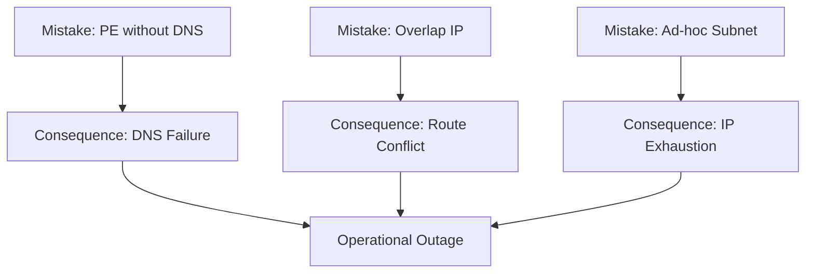

# Common Anti-Patterns

Avoid these frequent mistakes when building in Azure. These anti-patterns lead to downtime, security vulnerabilities, and high operational costs.

| Anti-Pattern | Description | Correct Approach |
| :--- | :--- | :--- |
| PE without DNS | Using Private Endpoints without DNS Zones | Deploy Private DNS Zones and VNet links. |
| Single Layer Check | Only checking NSGs, ignoring Firewall/DNS | Use a layered troubleshooting checklist. |
| Ad-hoc Subnets | Creating small subnets with no prefix plan | Use a predefined address prefix strategy. |
| Overlapping IP | Overlapping with on-premises ranges | Audit all ranges before peering or VPN setup. |
| Risky UDR | Changing UDRs in prod without testing | Test in dev/stage first with Flow Logs. |
| Ping Fallacy | Assuming ping failure = network problem | Check listener/OS firewall/ICMP blocking. |
| Open Public Access | Leaving Public Access enabled with PE | Disable Public Access once PE is verified. |
| Zero Monitoring | Deploying without any network metrics | Enable Network Watcher and Flow Logs. |

## Sources

- [Common Azure deployment errors](https://learn.microsoft.com/en-us/azure/azure-resource-manager/troubleshooting/common-deployment-errors)
- [Microsoft Cloud Adoption Framework - Governance](https://learn.microsoft.com/en-us/azure/cloud-adoption-framework/govern/guides/standard/network-security)
