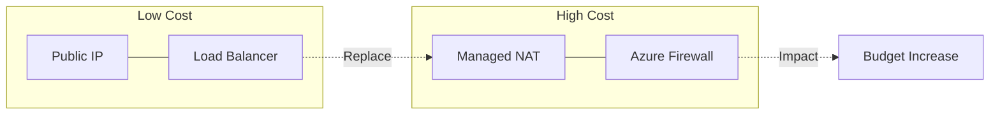

# Cost Awareness Best Practices

Optimize your Azure Networking spend by choosing the right services and minimizing unnecessary data transfer. Understand the underlying cost models to avoid unexpected charges.

| Service | Cost Model | Optimization |
| :--- | :--- | :--- |
| NAT Gateway | Hourly + Data | Consolidate to one per VNet. Use for outbound SNAT. |
| Azure Firewall | Hourly + Data | Use in Hub. Avoid in every Spoke. Consider Basic tier. |
| Load Balancer | Standard Fee + Data | Evaluate Standard LB pricing tiers; use NAT Gateway for outbound-only scenarios to reduce costs. |
| ExpressRoute | Circuit + Port + Data | Choose Metered if data volume is low. |
| VPN Gateway | Hourly + Data | Right-size SKU (e.g., VpnGw1 vs VpnGw2). |

!!! note
    Data transfer between regions and between availability zones (in some services) incurs costs. Always try to keep high-bandwidth workloads in the same region and zone.

## Validation Checks

| Check | Expected Result |
| :--- | :--- |
| Egress review | Cross-region and internet egress are tracked monthly |
| SKU review | Gateway and firewall SKUs match measured throughput |

## See Also
- [Network Design Baseline](../best-practices/network-design-baseline.md)
- [Connectivity Decision Guide](../reference/connectivity-decision-guide.md)
- [Observability Best Practices](../best-practices/observability-best-practices.md)

## Sources

- [Public IP addresses in Azure (pricing)](https://learn.microsoft.com/en-us/azure/virtual-network/ip-services/public-ip-addresses#pricing)
- [Azure Load Balancer overview](https://learn.microsoft.com/en-us/azure/load-balancer/load-balancer-overview)
- [Choose the right Azure Firewall SKU to meet your needs](https://learn.microsoft.com/en-us/azure/firewall/choose-firewall-sku)
