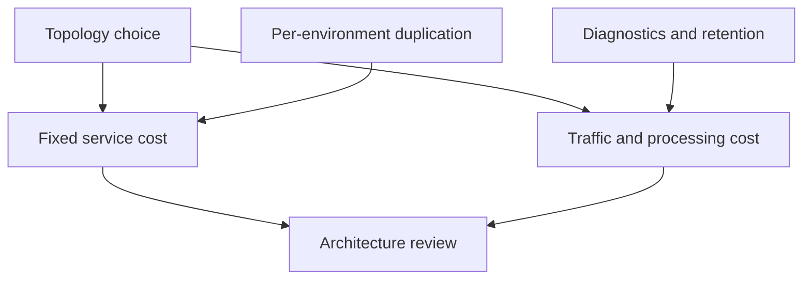

---
content_sources:
  diagrams:
    - id: why-this-matters
      type: flowchart
      source: mslearn-adapted
      based_on:
        - https://learn.microsoft.com/en-us/azure/cost-management-billing/costs/cost-analysis-common-uses
        - https://learn.microsoft.com/en-us/azure/firewall/firewall-faq
        - https://learn.microsoft.com/en-us/azure/network-watcher/network-watcher-monitoring-overview
content_validation:
  status: verified
  last_reviewed: 2026-07-25
  reviewer: agent
  core_claims:
    - claim: Azure Cost Management supports cost analysis views for investigating Azure spending patterns by resource, service, and scope.
      source: https://learn.microsoft.com/en-us/azure/cost-management-billing/costs/cost-analysis-common-uses
      verified: true
    - claim: Azure Firewall operational design affects cost because the service has fixed deployment characteristics and traffic-processing considerations that must be planned up front.
      source: https://learn.microsoft.com/en-us/azure/firewall/firewall-faq
      verified: true
---
# Cost Awareness Best Practices

Networking cost guidance should explain which architecture choices create fixed hourly cost, which ones scale with traffic or retained logs, and which ones quietly multiply when copied across environments.

## Why This Matters

Azure networking cost usually grows through design drift, not through a single expensive command. Teams centralize inspection, add gateway pairs, enable diagnostics everywhere, and duplicate shared services per environment until the monthly bill no longer matches the original risk model.

Good cost-aware networking guidance does not say "make it cheaper" in the abstract. It shows where architecture, resiliency, and operational evidence create real spend so those trade-offs can be deliberate.

<!-- diagram-id: why-this-matters -->

```mermaid
flowchart TD
    Topology[Topology choice] --> Fixed[Fixed service cost]
    Topology --> Variable[Traffic and processing cost]
    Diagnostics[Diagnostics and retention] --> Variable
    Environment[Per-environment duplication] --> Fixed
    Fixed --> Review[Architecture review]
    Variable --> Review
```

## Recommended Practices

### Separate fixed-cost services from usage-based services in design reviews

- Call out which components create fixed hourly deployment cost, such as gateways, firewalls, or always-on shared services.
- Call out which components scale with data transfer, processing, or retained telemetry.
- Review both categories together so the team does not underestimate the operational footprint of a topology.

```bash
az consumption usage list \
    --start-date 2026-07-01 \
    --end-date 2026-07-31
```

| Command | Purpose |
| --- | --- |
| `az consumption usage list` | List usage records for a billing period so networking charges can be reviewed by pattern. |
| `--start-date` | Start of the usage-reporting period. |
| `--end-date` | End of the usage-reporting period. |

### Challenge per-environment duplication of shared networking services

- Duplicate hubs, firewalls, and resolver paths only when isolation, compliance, or blast-radius requirements justify it.
- Compare dedicated-per-environment designs with a shared-hub model before cloning the control plane.
- Revisit temporary duplication decisions after migrations or separation events.

### Make cross-network traffic part of the architecture conversation

- Review peering paths, forced tunneling, and hybrid transit together because a design that looks operationally tidy may create steady inter-network transfer cost.
- Keep the reason for every inspection hop visible; extra hops should buy compliance, control, or resiliency.
- Avoid sending traffic through a centralized component "just in case" if a direct approved path is sufficient.

### Treat observability retention as a costed design choice

- Decide which diagnostics, metrics, and flow-level evidence are truly required for each networking control point.
- Align retention with incident and audit needs rather than keeping everything forever.
- Review monitoring scope when a service is copied into more regions or environments.

```bash
az monitor diagnostic-settings list \
    --resource $RESOURCE_ID
```

| Command | Purpose |
| --- | --- |
| `az monitor diagnostic-settings list` | Show which diagnostic pipelines are enabled for a networking resource. |
| `--resource` | Resource ID to inspect. |

### Use design reviews to compare resilience benefit against network spend

- Ask whether each extra gateway, firewall, or private connectivity path reduces a known risk or simply mirrors another environment's template.
- Document the business reason for premium connectivity or inspection tiers.
- Reassess after incident reviews; some high-cost patterns are justified only once a real failure mode is proven.

## Common Mistakes / Anti-Patterns

- Copying an expensive hub, firewall, or gateway stack into every environment without a fresh justification.
- Treating diagnostic retention as free because the cost is hidden in a separate workspace bill.
- Ignoring transfer and processing cost created by unnecessary inspection hops.
- Centralizing all networking services by default even when some workloads could use simpler approved patterns.
- Reviewing availability and security choices without reviewing their networking cost impact.

## Validation Checklist

- [ ] The design review distinguishes fixed network-service cost from usage-based cost.
- [ ] Shared-service duplication across environments is explicitly justified.
- [ ] Inter-network traffic paths are reviewed for avoidable transfer or processing cost.
- [ ] Diagnostic scope and retention are documented with cost ownership.
- [ ] Premium connectivity or inspection tiers map to a concrete business or compliance need.

## See Also

- [Network Design Baseline](network-design-baseline.md)
- [Hybrid Connectivity Best Practices](hybrid-connectivity-best-practices.md)
- [Observability Best Practices](observability-best-practices.md)
- [Connectivity Decision Guide](../reference/connectivity-decision-guide.md)

## Sources

- [Common uses for cost analysis](https://learn.microsoft.com/en-us/azure/cost-management-billing/costs/cost-analysis-common-uses)
- [Azure Firewall FAQ](https://learn.microsoft.com/en-us/azure/firewall/firewall-faq)
- [Network Watcher monitoring overview](https://learn.microsoft.com/en-us/azure/network-watcher/network-watcher-monitoring-overview)
