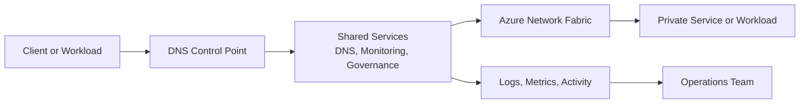

---
hide:
  - toc
---

# DNS Best Practices

Azure DNS design needs to make private, public, and hybrid name resolution predictable for operators and transparent for workloads.

## Why This Matters

Resolve from the right place, with the right zone, through the right forwarder chain.

In Azure, networking changes often look correct in the control plane while failing in the data plane. That is why good practices must combine architecture, CLI validation, and operational ownership.

Real-world incidents usually mix more than one factor: DNS, routes, NSGs, firewall policy, health probes, or hybrid dependencies. A strong practice guide makes those dependencies visible before the outage.



## Prerequisites

- Azure CLI 2.60 or later installed locally or in Azure Cloud Shell.
- Reader access to the current subscription and Contributor access in a lab subscription for hands-on changes.
- A shared naming convention for VNets, subnets, DNS zones, route tables, gateways, and firewall policies.
- A documented IP plan that includes Azure regions, on-premises ranges, partner networks, and future expansion.
- Diagnostic settings enabled for key networking resources so validation is based on evidence instead of assumptions.

## Recommended Practices

### Practice 1: Centralize private DNS ownership

**Why**: Private endpoints and hybrid services fail quickly when multiple teams create zones and forwarders without coordination.

**Real-world scenario**: A hub team creates zones, but a project team later deploys a duplicate zone in another subscription. Different VNets resolve different answers and the outage is incorrectly blamed on peering.

**How**

- Use Azure Private DNS Zones for Azure-private namespaces and link only the VNets that require them.
- If custom DNS is mandatory, define forwarder rules explicitly for Azure private suffixes.
- Validate from every connectivity domain, including on-premises, hub, spokes, and build agents.

```bash
az network private-dns zone list \
    --resource-group $RG \
    --output table

az network private-dns link vnet list \
    --resource-group $RG \
    --zone-name privatelink.blob.core.windows.net \
    --output table
```

**Validation**

- The expected VNet links exist.
- No duplicate private zone ownership exists for the same namespace.
- Clients resolve the expected private address.

**Operator cue**: If a name works only from one subnet or one VM, the issue is usually resolver path or zone linkage, not random Azure behavior.

**Trade-off**: Centralization improves consistency but demands disciplined change review.

### Practice 2: Use Private Resolver for hybrid DNS mediation

**Why**: Hybrid DNS is operationally safer when Azure and on-premises forwarders use a well-defined handoff point.

**Real-world scenario**: An on-premises DNS team forwards Azure private zones to an old VM forwarder while Azure workloads use the platform resolver. Different answers create intermittent failures during failover.

**How**

- Deploy inbound and outbound endpoints in dedicated subnets.
- Use DNS forwarding rulesets for on-premises namespaces instead of hard-coding VM forwarders in every spoke.
- Document which side is authoritative for every private namespace.

```bash
az network dns-resolver create \
    --resource-group $RG \
    --name $DNS_RESOLVER_NAME \
    --location $LOCATION \
    --virtual-network $HUB_VNET_ID

az network dns-resolver forwarding-ruleset list \
    --resource-group $RG \
    --output table
```

**Validation**

- Forwarding rulesets are attached to the intended VNets.
- Inbound and outbound endpoints use dedicated subnets.
- Hybrid test queries succeed in both directions.

**Operator cue**: When teams debate whether Azure or on-premises DNS is wrong, start by tracing the exact forwarder path.

**Trade-off**: Resolver centralization reduces drift but adds a shared dependency that must be monitored.

### Practice 3: Keep public and private records intentionally aligned

**Why**: Split-horizon DNS is safe only when teams understand which clients should see public vs private answers.

**Real-world scenario**: A storage account has a private endpoint for production, but build agents in another network still need the public endpoint. Without explicit design, one environment breaks while the other works.

**How**

- Document which client groups use public answers and which require private answers.
- Use private endpoint DNS zones only for clients that should consume the private path.
- Avoid manual host-file or custom-record workarounds that bypass central review.

```bash
az network private-endpoint dns-zone-group list \
    --resource-group $RG \
    --endpoint-name $PE_NAME
```

**Validation**

- Private endpoint zone groups exist and reference the correct zones.
- Clients resolve according to design intent.
- No unmanaged host overrides remain in production.

**Operator cue**: If one workaround depends on a local hosts file, there are probably more hidden ones.

**Trade-off**: Precise split-horizon design takes more upfront thought but avoids prolonged incidents.

### Practice 4: Test TTL, cache, and failover behavior

**Why**: DNS can look healthy in a single query while cached answers keep failures hidden or prolong recovery.

**Real-world scenario**: A cutover succeeds for new pods but not for long-running VMs because local and downstream caches hold the old answer.

**How**

- Review TTL values for private records and related application retry patterns.
- Flush caches on test clients during validation so you see authoritative behavior and cached behavior separately.
- Sequence DNS cutovers with application health checks, not with DNS change alone.

```bash
az network private-dns record-set a show \
    --resource-group $RG \
    --zone-name privatelink.database.windows.net \
    --name myserver
```

**Validation**

- Record data and TTL match the change plan.
- Validation covers both cached and fresh queries.
- Runbooks include cache-flush guidance where required.

**Operator cue**: A successful lookup after manual cache flush proves the change, but not full client recovery timing.

**Trade-off**: Lower TTLs can speed cutovers but may slightly increase resolver load.

### Practice 5: Audit DNS changes like security changes

**Why**: DNS changes can redirect traffic and expose data just as effectively as firewall changes.

**Real-world scenario**: A well-meaning engineer updates a record during incident response, but the undocumented change creates a second outage later.

**How**

- Send DNS control-plane logs to your monitoring workspace.
- Require change records for zone, record, and ruleset changes.
- Tag zones and resolver resources with owners and environment metadata.

```bash
az monitor diagnostic-settings create \
    --name send-dns-logs \
    --resource $DNS_RESOLVER_ID \
    --workspace $WORKSPACE_ID \
    --logs "[{"category":"DnsResolverDnsSecurityEvents","enabled":true}]"
```

**Validation**

- DNS changes are visible in activity logs.
- Every shared DNS zone has an owner.
- Incident responders can correlate name changes with outage windows.

**Operator cue**: If DNS changes are hard to audit, outages will be hard to explain.

**Trade-off**: More diagnostics cost money, but blind DNS operations cost credibility.

### Practice 6: Plan DNS onboarding as part of every private endpoint rollout

**Why**: Private endpoint deployment is incomplete until every required client can resolve the new name correctly.

**Real-world scenario**: A project team creates the endpoint and approves the connection, but the consuming VNet was never linked to the private zone. Deployment appears successful while runtime traffic fails.

**How**

- Bundle endpoint creation, zone-group configuration, VNet links, and validation in one change plan.
- Test from the application subnet and from operator tooling such as jump boxes or build runners.
- Remove stale records after decommissioning old endpoints to avoid accidental reuse.

```bash
az network private-endpoint show \
    --resource-group $RG \
    --name $PE_NAME \
    --query "{customDnsConfigs:customDnsConfigs}"
```

**Validation**

- The endpoint advertises the expected FQDNs.
- All intended clients resolve the endpoint privately.
- Retired endpoints do not leave misleading records behind.

**Operator cue**: A green endpoint connection state does not prove DNS readiness.

**Trade-off**: Bundling DNS with private endpoint rollout reduces surprises but requires cross-team coordination.

## Common Mistakes / Anti-Patterns

### Anti-Pattern 1: Assuming Azure-provided DNS solves hybrid resolution automatically

**What happens**: On-premises clients still fail to resolve private names.

**Why it is wrong**: Azure-provided DNS is VNet-scoped and does not magically extend to on-premises networks.

**Correct approach**: Add explicit forwarding via Azure DNS Private Resolver or an approved custom DNS path.

```bash
az network dns-resolver inbound-endpoint list \
    --resource-group $RG \
    --dns-resolver-name $DNS_RESOLVER_NAME
```

### Anti-Pattern 2: Creating duplicate private zones for the same namespace

**What happens**: Different networks receive different answers for the same service name.

**Why it is wrong**: Duplicate authoritative zones create unpredictable answers and ownership confusion.

**Correct approach**: Consolidate ownership and link the right VNets to the canonical zone.

```bash
az network private-dns zone list \
    --query "[].{name:name,resourceGroup:resourceGroup}" \
    --output table
```

### Anti-Pattern 3: Treating DNS as an application-team afterthought

**What happens**: Private endpoint projects go live with correct network objects but failed name resolution.

**Why it is wrong**: DNS is part of connectivity, not a post-deployment polish step.

**Correct approach**: Make DNS validation a release gate.

```bash
az network private-dns link vnet list \
    --resource-group $RG \
    --zone-name $ZONE_NAME
```

### Anti-Pattern 4: Ignoring caches during cutover

**What happens**: Some clients work and others fail for hours after an apparently successful change.

**Why it is wrong**: Client and resolver caches preserve old answers beyond the moment of change.

**Correct approach**: Account for TTL and flush strategies during migration plans.

```bash
az network private-dns record-set a list \
    --resource-group $RG \
    --zone-name $ZONE_NAME \
    --output table
```

## Performance Optimization Tips

- Measure baseline latency before and after every architectural change so optimization is data driven.
- Keep packet paths simple for critical applications and reduce unnecessary middleboxes where policy allows.
- Use regional affinity and dedicated subnets or policies for high-throughput paths.
- Test scaling behavior, not only steady-state connectivity.
- Review DNS lookup time, TLS handshake time, and transport latency separately to avoid false diagnoses.

## Security Considerations

- Use RBAC and change control to protect shared networking resources.
- Prefer private access patterns and least-privilege policy over broad temporary openings.
- Alert on route, DNS, NSG, firewall, and gateway changes that affect production.
- Separate management access from application access where practical.
- Document exception owners and expiry dates.

## Cost Optimization Strategies

- Understand which architecture components charge for deployment hours, data processed, and diagnostic retention.
- Centralize shared services where that reduces duplication without creating a dangerous bottleneck.
- Tune diagnostic collection to preserve useful evidence without storing redundant data forever.
- Retire stale policies, zones, and connections after decommissioning projects.
- Review traffic patterns to avoid paying for unnecessary transit or inspection hops.

## Validation Checklist

- [ ] The design has a documented owner.
- [ ] CLI validation exists for the most critical control points.
- [ ] The data plane behavior is tested from a representative workload.
- [ ] DNS, routing, and security assumptions are explicitly documented.
- [ ] Observability is enabled before production cutover.
- [ ] Rollback steps exist for major changes.
- [ ] Cost impact is reviewed during design approval.
- [ ] Security exceptions have owners and expiry dates.
- [ ] Runbooks link to the relevant troubleshooting playbooks.
- [ ] The current architecture diagram reflects the deployed environment.

## See Also

- [Index](../troubleshooting/index.md)
- [Index](../operations/index.md)
- [Index](../reference/index.md)
- [Index](../platform/index.md)

## Sources

- [https://learn.microsoft.com/en-us/azure/networking/](https://learn.microsoft.com/en-us/azure/networking/)
- [virtual-network](https://learn.microsoft.com/en-us/azure/well-architected/service-guides/virtual-network)
