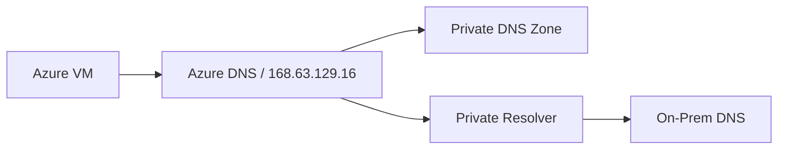

# DNS Best Practices

Reliable name resolution is critical for Private Endpoints and hybrid connectivity. Misconfigured DNS is the most common cause of connectivity failures in Azure.

| Scenario | DNS Type | Forwarding | Zone Link |
| :--- | :--- | :--- | :--- |
| Azure-only | Azure Private DNS | None | Linked to VNet |
| Hybrid (On-prem to Azure) | Private Resolver | On-prem to Resolver IP | Hub VNet Link |
| Hybrid (Azure to On-prem) | Private Resolver | Ruleset to On-prem DNS | Spoke VNet Link |
| Multi-region | Private DNS Zone | Global linkage | Link all VNets |

!!! warning
    Avoid mixing public and private resolution without a clear forwarding plan. This can lead to intermittent failures if the wrong server answers first.

## Validation Checks

| Check | Expected Result |
| :--- | :--- |
| Private endpoint lookup | FQDN resolves to private IP from all required VNets |
| Hybrid forwarding | On-prem and Azure conditional forwarders are symmetric |

## See Also
- [DNS Basics](../platform/dns-basics.md)
- [Configure DNS](../operations/configure-dns.md)
- [DNS Resolution Failures](../troubleshooting/playbooks/dns/dns-resolution-failures.md)

## Sources

- [Azure Private DNS documentation](https://learn.microsoft.com/en-us/azure/dns/private-dns-privatednszone)
- [What is Azure DNS Private Resolver?](https://learn.microsoft.com/en-us/azure/dns/dns-private-resolver-overview)
