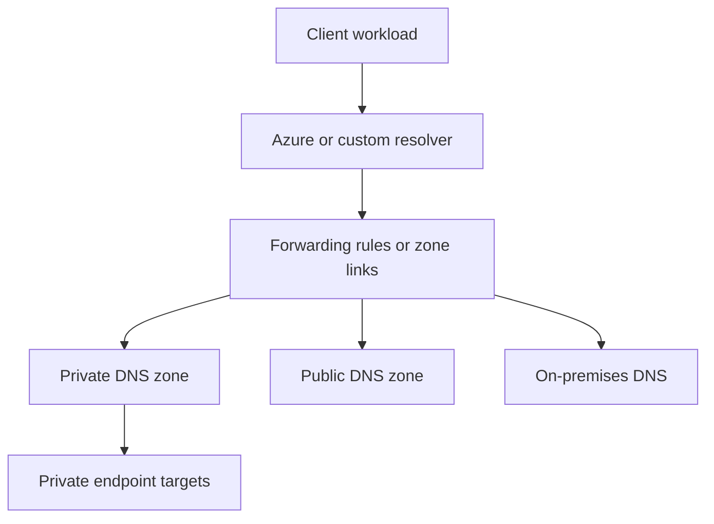

---
content_sources:
  diagrams:
    - id: why-this-matters
      type: flowchart
      source: mslearn-adapted
      based_on:
        - https://learn.microsoft.com/en-us/azure/dns/dns-overview
        - https://learn.microsoft.com/en-us/azure/dns/dns-private-resolver-overview
        - https://learn.microsoft.com/en-us/azure/private-link/private-endpoint-dns
content_validation:
  status: verified
  last_reviewed: 2026-07-25
  reviewer: agent
  core_claims:
    - claim: Azure DNS hosts public DNS domains and provides name resolution by using Azure infrastructure.
      source: https://learn.microsoft.com/en-us/azure/dns/dns-overview
      verified: true
    - claim: Azure DNS Private Resolver enables name resolution between Azure private DNS zones and on-premises DNS environments without deploying VM-based DNS forwarders.
      source: https://learn.microsoft.com/en-us/azure/dns/dns-private-resolver-overview
      verified: true
---
# DNS Best Practices

DNS guidance for Azure networking should explain who is authoritative for each namespace, how split-horizon answers are intended to behave, and how operators verify resolver paths across Azure and hybrid boundaries.

## Why This Matters

DNS failures look random until the forwarder chain is mapped. One subnet resolves a private IP, another resolves the public endpoint, and on-premises clients may use an entirely different chain again.

Because private endpoints, hybrid connectivity, and service discovery all depend on predictable name resolution, DNS best practices must focus on authoritative ownership, resolver path design, and cache-aware validation.

<!-- diagram-id: why-this-matters -->

```mermaid
flowchart TD
    Client[Client workload] --> Resolver[Azure or custom resolver]
    Resolver --> Ruleset[Forwarding rules or zone links]
    Ruleset --> PrivateZone[Private DNS zone]
    Ruleset --> PublicZone[Public DNS zone]
    Ruleset --> OnPrem[On-premises DNS]
    PrivateZone --> PrivateEndpoint[Private endpoint targets]
```

## Recommended Practices

### Assign clear authority for every namespace

- Define who owns public zones, private zones, and hybrid forwarding rules before shared services go live.
- Avoid duplicate private-zone ownership for the same namespace across subscriptions or landing zones.
- Keep zone ownership and resolver ownership aligned with the teams that can approve service cutovers.

```bash
az network private-dns zone list \
    --resource-group $RG \
    --output table

az network private-dns link vnet list \
    --resource-group $RG \
    --zone-name $PRIVATE_DNS_ZONE_NAME \
    --output table
```

| Command | Purpose |
| --- | --- |
| `az network private-dns zone list` | List the private DNS zones owned in the resource group. |
| `--resource-group` | Resource group that contains the private DNS zones. |
| `--output` | Output format for quick review. |
| `az network private-dns link vnet list` | List VNet links for a private DNS zone. |
| `--resource-group` | Resource group that contains the private DNS zone. |
| `--zone-name` | Private DNS zone to inspect. |
| `--output` | Output format for reviewing the links. |

### Design split-horizon DNS intentionally

- Document which clients should resolve public answers and which should resolve private answers.
- Keep private endpoint DNS onboarding in the same change plan as the service rollout.
- Do not rely on host-file or one-off resolver workarounds to compensate for missing authoritative design.

### Use Azure DNS Private Resolver when hybrid forwarding needs a managed handoff

- Prefer managed forwarding rules and inbound or outbound endpoints over VM forwarders when the goal is stable hybrid resolution.
- Keep the authoritative side of each namespace explicit so Azure-to-on-premises and on-premises-to-Azure forwarding are predictable.
- Reserve dedicated subnets for resolver endpoints and monitor them like shared infrastructure.

```bash
az network dns-resolver show \
    --resource-group $RG \
    --name $DNS_RESOLVER_NAME

az network dns-resolver forwarding-ruleset list \
    --resource-group $RG \
    --output table
```

| Command | Purpose |
| --- | --- |
| `az network dns-resolver show` | Show the Azure DNS Private Resolver instance that mediates hybrid name resolution. |
| `--resource-group` | Resource group that contains the resolver. |
| `--name` | Resolver to inspect. |
| `az network dns-resolver forwarding-ruleset list` | List forwarding rulesets used by the resolver. |
| `--resource-group` | Resource group that contains the forwarding rulesets. |
| `--output` | Output format for reviewing the rulesets. |

### Validate cache and failover behavior separately from authoritative answers

- Check both fresh lookups and cached client behavior during DNS cutovers.
- Keep TTL expectations and application retry expectations in the same runbook.
- Sequence DNS changes with application validation instead of assuming a record update proves service recovery.

### Audit DNS changes like traffic-control changes

- Send resolver and shared DNS diagnostics to a workspace where incident responders can correlate them with service outages.
- Require change records for zone, link, and forwarding-rule edits.
- Review old records and stale links so consumers do not follow abandoned paths.

## Common Mistakes / Anti-Patterns

- Creating duplicate private zones for the same namespace in different landing zones.
- Treating private endpoint DNS onboarding as optional follow-up work.
- Using VM forwarders as permanent hybrid infrastructure without clear ownership.
- Validating only one client subnet and assuming the full resolver chain is correct everywhere.
- Ignoring cache behavior during cutovers and then blaming Azure for delayed recovery.

## Validation Checklist

- [ ] Every namespace has a named authoritative owner.
- [ ] Private and public resolution behavior is documented for each consumer group.
- [ ] Hybrid forwarding rules are explicit and use the intended managed or custom resolver path.
- [ ] DNS cutovers include both authoritative and cached-behavior checks.
- [ ] Shared DNS changes are auditable and have clear rollback notes.

## See Also

- [Private Endpoint Best Practices](private-endpoint-best-practices.md)
- [Hybrid Connectivity Best Practices](hybrid-connectivity-best-practices.md)
- [Configure DNS](../operations/configure-dns.md)
- [DNS Resolution Failures](../troubleshooting/playbooks/dns/dns-resolution-failures.md)

## Sources

- [Azure DNS overview](https://learn.microsoft.com/en-us/azure/dns/dns-overview)
- [Azure DNS Private Resolver overview](https://learn.microsoft.com/en-us/azure/dns/dns-private-resolver-overview)
- [Azure Private Endpoint DNS configuration](https://learn.microsoft.com/en-us/azure/private-link/private-endpoint-dns)
