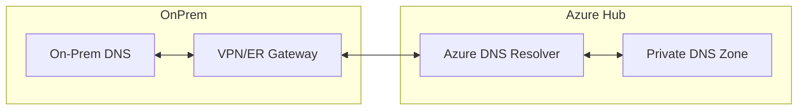

# Hybrid Connectivity Best Practices

Designing connectivity between on-premises and Azure requires careful planning of address spaces, DNS, and routing to ensure a seamless "single network" experience.

| Category | Best Practice | Description |
| :--- | :--- | :--- |
| Address Space | Zero Overlap | Strictly audit on-prem and Azure ranges before peering. |
| DNS | Two-way resolution | Deploy Azure DNS Private Resolver for seamless lookup. |
| Routing | Gateway Propagation | Enable BGP where possible to automate route tables. |
| Redundancy | Dual-circuit ER | Use multiple circuits or VPN backup for critical paths. |

!!! note
    Verify route advertisements in both directions using the "BGP Peers" or "Route Table" view in the Azure Portal to confirm that expected ranges are present.

## Validation Checks

| Check | Expected Result |
| :--- | :--- |
| Prefix validation | Advertised prefixes match approved address plan |
| Failover drill | Backup path restores connectivity within target RTO |

## See Also
- [Hybrid Connectivity Basics](../platform/hybrid-connectivity-basics.md)
- [VPN and ExpressRoute Basics](../operations/vpn-and-expressroute-basics.md)
- [Hybrid Connectivity Issues](../troubleshooting/playbooks/routing/hybrid-connectivity-issues.md)

## Sources

- [Choose a solution for connecting an on-premises network to Azure](https://learn.microsoft.com/en-us/azure/architecture/reference-architectures/hybrid-networking/)
- [What is Azure DNS Private Resolver?](https://learn.microsoft.com/en-us/azure/dns/dns-private-resolver-overview)
