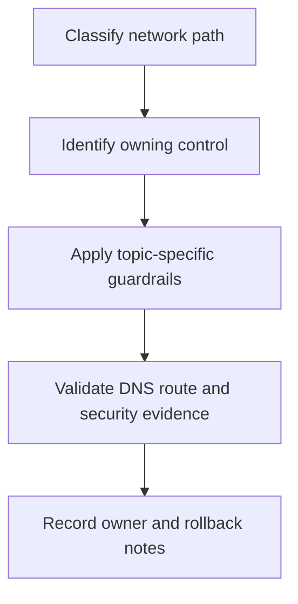

---
content_sources:
  diagrams:
  - id: best-practices-hybrid-connectivity-best-practices-flow
    type: flowchart
    source: mslearn-adapted
    description: Hybrid path control
    based_on:
    - https://learn.microsoft.com/en-us/azure/vpn-gateway/vpn-gateway-about-vpngateways
    - https://learn.microsoft.com/en-us/azure/expressroute/expressroute-introduction
    - https://learn.microsoft.com/en-us/azure/vpn-gateway/vpn-gateway-bgp-overview
content_validation:
  status: pending_review
  last_reviewed: '2026-05-22'
  reviewer: ai-agent
  core_claims:
  - claim: This document has source metadata and is queued for text-level Microsoft
      Learn verification.
    source: https://learn.microsoft.com/en-us/azure/vpn-gateway/vpn-gateway-about-vpngateways
    verified: false
  - claim: Core Azure networking guidance on this page should remain traceable to
      the listed sources before it is marked verified.
    source: https://learn.microsoft.com/en-us/azure/vpn-gateway/vpn-gateway-about-vpngateways
    verified: false
---

# Hybrid Connectivity Best Practices

Hybrid connectivity should define routing authority, gateway sizing, failover behavior, and operational test evidence.

## Why This Matters

An on-premises network connects to Azure through VPN or ExpressRoute and must avoid route leaks and asymmetric paths.

<!-- diagram-id: best-practices-hybrid-connectivity-best-practices-flow -->

```mermaid
flowchart TD
    A[Classify network path] --> B[Identify owning control]
    B --> C[Apply topic-specific guardrails]
    C --> D[Validate DNS route and security evidence]
    D --> E[Record owner and rollback notes]
```

## Recommended Practices

### 1. Decide route authority

**Why:** BGP, UDRs, and gateway route propagation can produce unexpected preferred paths.

**How:** Document which side advertises each prefix and where UDRs intentionally override propagation.

**Validation:** Effective routes and gateway route tables match the design.

### 2. Design failover intentionally

**Why:** VPN backup for ExpressRoute or active-active gateways require tested failover behavior.

**How:** Test failover in a maintenance window and record convergence time.

**Validation:** Runbooks include expected outage and rollback procedure.

### 3. Monitor tunnel and circuit health

**Why:** Hybrid incidents are often outside the VM or subnet where symptoms appear.

**How:** Alert on gateway metrics, BGP status, tunnel status, and packet loss.

**Validation:** Operators can identify whether Azure, provider, or on-premises path changed.

### CLI review example

```bash
az network vnet show \
    --resource-group $RG \
    --name $VNET_NAME \
    --query "{name:name,addressSpace:addressSpace.addressPrefixes,subnets:subnets[].name}" \
    --output json

az network nic show-effective-route-table \
    --resource-group $RG \
    --name $NIC_NAME \
    --output table

az network nic list-effective-nsg \
    --resource-group $RG \
    --name $NIC_NAME \
    --output table
```

| Element | Purpose |
|---|---|
| `$RG` | Resource group containing the networking resources. |
| `$VNET_NAME` | Virtual network being created, linked, or inspected. |
| `$NIC_NAME` | Network interface used for effective rule or route checks. |
| `--resource-group` | Scopes the command to the intended resource group. |
| `--name` | Identifies the target Azure networking resource. |
| `--query` | Filters output to the evidence operators need. |
| `--output` | Controls output format for review or automation. |
| Expected result | Command succeeds and returns resource state, path evidence, or operation status for the change record. |

## Common Mistakes / Anti-Patterns

- Reviewing a single resource without validating DNS, route, and security behavior from the actual source subnet.
- Making broad allow or default-route changes without recording the owner and rollback path.
- Disabling public access or changing peering and route propagation before private path validation.

## Validation Checklist

- [ ] Source, destination, protocol, port, DNS name, and owner are recorded.
- [ ] Effective route and effective security rule evidence matches the intended path.
- [ ] DNS resolution is tested from the consumer network when private connectivity is involved.
- [ ] Rollback command or manual rollback path is documented.

## See Also

- [Network Design Baseline](network-design-baseline.md)
- [Operations](../operations/index.md)
- [Troubleshooting](../troubleshooting/index.md)

## Sources

- [Vpn Gateway About Vpngateways](https://learn.microsoft.com/en-us/azure/vpn-gateway/vpn-gateway-about-vpngateways)
- [Expressroute Introduction](https://learn.microsoft.com/en-us/azure/expressroute/expressroute-introduction)
- [Vpn Gateway Bgp Overview](https://learn.microsoft.com/en-us/azure/vpn-gateway/vpn-gateway-bgp-overview)
