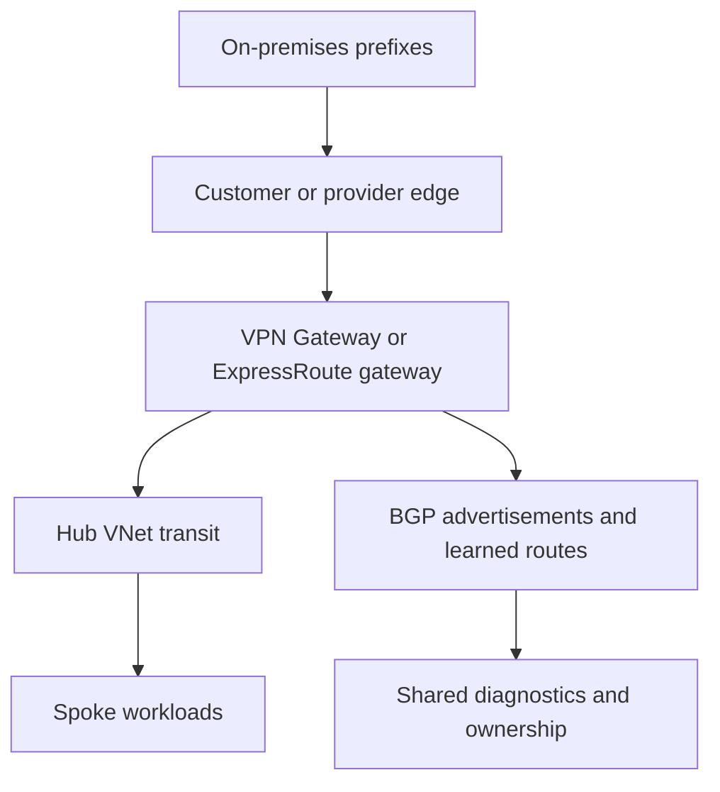

---
content_sources:
  diagrams:
    - id: why-this-matters
      type: flowchart
      source: mslearn-adapted
      based_on:
        - https://learn.microsoft.com/en-us/azure/expressroute/expressroute-introduction
        - https://learn.microsoft.com/en-us/azure/vpn-gateway/tutorial-site-to-site-portal
        - https://learn.microsoft.com/en-us/azure/vpn-gateway/bgp-howto
content_validation:
  status: verified
  last_reviewed: 2026-07-25
  reviewer: agent
  core_claims:
    - claim: ExpressRoute provides private connectivity between on-premises infrastructure and Microsoft cloud services.
      source: https://learn.microsoft.com/en-us/azure/expressroute/expressroute-introduction
      verified: true
    - claim: Azure VPN Gateway can use BGP to exchange routes dynamically with site-to-site VPN connections.
      source: https://learn.microsoft.com/en-us/azure/vpn-gateway/bgp-howto
      verified: true
---
# Hybrid Connectivity Best Practices

Hybrid connectivity guidance should explain how Azure and on-premises exchange routes, where provider responsibility stops, and how failover is validated before a real incident tests it.

## Why This Matters

Hybrid outages often become finger-pointing exercises because the Azure team sees healthy resources while the network provider or on-premises team sees a different control point. Without a shared route model and evidence plan, both sides can be technically correct and still not restore service.

That is why hybrid best practices must focus on route advertisements, gateway ownership boundaries, DNS implications, and failover testing instead of generic networking hygiene.

<!-- diagram-id: why-this-matters -->

```mermaid
flowchart TD
    OnPrem[On-premises prefixes] --> CPE[Customer or provider edge]
    CPE --> Gateway[VPN Gateway or ExpressRoute gateway]
    Gateway --> Hub[Hub VNet transit]
    Hub --> Spokes[Spoke workloads]
    Gateway --> BGP[BGP advertisements and learned routes]
    BGP --> Operators[Shared diagnostics and ownership]
```

## Recommended Practices

### Keep prefix ownership and advertisement intent explicit

- Maintain one authoritative list of on-premises, partner, and Azure-advertised prefixes.
- Review local network gateway prefixes, BGP advertisements, and route-table expectations in the same change review.
- Treat overlapping or undocumented prefixes as production risks, not as cleanup tasks for later.

```bash
az network vnet-gateway list-learned-routes \
    --resource-group $RG \
    --name $VNET_GATEWAY_NAME

az network vnet-gateway list-advertised-routes \
    --resource-group $RG \
    --name $VNET_GATEWAY_NAME \
    --peer $BGP_PEER_IP
```

| Command | Purpose |
| --- | --- |
| `az network vnet-gateway list-learned-routes` | Show the routes learned by the Azure virtual network gateway. |
| `--resource-group` | Resource group that contains the gateway. |
| `--name` | Gateway to inspect. |
| `az network vnet-gateway list-advertised-routes` | Show the routes the gateway advertises to a specific peer. |
| `--resource-group` | Resource group that contains the gateway. |
| `--name` | Gateway to inspect. |
| `--peer` | Peer IP address whose advertised routes are inspected. |

### Decide failover behavior before choosing the connectivity mix

- Document whether VPN is primary, ExpressRoute is primary, or one path exists only for backup.
- Validate expected route preference, not just raw tunnel or circuit presence.
- Keep failover expectations synchronized between Azure operators, the network provider, and on-premises teams.

### Test hybrid paths from actual application segments

- Run connectivity and route validation from representative hub and spoke workloads, not only from a gateway status page.
- Include DNS checks if private namespaces cross the hybrid boundary.
- Store the known-good learned-route and connection-state evidence for future comparison.

```bash
az network vpn-connection show \
    --resource-group $RG \
    --name $VPN_CONNECTION_NAME \
    --query "{connectionStatus:connectionStatus,ingressBytesTransferred:ingressBytesTransferred,egressBytesTransferred:egressBytesTransferred}"

az network watcher test-connectivity \
    --resource-group $RG \
    --source-resource $SOURCE_RESOURCE_ID \
    --dest-address $ONPREM_DESTINATION_IP \
    --dest-port 443
```

| Command | Purpose |
| --- | --- |
| `az network vpn-connection show` | Show the status and byte counters for a VPN connection. |
| `--resource-group` | Resource group that contains the connection. |
| `--name` | VPN connection to inspect. |
| `--query` | JMESPath projection for connection state and traffic counters. |
| `az network watcher test-connectivity` | Test end-to-end connectivity from an Azure workload to an on-premises target. |
| `--resource-group` | Resource group that contains the source resource. |
| `--source-resource` | Resource ID of the workload that originates the test. |
| `--dest-address` | Destination IP address or FQDN in the hybrid environment. |
| `--dest-port` | Destination port to test. |

### Keep provider demarcation and Azure demarcation visible

- Record which evidence the Azure team owns, which evidence the provider owns, and what both sides must compare during an outage.
- Make BGP peer details, connection ownership, and escalation paths part of the runbook.
- Avoid ambiguous designs where no team can tell whether the failure is route exchange, tunnel state, or downstream filtering.

### Review hybrid changes with routing and DNS together

- Any change to learned prefixes, forwarded traffic, or resolver path can change runtime behavior for private services.
- Re-check route tables and hybrid DNS forwarding when new spokes or private endpoints are onboarded.
- Treat hub growth as a hybrid-impact review trigger, not just an Azure-only change.

## Common Mistakes / Anti-Patterns

- Accepting a healthy gateway status as proof that workloads can reach required on-premises prefixes.
- Letting prefix inventories drift separately across Azure, provider, and on-premises teams.
- Assuming primary and backup path preference without validating learned and advertised routes.
- Escalating hybrid incidents without a clear evidence split between Azure and provider control points.
- Changing hybrid topology without re-checking the DNS and route experience from consuming spokes.

## Validation Checklist

- [ ] Prefix ownership and route advertisements are documented and reviewed jointly.
- [ ] Primary and backup connectivity expectations are explicit.
- [ ] Workload-based connectivity tests exist for important hybrid paths.
- [ ] Azure and provider demarcation points are written into the runbook.
- [ ] Hybrid topology changes trigger both routing and DNS validation.

## See Also

- [Routing Best Practices](routing-best-practices.md)
- [Dns Best Practices](dns-best-practices.md)
- [Vpn And Expressroute Basics](../operations/vpn-and-expressroute-basics.md)
- [VPN Gateway Troubleshooting](../troubleshooting/playbooks/vpn-gateway-troubleshooting.md)

## Sources

- [What is ExpressRoute?](https://learn.microsoft.com/en-us/azure/expressroute/expressroute-introduction)
- [Create a site-to-site VPN connection in the Azure portal](https://learn.microsoft.com/en-us/azure/vpn-gateway/tutorial-site-to-site-portal)
- [Configure BGP for Azure VPN Gateway](https://learn.microsoft.com/en-us/azure/vpn-gateway/bgp-howto)
