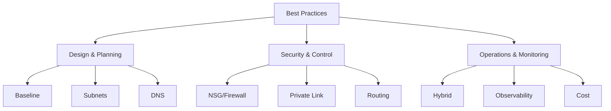

# Best Practices

!!! note
    Explore the core recommendations for designing, implementing, and maintaining Azure Networking environments. These practices align with the Microsoft Cloud Adoption Framework (CAF) and Well-Architected Framework (WAF).

| Page | Description |
| :--- | :--- |
| [Network Design Baseline](network-design-baseline.md) | Fundamental principles for address space and architecture. |
| [Subnet Design](subnet-design-best-practices.md) | How to structure subnets for security and scalability. |
| [DNS Best Practices](dns-best-practices.md) | Designing reliable name resolution for hybrid and private workloads. |
| [Routing Best Practices](routing-best-practices.md) | Managing traffic flow with UDRs and NVAs effectively. |
| [NSG and Firewall](nsg-and-firewall-best-practices.md) | Implementing layered security and least privilege. |
| [Private Endpoint](private-endpoint-best-practices.md) | Securely exposing services without public internet exposure. |
| [Hybrid Connectivity](hybrid-connectivity-best-practices.md) | Best practices for VPN, ExpressRoute, and cross-premises DNS. |
| [Observability](observability-best-practices.md) | Monitoring, diagnostics, and troubleshooting workflows. |
| [Cost Awareness](cost-awareness-best-practices.md) | Optimizing networking spend and understanding cost drivers. |
| [Common Anti-Patterns](common-anti-patterns.md) | Frequent mistakes to avoid in production environments. |

## Key Implementation Checklist

Before moving a network design into production, ensure these high-level best practices are verified:

- [ ] IP Address ranges do not overlap with any connected on-premises or peered networks.
- [ ] Subnet sizes are planned for expected workload growth and Azure service requirements (some services need dedicated subnets with specific minimum sizes).
- [ ] DNS resolution is tested from all VNets using Private DNS Zones.
- [ ] NSGs are applied at the subnet level with least-privilege rules.
- [ ] Network Watcher Flow Logs are enabled for all active subnets.
- [ ] Private Endpoints are used instead of service endpoints where possible.
- [ ] Routing tables (UDRs) are documented and minimize unnecessary hops.
- [ ] Standard Load Balancer is used instead of Basic for HA and security.
- [ ] Azure Bastion is deployed for secure management access.
- [ ] Cost monitoring is configured in Microsoft Cost Management.

## See Also
- [Learning Path](../start-here/learning-path.md)
- [Network Design Baseline](../best-practices/network-design-baseline.md)
## Sources

- [Microsoft Azure Well-Architected Framework - Network design](https://learn.microsoft.com/en-us/azure/well-architected/service-guides/azure-virtual-network)
- [Azure landing zone design principles](https://learn.microsoft.com/en-us/azure/cloud-adoption-framework/ready/landing-zone/design-principles)
