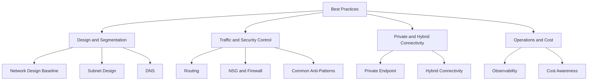

---
hide:
  - toc
content_sources:
  diagrams:
    - id: why-this-section-matters
      type: flowchart
      source: self-generated
      justification: "Guide navigation diagram created for this repository and grounded in Microsoft Learn networking overview content."
      based_on:
        - https://learn.microsoft.com/en-us/azure/well-architected/service-guides/virtual-network
        - https://learn.microsoft.com/en-us/azure/cloud-adoption-framework/ready/landing-zone/design-area/network-topology-and-connectivity
        - https://learn.microsoft.com/en-us/azure/networking/
---

# Best Practices

This section collects production-ready Azure networking guidance for design, governance, security, observability, and cost management. Use it as the operating baseline before introducing platform scale, private endpoints, or hybrid connectivity.

## Why This Section Matters

Best practices are where architecture decisions become enforceable standards. The individual documents in this section are intended to be read together rather than as isolated checklists.

A strong Azure networking estate is predictable in five ways: address space does not overlap, DNS behavior is explicit, route ownership is clear, security policy is layered and observable, and cost drivers are reviewed before they scale.

The practical risk is not a missing feature. It is unmanaged interaction between features: a private endpoint rollout without DNS links, a hub-spoke topology without route validation, or a firewall deployment without an egress catalog.

<!-- diagram-id: why-this-section-matters -->

## Document Map

| Page | Focus area | When to read it | Key outcome |
| --- | --- | --- | --- |
| [Network Design Baseline](network-design-baseline.md) | Addressing, landing zone layout, ownership | Before any new Azure landing zone or regional expansion | A scalable and governable foundation |
| [Subnet Design](subnet-design-best-practices.md) | Segmentation, sizing, delegated services | When creating or refactoring VNets | Clear policy boundaries and room for growth |
| [DNS Best Practices](dns-best-practices.md) | Private, public, and hybrid name resolution | Before private endpoints or hybrid DNS cutovers | Predictable name resolution across all clients |
| [Routing Best Practices](routing-best-practices.md) | UDRs, BGP, peering, transit | Before hub-spoke and forced tunneling changes | Deterministic packet paths |
| [NSG and Firewall](nsg-and-firewall-best-practices.md) | Segmentation and centralized inspection | Before hardening or egress-control projects | Layered and explainable filtering |
| [Private Endpoint](private-endpoint-best-practices.md) | Private Link rollout, zone groups, subnet placement | Before replacing public access with private access | Reliable private consumption of PaaS services |
| [Hybrid Connectivity](hybrid-connectivity-best-practices.md) | VPN, ExpressRoute, BGP, failover | Before or during on-premises integration | Stable cross-boundary connectivity |
| [Observability](observability-best-practices.md) | Logs, metrics, probes, evidence collection | Before production cutover | Faster troubleshooting and safer change control |
| [Cost Awareness](cost-awareness-best-practices.md) | Traffic, gateways, firewalls, logging costs | During architecture review and quarterly FinOps reviews | Intentional spend with fewer surprises |
| [Common Anti-Patterns](common-anti-patterns.md) | Typical failure patterns | During design review or after incidents | Faster recognition of risky shortcuts |

## Recommended Reading Paths

### Path 1: New landing zone build

1. Start with [Network Design Baseline](network-design-baseline.md).
2. Continue to [Subnet Design](subnet-design-best-practices.md).
3. Lock in [DNS Best Practices](dns-best-practices.md) and [Routing Best Practices](routing-best-practices.md).
4. Add [NSG and Firewall](nsg-and-firewall-best-practices.md) before production hardening.
5. Finish with [Observability](observability-best-practices.md) and [Cost Awareness](cost-awareness-best-practices.md).

### Path 2: Private endpoint program

1. Review [Private Endpoint](private-endpoint-best-practices.md).
2. Pair it with [DNS Best Practices](dns-best-practices.md).
3. Verify upstream route and inspection behavior in [Routing Best Practices](routing-best-practices.md) and [NSG and Firewall](nsg-and-firewall-best-practices.md).
4. Enable evidence collection with [Observability](observability-best-practices.md).

### Path 3: Hybrid modernization

1. Read [Network Design Baseline](network-design-baseline.md).
2. Continue with [Hybrid Connectivity](hybrid-connectivity-best-practices.md).
3. Validate DNS and route ownership with [DNS Best Practices](dns-best-practices.md) and [Routing Best Practices](routing-best-practices.md).
4. Review [Common Anti-Patterns](common-anti-patterns.md) before migrating production traffic.

## Maturity Model

| Level | Characteristics | Typical gaps | Next move |
| --- | --- | --- | --- |
| Foundational | VNets and subnets exist, but naming and ownership are informal. | DNS and routing assumptions live in tribal knowledge. | Standardize address planning, tags, and diagrams. |
| Managed | Shared services are centralized and common policies exist. | Validation is still manual and exception tracking is weak. | Add observability and repeatable release validation. |
| Production Ready | DNS, routes, NSGs, and logs are predictable and tested. | Cost and anti-pattern reviews may still be reactive. | Add quarterly architecture and FinOps reviews. |
| Optimized | Architecture choices are evidence-based, cost-aware, and resilient. | Risk shifts to governance drift over time. | Keep diagrams, runbooks, and telemetry aligned as services evolve. |

## Design Review Questions

- Which design assumption would fail first during regional expansion?
- Can operators explain how private DNS resolution works from each spoke and from on-premises?
- Which route or firewall exception still exists only because the owning team never had time to remove it?
- Do subnets map to trust boundaries and operational boundaries, or only to team preferences?
- Can incident responders identify the correct playbook in less than five minutes?
- Which networking resources send logs today, and which would still be dark during an outage?
- What cost driver would grow fastest if the current pattern were copied to ten more application teams?
- Where would a new private endpoint be placed, approved, named, and monitored?
- Which hybrid route advertisements or DNS forwarders would be hardest to validate during an emergency?
- What would the rollback path be if a central firewall policy broke critical traffic?

## Implementation Checklist

- [ ] Document global and regional IP plans before new VNet creation.
- [ ] Reserve platform subnets in shared landing zones before workload onboarding.
- [ ] Define the canonical DNS ownership model for private and hybrid namespaces.
- [ ] Standardize route table, NSG, and firewall attachment patterns by subnet type.
- [ ] Deploy diagnostics and synthetic tests before production cutover.
- [ ] Record shared-resource owners, on-call paths, and break-glass procedures.
- [ ] Review cost impact for gateways, firewalls, traffic inspection, and log retention.
- [ ] Map each critical workload dependency to its DNS, route, and egress requirements.
- [ ] Revisit common anti-patterns after every major incident or architecture change.
- [ ] Keep diagrams and runbooks current after change requests.

## Practice-by-Practice Guidance

- Network Design Baseline sets the foundation. Read it when the question is about prefixes, hubs, spokes, central services, or landing zone governance.

- Subnet Design is about operational boundaries. Read it when a team wants to add new subnets, delegated services, or private endpoints.

- DNS Best Practices matters whenever the environment introduces private endpoints, custom DNS, or hybrid name resolution.

- Routing Best Practices matters when routes become explicit: UDRs, peering, BGP, gateway transit, or forced tunneling.

- NSG and Firewall Best Practices helps distinguish local segmentation from centralized inspection and shows how to harden without breaking probes or dependencies.

- Private Endpoint Best Practices explains why endpoint creation, DNS, subnet placement, and approval workflow must be one change plan.

- Hybrid Connectivity Best Practices focuses on S2S VPN, P2S, ExpressRoute, and failover expectations.

- Observability Best Practices shortens triage by connecting metrics, diagnostics, activity logs, and probe evidence.

- Cost Awareness Best Practices helps architecture teams understand that traffic paths and logging choices shape spend.

- Common Anti-Patterns is best used during design review and post-incident learning to recognize risky shortcuts early.

- Operating note 126: keep best-practice adoption tied to real workload release gates, not optional documentation reviews.
- Operating note 127: keep best-practice adoption tied to real workload release gates, not optional documentation reviews.
- Operating note 128: keep best-practice adoption tied to real workload release gates, not optional documentation reviews.
- Operating note 129: keep best-practice adoption tied to real workload release gates, not optional documentation reviews.
- Operating note 130: keep best-practice adoption tied to real workload release gates, not optional documentation reviews.
- Operating note 131: keep best-practice adoption tied to real workload release gates, not optional documentation reviews.
- Operating note 132: keep best-practice adoption tied to real workload release gates, not optional documentation reviews.
- Operating note 133: keep best-practice adoption tied to real workload release gates, not optional documentation reviews.
- Operating note 134: keep best-practice adoption tied to real workload release gates, not optional documentation reviews.
- Operating note 135: keep best-practice adoption tied to real workload release gates, not optional documentation reviews.
- Operating note 136: keep best-practice adoption tied to real workload release gates, not optional documentation reviews.
- Operating note 137: keep best-practice adoption tied to real workload release gates, not optional documentation reviews.
- Operating note 138: keep best-practice adoption tied to real workload release gates, not optional documentation reviews.
- Operating note 139: keep best-practice adoption tied to real workload release gates, not optional documentation reviews.
- Operating note 140: keep best-practice adoption tied to real workload release gates, not optional documentation reviews.
- Operating note 141: keep best-practice adoption tied to real workload release gates, not optional documentation reviews.
- Operating note 142: keep best-practice adoption tied to real workload release gates, not optional documentation reviews.
- Operating note 143: keep best-practice adoption tied to real workload release gates, not optional documentation reviews.
- Operating note 144: keep best-practice adoption tied to real workload release gates, not optional documentation reviews.
- Operating note 145: keep best-practice adoption tied to real workload release gates, not optional documentation reviews.
- Operating note 146: keep best-practice adoption tied to real workload release gates, not optional documentation reviews.
- Operating note 147: keep best-practice adoption tied to real workload release gates, not optional documentation reviews.
- Operating note 148: keep best-practice adoption tied to real workload release gates, not optional documentation reviews.
- Operating note 149: keep best-practice adoption tied to real workload release gates, not optional documentation reviews.
- Operating note 150: keep best-practice adoption tied to real workload release gates, not optional documentation reviews.
- Operating note 151: keep best-practice adoption tied to real workload release gates, not optional documentation reviews.
- Operating note 152: keep best-practice adoption tied to real workload release gates, not optional documentation reviews.
- Operating note 153: keep best-practice adoption tied to real workload release gates, not optional documentation reviews.
- Operating note 154: keep best-practice adoption tied to real workload release gates, not optional documentation reviews.
- Operating note 155: keep best-practice adoption tied to real workload release gates, not optional documentation reviews.
- Operating note 156: keep best-practice adoption tied to real workload release gates, not optional documentation reviews.
- Operating note 157: keep best-practice adoption tied to real workload release gates, not optional documentation reviews.
- Operating note 158: keep best-practice adoption tied to real workload release gates, not optional documentation reviews.
- Operating note 159: keep best-practice adoption tied to real workload release gates, not optional documentation reviews.
- Operating note 160: keep best-practice adoption tied to real workload release gates, not optional documentation reviews.
- Operating note 161: keep best-practice adoption tied to real workload release gates, not optional documentation reviews.
- Operating note 162: keep best-practice adoption tied to real workload release gates, not optional documentation reviews.
- Operating note 163: keep best-practice adoption tied to real workload release gates, not optional documentation reviews.
- Operating note 164: keep best-practice adoption tied to real workload release gates, not optional documentation reviews.
- Operating note 165: keep best-practice adoption tied to real workload release gates, not optional documentation reviews.
- Operating note 166: keep best-practice adoption tied to real workload release gates, not optional documentation reviews.
- Operating note 167: keep best-practice adoption tied to real workload release gates, not optional documentation reviews.
- Operating note 168: keep best-practice adoption tied to real workload release gates, not optional documentation reviews.
- Operating note 169: keep best-practice adoption tied to real workload release gates, not optional documentation reviews.
- Operating note 170: keep best-practice adoption tied to real workload release gates, not optional documentation reviews.
- Operating note 171: keep best-practice adoption tied to real workload release gates, not optional documentation reviews.
- Operating note 172: keep best-practice adoption tied to real workload release gates, not optional documentation reviews.
- Operating note 173: keep best-practice adoption tied to real workload release gates, not optional documentation reviews.
- Operating note 174: keep best-practice adoption tied to real workload release gates, not optional documentation reviews.
- Operating note 175: keep best-practice adoption tied to real workload release gates, not optional documentation reviews.
- Operating note 176: keep best-practice adoption tied to real workload release gates, not optional documentation reviews.
- Operating note 177: keep best-practice adoption tied to real workload release gates, not optional documentation reviews.
- Operating note 178: keep best-practice adoption tied to real workload release gates, not optional documentation reviews.
- Operating note 179: keep best-practice adoption tied to real workload release gates, not optional documentation reviews.
- Operating note 180: keep best-practice adoption tied to real workload release gates, not optional documentation reviews.
- Operating note 181: keep best-practice adoption tied to real workload release gates, not optional documentation reviews.
- Operating note 182: keep best-practice adoption tied to real workload release gates, not optional documentation reviews.
- Operating note 183: keep best-practice adoption tied to real workload release gates, not optional documentation reviews.
- Operating note 184: keep best-practice adoption tied to real workload release gates, not optional documentation reviews.
- Operating note 185: keep best-practice adoption tied to real workload release gates, not optional documentation reviews.
- Operating note 186: keep best-practice adoption tied to real workload release gates, not optional documentation reviews.
- Operating note 187: keep best-practice adoption tied to real workload release gates, not optional documentation reviews.
- Operating note 188: keep best-practice adoption tied to real workload release gates, not optional documentation reviews.
- Operating note 189: keep best-practice adoption tied to real workload release gates, not optional documentation reviews.
- Operating note 190: keep best-practice adoption tied to real workload release gates, not optional documentation reviews.
- Operating note 191: keep best-practice adoption tied to real workload release gates, not optional documentation reviews.
- Operating note 192: keep best-practice adoption tied to real workload release gates, not optional documentation reviews.
- Operating note 193: keep best-practice adoption tied to real workload release gates, not optional documentation reviews.
- Operating note 194: keep best-practice adoption tied to real workload release gates, not optional documentation reviews.
- Operating note 195: keep best-practice adoption tied to real workload release gates, not optional documentation reviews.
- Operating note 196: keep best-practice adoption tied to real workload release gates, not optional documentation reviews.
- Operating note 197: keep best-practice adoption tied to real workload release gates, not optional documentation reviews.
- Operating note 198: keep best-practice adoption tied to real workload release gates, not optional documentation reviews.
- Operating note 199: keep best-practice adoption tied to real workload release gates, not optional documentation reviews.
- Operating note 200: keep best-practice adoption tied to real workload release gates, not optional documentation reviews.
- Operating note 201: keep best-practice adoption tied to real workload release gates, not optional documentation reviews.
- Operating note 202: keep best-practice adoption tied to real workload release gates, not optional documentation reviews.
- Operating note 203: keep best-practice adoption tied to real workload release gates, not optional documentation reviews.
- Operating note 204: keep best-practice adoption tied to real workload release gates, not optional documentation reviews.
- Operating note 205: keep best-practice adoption tied to real workload release gates, not optional documentation reviews.
- Operating note 206: keep best-practice adoption tied to real workload release gates, not optional documentation reviews.
- Operating note 207: keep best-practice adoption tied to real workload release gates, not optional documentation reviews.
- Operating note 208: keep best-practice adoption tied to real workload release gates, not optional documentation reviews.
- Operating note 209: keep best-practice adoption tied to real workload release gates, not optional documentation reviews.
- Operating note 210: keep best-practice adoption tied to real workload release gates, not optional documentation reviews.
- Operating note 211: keep best-practice adoption tied to real workload release gates, not optional documentation reviews.
- Operating note 212: keep best-practice adoption tied to real workload release gates, not optional documentation reviews.
- Operating note 213: keep best-practice adoption tied to real workload release gates, not optional documentation reviews.
- Operating note 214: keep best-practice adoption tied to real workload release gates, not optional documentation reviews.
- Operating note 215: keep best-practice adoption tied to real workload release gates, not optional documentation reviews.
- Operating note 216: keep best-practice adoption tied to real workload release gates, not optional documentation reviews.
- Operating note 217: keep best-practice adoption tied to real workload release gates, not optional documentation reviews.
- Operating note 218: keep best-practice adoption tied to real workload release gates, not optional documentation reviews.
- Operating note 219: keep best-practice adoption tied to real workload release gates, not optional documentation reviews.
- Operating note 220: keep best-practice adoption tied to real workload release gates, not optional documentation reviews.
- Operating note 221: keep best-practice adoption tied to real workload release gates, not optional documentation reviews.
- Operating note 222: keep best-practice adoption tied to real workload release gates, not optional documentation reviews.
- Operating note 223: keep best-practice adoption tied to real workload release gates, not optional documentation reviews.
- Operating note 224: keep best-practice adoption tied to real workload release gates, not optional documentation reviews.
- Operating note 225: keep best-practice adoption tied to real workload release gates, not optional documentation reviews.
- Operating note 226: keep best-practice adoption tied to real workload release gates, not optional documentation reviews.
- Operating note 227: keep best-practice adoption tied to real workload release gates, not optional documentation reviews.
- Operating note 228: keep best-practice adoption tied to real workload release gates, not optional documentation reviews.
- Operating note 229: keep best-practice adoption tied to real workload release gates, not optional documentation reviews.
- Operating note 230: keep best-practice adoption tied to real workload release gates, not optional documentation reviews.
- Operating note 231: keep best-practice adoption tied to real workload release gates, not optional documentation reviews.
- Operating note 232: keep best-practice adoption tied to real workload release gates, not optional documentation reviews.
- Operating note 233: keep best-practice adoption tied to real workload release gates, not optional documentation reviews.
- Operating note 234: keep best-practice adoption tied to real workload release gates, not optional documentation reviews.
- Operating note 235: keep best-practice adoption tied to real workload release gates, not optional documentation reviews.
- Operating note 236: keep best-practice adoption tied to real workload release gates, not optional documentation reviews.
- Operating note 237: keep best-practice adoption tied to real workload release gates, not optional documentation reviews.
- Operating note 238: keep best-practice adoption tied to real workload release gates, not optional documentation reviews.
- Operating note 239: keep best-practice adoption tied to real workload release gates, not optional documentation reviews.
- Operating note 240: keep best-practice adoption tied to real workload release gates, not optional documentation reviews.
- Operating note 241: keep best-practice adoption tied to real workload release gates, not optional documentation reviews.
- Operating note 242: keep best-practice adoption tied to real workload release gates, not optional documentation reviews.
- Operating note 243: keep best-practice adoption tied to real workload release gates, not optional documentation reviews.
- Operating note 244: keep best-practice adoption tied to real workload release gates, not optional documentation reviews.
- Operating note 245: keep best-practice adoption tied to real workload release gates, not optional documentation reviews.
- Operating note 246: keep best-practice adoption tied to real workload release gates, not optional documentation reviews.
- Operating note 247: keep best-practice adoption tied to real workload release gates, not optional documentation reviews.
- Operating note 248: keep best-practice adoption tied to real workload release gates, not optional documentation reviews.
- Operating note 249: keep best-practice adoption tied to real workload release gates, not optional documentation reviews.
- Operating note 250: keep best-practice adoption tied to real workload release gates, not optional documentation reviews.
- Operating note 251: keep best-practice adoption tied to real workload release gates, not optional documentation reviews.
- Operating note 252: keep best-practice adoption tied to real workload release gates, not optional documentation reviews.
- Operating note 253: keep best-practice adoption tied to real workload release gates, not optional documentation reviews.
- Operating note 254: keep best-practice adoption tied to real workload release gates, not optional documentation reviews.
- Operating note 255: keep best-practice adoption tied to real workload release gates, not optional documentation reviews.
- Operating note 256: keep best-practice adoption tied to real workload release gates, not optional documentation reviews.
- Operating note 257: keep best-practice adoption tied to real workload release gates, not optional documentation reviews.
- Operating note 258: keep best-practice adoption tied to real workload release gates, not optional documentation reviews.
- Operating note 259: keep best-practice adoption tied to real workload release gates, not optional documentation reviews.
- Operating note 260: keep best-practice adoption tied to real workload release gates, not optional documentation reviews.
- Operating note 261: keep best-practice adoption tied to real workload release gates, not optional documentation reviews.
- Operating note 262: keep best-practice adoption tied to real workload release gates, not optional documentation reviews.
- Operating note 263: keep best-practice adoption tied to real workload release gates, not optional documentation reviews.
- Operating note 264: keep best-practice adoption tied to real workload release gates, not optional documentation reviews.
- Operating note 265: keep best-practice adoption tied to real workload release gates, not optional documentation reviews.
- Operating note 266: keep best-practice adoption tied to real workload release gates, not optional documentation reviews.
- Operating note 267: keep best-practice adoption tied to real workload release gates, not optional documentation reviews.
- Operating note 268: keep best-practice adoption tied to real workload release gates, not optional documentation reviews.
- Operating note 269: keep best-practice adoption tied to real workload release gates, not optional documentation reviews.
- Operating note 270: keep best-practice adoption tied to real workload release gates, not optional documentation reviews.
- Operating note 271: keep best-practice adoption tied to real workload release gates, not optional documentation reviews.
- Operating note 272: keep best-practice adoption tied to real workload release gates, not optional documentation reviews.
- Operating note 273: keep best-practice adoption tied to real workload release gates, not optional documentation reviews.
- Operating note 274: keep best-practice adoption tied to real workload release gates, not optional documentation reviews.
- Operating note 275: keep best-practice adoption tied to real workload release gates, not optional documentation reviews.
- Operating note 276: keep best-practice adoption tied to real workload release gates, not optional documentation reviews.
- Operating note 277: keep best-practice adoption tied to real workload release gates, not optional documentation reviews.
- Operating note 278: keep best-practice adoption tied to real workload release gates, not optional documentation reviews.
- Operating note 279: keep best-practice adoption tied to real workload release gates, not optional documentation reviews.
- Operating note 280: keep best-practice adoption tied to real workload release gates, not optional documentation reviews.
- Operating note 281: keep best-practice adoption tied to real workload release gates, not optional documentation reviews.
- Operating note 282: keep best-practice adoption tied to real workload release gates, not optional documentation reviews.
- Operating note 283: keep best-practice adoption tied to real workload release gates, not optional documentation reviews.
- Operating note 284: keep best-practice adoption tied to real workload release gates, not optional documentation reviews.
- Operating note 285: keep best-practice adoption tied to real workload release gates, not optional documentation reviews.
- Operating note 286: keep best-practice adoption tied to real workload release gates, not optional documentation reviews.
- Operating note 287: keep best-practice adoption tied to real workload release gates, not optional documentation reviews.
- Operating note 288: keep best-practice adoption tied to real workload release gates, not optional documentation reviews.
- Operating note 289: keep best-practice adoption tied to real workload release gates, not optional documentation reviews.
- Operating note 290: keep best-practice adoption tied to real workload release gates, not optional documentation reviews.
- Operating note 291: keep best-practice adoption tied to real workload release gates, not optional documentation reviews.
- Operating note 292: keep best-practice adoption tied to real workload release gates, not optional documentation reviews.
- Operating note 293: keep best-practice adoption tied to real workload release gates, not optional documentation reviews.
- Operating note 294: keep best-practice adoption tied to real workload release gates, not optional documentation reviews.
- Operating note 295: keep best-practice adoption tied to real workload release gates, not optional documentation reviews.
- Operating note 296: keep best-practice adoption tied to real workload release gates, not optional documentation reviews.
- Operating note 297: keep best-practice adoption tied to real workload release gates, not optional documentation reviews.
- Operating note 298: keep best-practice adoption tied to real workload release gates, not optional documentation reviews.
- Operating note 299: keep best-practice adoption tied to real workload release gates, not optional documentation reviews.
- Operating note 300: keep best-practice adoption tied to real workload release gates, not optional documentation reviews.
- Operating note 301: keep best-practice adoption tied to real workload release gates, not optional documentation reviews.
- Operating note 302: keep best-practice adoption tied to real workload release gates, not optional documentation reviews.
- Operating note 303: keep best-practice adoption tied to real workload release gates, not optional documentation reviews.
- Operating note 304: keep best-practice adoption tied to real workload release gates, not optional documentation reviews.

## See Also

- [Learning Path](../start-here/learning-path.md)
- [Connectivity Decision Guide](../reference/connectivity-decision-guide.md)
- [Troubleshooting Home](../troubleshooting/index.md)
- [Operations Home](../operations/index.md)

## Sources

- [Azure well-architected virtual network guidance](https://learn.microsoft.com/en-us/azure/well-architected/service-guides/virtual-network)
- [Azure landing zone network topology and connectivity](https://learn.microsoft.com/en-us/azure/cloud-adoption-framework/ready/landing-zone/design-area/network-topology-and-connectivity)
- [Azure networking documentation](https://learn.microsoft.com/en-us/azure/networking/)
