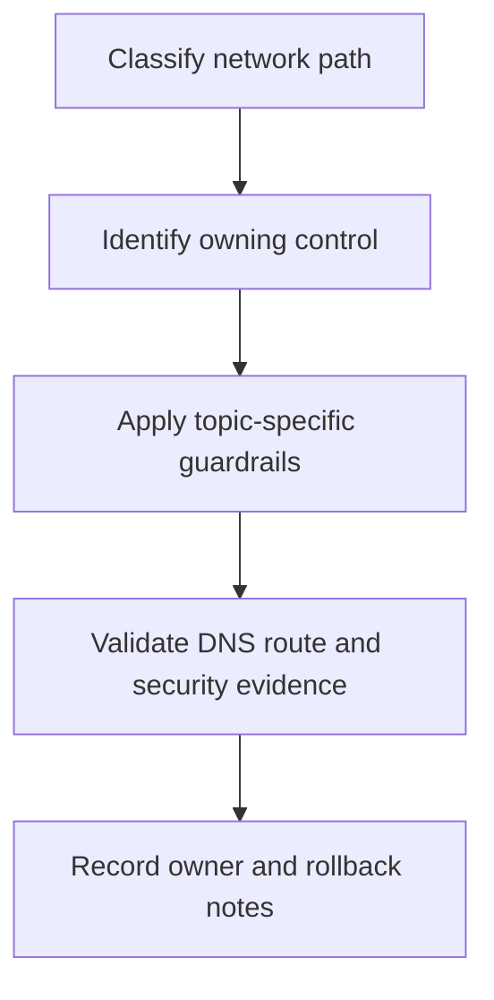

---
content_sources:
  diagrams:
  - id: best-practices-index-flow
    type: flowchart
    source: mslearn-adapted
    description: Practice map
    based_on:
    - https://learn.microsoft.com/en-us/azure/virtual-network/virtual-networks-overview
    - https://learn.microsoft.com/en-us/azure/virtual-network/network-security-groups-overview
    - https://learn.microsoft.com/en-us/azure/private-link/private-endpoint-overview
content_validation:
  status: pending_review
  last_reviewed: '2026-05-22'
  reviewer: ai-agent
  core_claims:
  - claim: This document has source metadata and is queued for text-level Microsoft
      Learn verification.
    source: https://learn.microsoft.com/en-us/azure/virtual-network/virtual-networks-overview
    verified: false
  - claim: Core Azure networking guidance on this page should remain traceable to
      the listed sources before it is marked verified.
    source: https://learn.microsoft.com/en-us/azure/virtual-network/virtual-networks-overview
    verified: false
---

# Best Practices

Use these pages to review Azure networking designs before production changes.

## Why This Matters

A platform team needs one review path for address space, routing, DNS, security, private connectivity, hybrid links, observability, and cost.

<!-- diagram-id: best-practices-index-flow -->

```mermaid
flowchart TD
    A[Classify network path] --> B[Identify owning control]
    B --> C[Apply topic-specific guardrails]
    C --> D[Validate DNS route and security evidence]
    D --> E[Record owner and rollback notes]
```

## Recommended Practices

### 1. Start with the network design baseline

**Why:** Address planning, subnet ownership, route intent, DNS, and security boundaries interact.

**How:** Use the baseline page to capture shared standards before opening a topic-specific page.

**Validation:** Every production change points to a baseline owner and evidence pack.

### 2. Keep path-specific guidance separate

**Why:** A DNS problem, UDR problem, and Private Endpoint problem need different evidence.

**How:** Use the owning page for the packet path being changed.

**Validation:** Review notes identify the specific network control under change.

### 3. Validate both directions of traffic

**Why:** Inbound success does not prove outbound or return path correctness.

**How:** Test source, destination, DNS, effective routes, and effective security rules.

**Validation:** Evidence includes packet path, name resolution, and control-plane state.

### CLI review example

```bash
az network vnet show \
    --resource-group $RG \
    --name $VNET_NAME \
    --query "{name:name,addressSpace:addressSpace.addressPrefixes,subnets:subnets[].name}" \
    --output json

az network nic show-effective-route-table \
    --resource-group $RG \
    --name $NIC_NAME \
    --output table

az network nic list-effective-nsg \
    --resource-group $RG \
    --name $NIC_NAME \
    --output table
```

| Element | Purpose |
|---|---|
| `$RG` | Resource group containing the networking resources. |
| `$VNET_NAME` | Virtual network being created, linked, or inspected. |
| `$NIC_NAME` | Network interface used for effective rule or route checks. |
| `--resource-group` | Scopes the command to the intended resource group. |
| `--name` | Identifies the target Azure networking resource. |
| `--query` | Filters output to the evidence operators need. |
| `--output` | Controls output format for review or automation. |
| Expected result | Command succeeds and returns resource state, path evidence, or operation status for the change record. |

## Common Mistakes / Anti-Patterns

- Reviewing a single resource without validating DNS, route, and security behavior from the actual source subnet.
- Making broad allow or default-route changes without recording the owner and rollback path.
- Disabling public access or changing peering and route propagation before private path validation.

## Validation Checklist

- [ ] Source, destination, protocol, port, DNS name, and owner are recorded.
- [ ] Effective route and effective security rule evidence matches the intended path.
- [ ] DNS resolution is tested from the consumer network when private connectivity is involved.
- [ ] Rollback command or manual rollback path is documented.

## See Also

- [Network Design Baseline](network-design-baseline.md)
- [Operations](../operations/index.md)
- [Troubleshooting](../troubleshooting/index.md)

## Sources

- [Virtual Networks Overview](https://learn.microsoft.com/en-us/azure/virtual-network/virtual-networks-overview)
- [Network Security Groups Overview](https://learn.microsoft.com/en-us/azure/virtual-network/network-security-groups-overview)
- [Private Endpoint Overview](https://learn.microsoft.com/en-us/azure/private-link/private-endpoint-overview)
