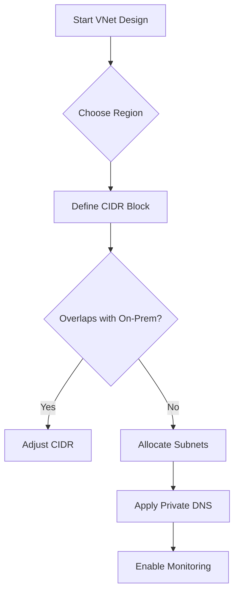

# Network Design Baseline

Establish a robust foundation by following these core principles for Azure Virtual Network design. Prioritizing address planning and private connectivity prevents future rework.

| Area | Checklist Item | Description |
| :--- | :--- | :--- |
| Address Space | Plan for Growth | Use non-overlapping CIDR blocks. Allow for 100% expansion. |
| Subnetting | Subnet by Purpose | Separate by role (Gateway, DMZ, App, Data) rather than department. |
| Private First | Disable Public IP | Use Private Endpoints and Bastion for management traffic. |
| DNS Strategy | Centralized DNS | Use Private DNS Zones linked to a hub VNet for resolution. |
| Monitoring | Network Watcher | Enable Flow Logs and Traffic Analytics in all active regions. |

!!! tip
    Start with a simple VNet but ensure the address space is large enough. A /16 or /20 is common for primary landing zones to avoid fragmentation.

## Validation Checks

| Check | Expected Result |
| :--- | :--- |
| Address overlap review | No overlap across hub, spokes, and on-premises |
| Subnet reservation review | Reserved ranges for future platform services |

## See Also
- [How Azure Networking Works](../platform/how-azure-networking-works.md)
- [Subnet Design Best Practices](../best-practices/subnet-design-best-practices.md)
- [Cost Awareness Best Practices](../best-practices/cost-awareness-best-practices.md)

## Sources

- [Plan for virtual networks](https://learn.microsoft.com/en-us/azure/virtual-network/virtual-network-vnet-plan-design-arm)
- [Azure landing zone design area: Network topology and connectivity](https://learn.microsoft.com/en-us/azure/cloud-adoption-framework/ready/landing-zone/design-area/network-topology-and-connectivity)
