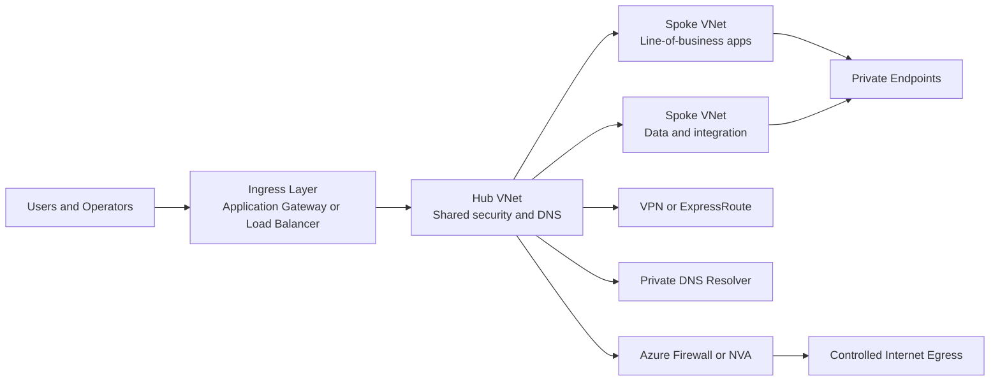

---
hide:
  - toc
---

# Network Design Baseline

A strong Azure networking baseline reduces redesign work later by making address allocation, segmentation, egress control, DNS ownership, and observability explicit before the first workload arrives.

## Why This Matters

Teams often discover networking debt only after they introduce private endpoints, hub-spoke peering, or hybrid connectivity. At that point every change becomes a migration rather than a clean design decision.

A production baseline is not a diagram alone. It is the combination of address governance, default routes, security controls, DNS patterns, logging, and documented ownership boundaries between platform and application teams.

The most expensive networking incidents usually come from early shortcuts: overlapping CIDRs, ad hoc subnet growth, public exposure left in place during a temporary workaround, and undocumented DNS changes during private link rollouts.



## Prerequisites

- Azure CLI 2.60 or later installed locally or in Azure Cloud Shell.
- Reader access to the current subscription and Contributor access in a lab subscription for hands-on changes.
- A shared naming convention for VNets, subnets, DNS zones, route tables, gateways, and firewall policies.
- A documented IP plan that includes Azure regions, on-premises ranges, partner networks, and future expansion.
- Diagnostic settings enabled for key networking resources so validation is based on evidence instead of assumptions.

## Recommended Practices

### Practice 1: Reserve address space for growth, not only for today

**Why**: Expanding a VNet or splitting subnets under production load is possible, but it introduces route changes, maintenance windows, and a high chance of human error.

**Real-world scenario**: A hub VNet starts as /24 for a pilot. Six months later, private endpoints, Azure Firewall, and a VPN gateway all require dedicated subnets. Because the hub cannot absorb them cleanly, the platform team is forced into a second hub and unnecessary transit complexity.

**How**

- Choose non-overlapping RFC1918 ranges that leave room for regional growth, partner integration, and emergency migration space.
- Keep hub, shared services, and workload spokes in separate prefixes so route summaries remain readable.
- Document reserved subnets for Azure Firewall, GatewaySubnet, Azure Bastion, application ingress, data services, and private endpoints before any workload teams self-serve.

```bash
az network vnet create \
    --resource-group $RG \
    --name $VNET_NAME \
    --location $LOCATION \
    --address-prefixes 10.20.0.0/16 \
    --subnet-name GatewaySubnet \
    --subnet-prefixes 10.20.0.0/24

az network vnet subnet create \
    --resource-group $RG \
    --vnet-name $VNET_NAME \
    --name AzureFirewallSubnet \
    --address-prefixes 10.20.1.0/24
```

**Validation**

- No address prefix overlaps with peered VNets, on-premises routes, partner networks, or ExpressRoute-connected environments.
- Reserved platform subnets exist before workload deployment begins.
- The IP plan records the business owner and intended purpose of every subnet.

**Operator cue**: If teams are already asking for exceptions because the network is full, the initial address plan was too small.

**Trade-off**: Larger address spaces increase planning discipline requirements, but they are far cheaper than redesigning transit later.

### Practice 2: Adopt hub-spoke intentionally, not by default

**Why**: Hub-spoke is powerful for shared DNS, egress inspection, and hybrid ingress, but it also centralizes failure domains and makes route ownership more sensitive.

**Real-world scenario**: A business unit deploys every workload into a single flat VNet because it is simple. Later, a data classification requirement forces segmentation. Because everything shares one subnet model, the remediation becomes a full migration instead of a routing change.

**How**

- Use a hub for shared services such as DNS forwarding, firewalling, bastion, and gateway connectivity.
- Create spokes for workload isolation, environment separation, or data residency boundaries.
- Define whether peering uses remote gateways, forwarded traffic, or direct spoke-to-spoke communication before rollout.

```bash
az network vnet peering create \
    --resource-group $RG \
    --name hub-to-spoke \
    --vnet-name $HUB_VNET_NAME \
    --remote-vnet $SPOKE_VNET_ID \
    --allow-vnet-access true \
    --allow-forwarded-traffic true

az network vnet peering create \
    --resource-group $RG \
    --name spoke-to-hub \
    --vnet-name $SPOKE_VNET_NAME \
    --remote-vnet $HUB_VNET_ID \
    --allow-vnet-access true \
    --use-remote-gateways true
```

**Validation**

- Peering settings match the intended transit model on both sides.
- Shared services in the hub are reachable from spokes using private IPs and correct DNS records.
- Spoke teams understand which routes they can change and which are centrally owned.

**Operator cue**: When every spoke requires a custom exception to use the hub, the shared-services boundary is probably unclear.

**Trade-off**: Centralization improves governance, but it slows change if the hub team becomes an approval bottleneck.

### Practice 3: Treat DNS as part of the network baseline

**Why**: Private connectivity fails most often because workloads resolve the wrong address, not because packets cannot traverse the network.

**Real-world scenario**: A storage account private endpoint is deployed correctly, but workloads still reach the public endpoint because the VNet was not linked to the private DNS zone. The incident is first reported as a firewall problem even though routing is healthy.

**How**

- Define authoritative DNS ownership for Azure-hosted private zones, on-premises namespaces, and split-horizon names.
- Use Azure DNS Private Resolver or a deliberate custom DNS design rather than ad hoc VM-based forwarders.
- Record which VNets must link to each private DNS zone and which conditional forwarders must exist on-premises.

```bash
az network private-dns zone create \
    --resource-group $RG \
    --name privatelink.database.windows.net

az network private-dns link vnet create \
    --resource-group $RG \
    --zone-name privatelink.database.windows.net \
    --name link-spoke-app \
    --virtual-network $SPOKE_VNET_ID \
    --registration-enabled false
```

**Validation**

- Critical private endpoints resolve to private IP addresses from every required VNet.
- Hybrid DNS tests succeed from both Azure-hosted and on-premises clients.
- Resolver paths are documented so operators know where to troubleshoot first.

**Operator cue**: If an outage is described as random but only affects private resources, validate DNS before changing routes or firewalls.

**Trade-off**: Central DNS simplifies control, but it requires clear ownership and disciplined change management.

### Practice 4: Design egress control before workloads depend on public services

**Why**: Outbound governance is harder to retrofit because application teams already rely on implicit internet access, broad NSG rules, or default system routes.

**Real-world scenario**: A compliance review requires all egress to traverse a firewall. Workloads have hard-coded public endpoints, no FQDN allowlist, and inconsistent route tables. The resulting migration creates downtime because the network baseline never defined egress patterns.

**How**

- Choose whether internet egress is direct, NAT Gateway-based, Azure Firewall-based, or appliance-based.
- Apply route tables consistently so all subnets in the same trust zone use the same next-hop strategy.
- Collect flow evidence before forcing all traffic through inspection to avoid breaking hidden dependencies.

```bash
az network route-table create \
    --resource-group $RG \
    --name $ROUTE_TABLE_NAME \
    --location $LOCATION

az network route-table route create \
    --resource-group $RG \
    --route-table-name $ROUTE_TABLE_NAME \
    --name default-egress \
    --address-prefix 0.0.0.0/0 \
    --next-hop-type VirtualAppliance \
    --next-hop-ip-address 10.20.1.4
```

**Validation**

- Effective routes match the intended egress architecture on representative NICs.
- Critical outbound dependencies are cataloged and tested through the target path.
- Operators can identify which subnets use default system routes and which use forced tunneling.

**Operator cue**: If different application teams cannot explain how their workloads leave Azure, your egress model is not operationally ready.

**Trade-off**: Inspection improves governance and logging, but it adds latency, cost, and change coordination.

### Practice 5: Bake observability into the landing zone

**Why**: Troubleshooting without baseline telemetry turns every incident into a debate about which team owns the problem.

**Real-world scenario**: A peering issue affects only one subnet. Because flow logs, effective routes, and connection-monitor probes were never enabled, the team spends hours guessing whether DNS, NSGs, or routes changed.

**How**

- Enable Network Watcher in every active region before production cutover.
- Configure diagnostic settings for firewalls, load balancers, gateways, DNS resolvers, and Application Gateway where used.
- Run synthetic connectivity checks for critical paths such as hybrid DNS, shared services, and private endpoints.

```bash
az network watcher configure \
    --resource-group NetworkWatcherRG \
    --locations $LOCATION \
    --enabled true

az monitor diagnostic-settings create \
    --name send-network-logs \
    --resource $FIREWALL_ID \
    --workspace $WORKSPACE_ID \
    --logs "[{"category":"AzureFirewallNetworkRule","enabled":true}]"
```

**Validation**

- Diagnostics arrive in Log Analytics before the first production deployment.
- The operations team has a documented query pack or workbook for network triage.
- Connection tests cover at least one representative path per trust boundary.

**Operator cue**: If a planned maintenance window requires disabling diagnostics to save cost, the telemetry design is probably too fragile.

**Trade-off**: More logging increases cost, but the absence of evidence prolongs outages and often costs more.

### Practice 6: Document ownership boundaries and exception paths

**Why**: Strong network design fails operationally when nobody knows who approves new prefixes, DNS zones, firewall rules, or emergency temporary access.

**Real-world scenario**: An urgent vendor integration needs a new route and private DNS forwarder. The platform team assumes the security team owns approval, while security assumes networking already reviewed the change. The application launch is delayed because the baseline never defined escalation paths.

**How**

- Define service owners for IP planning, DNS, egress policy, hybrid connectivity, and emergency access.
- Capture change windows and break-glass approval paths for network emergencies.
- Attach ownership metadata to route tables, private DNS zones, and firewall policies so operators can find the right team quickly.

```bash
az tag create \
    --resource-id $ROUTE_TABLE_ID \
    --tags Owner=platform-networking Environment=prod ChangeWindow=Sunday0200UTC

az network route-table show \
    --resource-group $RG \
    --name $ROUTE_TABLE_NAME \
    --query "{name:name,tags:tags}"
```

**Validation**

- Every shared networking resource has an owner tag or documented owner.
- Break-glass procedures are tested before the first real incident.
- Architecture diagrams and runbooks stay aligned after change requests.

**Operator cue**: If incident channels begin with "who owns this?" the baseline is incomplete no matter how good the architecture looks.

**Trade-off**: More governance artifacts require upkeep, but they dramatically reduce confusion during outages.

## Common Mistakes / Anti-Patterns

### Anti-Pattern 1: Treating CIDR planning as a one-time spreadsheet task

**What happens**: New spokes or hybrid links cannot be added without renumbering existing networks.

**Why it is wrong**: Address management is a living control. If it is not revisited as the estate grows, overlaps appear exactly when you need fast delivery.

**Correct approach**: Maintain an authoritative address registry and require design review before any new prefix is approved.

```bash
az network vnet list \
    --query "[].{name:name,addressSpace:addressSpace.addressPrefixes}" \
    --output table
```

### Anti-Pattern 2: Mixing shared services and workloads in the same subnets

**What happens**: A single NSG or route table change affects unrelated applications and forces risky maintenance windows.

**Why it is wrong**: Subnet boundaries are also operational boundaries. Shared infrastructure and workloads rarely share the same change cadence or trust model.

**Correct approach**: Use dedicated platform subnets and isolate application tiers by role instead of by convenience.

```bash
az network vnet subnet show \
    --resource-group $RG \
    --vnet-name $VNET_NAME \
    --name $SUBNET_NAME \
    --query "{nsg:networkSecurityGroup.id,routeTable:routeTable.id,delegations:delegations}"
```

### Anti-Pattern 3: Relying on diagrams without validating effective routes and DNS

**What happens**: The architecture review looks correct, but workloads still resolve public endpoints or follow unexpected next hops.

**Why it is wrong**: Control-plane intent must be validated from the data plane. Effective routes and actual resolver answers determine real behavior.

**Correct approach**: Add pre-production validation steps that test connectivity from representative workloads.

```bash
az network nic show-effective-route-table \
    --resource-group $RG \
    --name $NIC_NAME
```

### Anti-Pattern 4: Ignoring emergency rollback patterns

**What happens**: A security or routing change breaks traffic and nobody knows the safest way to back out quickly.

**Why it is wrong**: A design is incomplete if it cannot be rolled back under incident pressure.

**Correct approach**: Record reversible changes, backup route table states, and known-good firewall policies before production rollout.

```bash
az network route-table route list \
    --resource-group $RG \
    --route-table-name $ROUTE_TABLE_NAME \
    --output table
```

## Performance Optimization Tips

- Keep east-west traffic local where possible. Avoid unnecessary hub traversal for spoke-to-spoke traffic unless inspection or centralized services justify the latency.
- Use Standard Load Balancer, zone-aware designs, and region-local dependencies so packet paths stay short and resilient.
- Reserve subnet capacity for bursty services such as private endpoints and gateway growth so scaling does not trigger emergency redesign.
- Measure connection setup time and DNS lookup latency separately. Many performance complaints hide a name-resolution issue rather than a transport issue.
- Use connection monitoring for critical application paths and compare regional baselines before declaring a service degradation.

## Security Considerations

- Prefer private ingress and explicit egress controls over broad public exposure that relies on application-layer filtering alone.
- Use least-privilege NSG and firewall rules, and require business justification for temporary internet exceptions.
- Protect control-plane changes with RBAC, resource locks where appropriate, and alerting for route, peering, and DNS modifications.
- Centralize break-glass access through Azure Bastion or approved jump hosts instead of maintaining public management endpoints.
- Review trusted service and service-endpoint usage carefully so data exfiltration paths remain visible to the security team.

## Cost Optimization Strategies

- Avoid duplicating expensive shared services such as firewalls, resolvers, and gateways without a clear isolation or compliance reason.
- Choose logging levels intentionally. Collect enough to troubleshoot critical paths, then tune retention and workspace routing to control spend.
- Peering charges, firewall processing, and cross-zone traffic increase with architecture sprawl. Simpler topologies often cost less and fail less.
- Retire unused VNets, route tables, and private DNS zones after project shutdown to prevent unnoticed operational drag.
- Review whether direct private endpoints can replace more complex transit patterns that add both cost and operational dependency.

## Validation Checklist

- [ ] Address prefixes are unique across Azure, on-premises, partners, and disaster recovery environments.
- [ ] Dedicated subnets exist for Azure Firewall, GatewaySubnet, Bastion, ingress, workloads, and private endpoints where relevant.
- [ ] Hub-spoke or flat-network design choices are documented with explicit reasons.
- [ ] DNS ownership, private zone links, and hybrid forwarders are documented and tested.
- [ ] Every shared route table, firewall policy, and DNS zone has an owner.
- [ ] Representative workloads have validated effective routes and expected DNS answers.
- [ ] Critical network resources send logs to Log Analytics or an equivalent monitoring destination.
- [ ] Break-glass and rollback procedures are documented.
- [ ] Peering, egress, and hybrid changes follow an agreed approval process.
- [ ] Architecture diagrams reflect the current deployed state.

## See Also

- [How Azure Networking Works](../platform/how-azure-networking-works.md)
- [Create Vnet And Subnets](../operations/create-vnet-and-subnets.md)
- [Peering Basics](../operations/peering-basics.md)
- [Azure Networking Components](../reference/azure-networking-components.md)

## Sources

- [virtual-network-vnet-plan-design-arm](https://learn.microsoft.com/en-us/azure/virtual-network/virtual-network-vnet-plan-design-arm)
- [network-topology-and-connectivity](https://learn.microsoft.com/en-us/azure/cloud-adoption-framework/ready/landing-zone/design-area/network-topology-and-connectivity)
- [virtual-network](https://learn.microsoft.com/en-us/azure/well-architected/service-guides/virtual-network)
