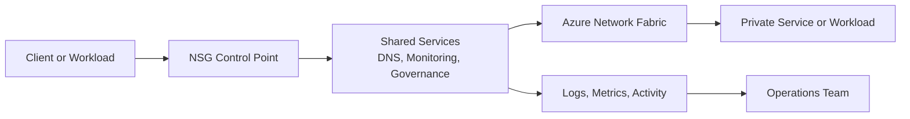

---
hide:
  - toc
---

# NSG and Firewall Best Practices

Layered filtering in Azure works best when NSGs provide local segmentation and Azure Firewall or an approved appliance provides centralized inspection where needed.

## Why This Matters

Security controls should explain traffic outcomes, not obscure them.

In Azure, networking changes often look correct in the control plane while failing in the data plane. That is why good practices must combine architecture, CLI validation, and operational ownership.

Real-world incidents usually mix more than one factor: DNS, routes, NSGs, firewall policy, health probes, or hybrid dependencies. A strong practice guide makes those dependencies visible before the outage.

Use NSGs for local segmentation and Azure Firewall for centralized L3-L7 inspection where justified. Avoid rule duplication by using firewall policy hierarchy and readable rule collections. Validate probe traffic, platform dependencies, and DNS explicitly before tightening rules.



## Prerequisites

- Azure CLI 2.60 or later installed locally or in Azure Cloud Shell.
- Reader access to the current subscription and Contributor access in a lab subscription for hands-on changes.
- A shared naming convention for VNets, subnets, DNS zones, route tables, gateways, and firewall policies.
- A documented IP plan that includes Azure regions, on-premises ranges, partner networks, and future expansion.
- Diagnostic settings enabled for key networking resources so validation is based on evidence instead of assumptions.

## Recommended Practices

### Practice 1: Baseline nsg and firewall ownership and intent

**Why**: NSG and Firewall changes are safer when the team can explain who owns them, what good looks like, and how to validate results.

**Real-world scenario**: A production change affects nsg and firewall but no one knows whether the platform, security, or application team approves it. The delay becomes an outage multiplier.

**How**

- Tag shared resources with owner and environment.
- Write pre-change validation and rollback steps before touching production.
- Review design assumptions with application teams that depend on the path.

```bash
az resource show \
    --ids $RESOURCE_ID \
    --query "{id:id,name:name,type:type,tags:tags}"
```

**Validation**

- Resources expose clear ownership metadata.
- Runbooks identify the validation command set.
- Change reviewers agree on rollback criteria.

**Operator cue**: If ownership discovery takes longer than the change itself, governance is too implicit.

**Trade-off**: Ownership overhead is a small price for predictable operations.

### Practice 2: Validate from the data plane, not only from the portal

**Why**: Azure networking issues are often obvious only when tested from a real client path.

**Real-world scenario**: The portal shows healthy nsg and firewall configuration, but workloads still fail because the packet path or resolver path differs from assumptions.

**How**

- Test from representative subnets, not from an operator workstation only.
- Capture CLI evidence such as effective routes, NSGs, or connection state.
- Store validation artifacts with the change record.

```bash
az network watcher test-connectivity \
    --resource-group $RG \
    --source-resource $SOURCE_ID \
    --dest-address $DESTINATION_FQDN \
    --dest-port 443
```

**Validation**

- Tests run from a real source workload.
- Evidence is retained with timestamps.
- Operators can repeat the validation later.

**Operator cue**: A healthy portal state does not guarantee data-plane success.

**Trade-off**: More validation steps increase release discipline but reduce outage ambiguity.

### Practice 3: Standardize patterns before scale multiplies drift

**Why**: NSG and Firewall drift is manageable in one environment and painful in twenty.

**Real-world scenario**: A project invents its own pattern for nsg and firewall, then another team copies it with minor changes. Over time no one can tell which variant is authoritative.

**How**

- Create reusable templates and naming rules.
- Prefer shared policy objects where multiple environments need the same baseline.
- Review exceptions quarterly and retire temporary patterns that became permanent.

```bash
az resource list \
    --resource-group $RG \
    --query "[].{name:name,type:type,location:location}" \
    --output table
```

**Validation**

- Common resources follow the same naming pattern.
- Exceptions are documented and time-bounded.
- New teams can self-serve without inventing a new pattern.

**Operator cue**: The number of exception documents is a good signal of architectural drift.

**Trade-off**: Standardization reduces local autonomy but speeds safe delivery.

### Practice 4: Design for failure and rollback

**Why**: Healthy production networking assumes something will fail and makes recovery explicit.

**Real-world scenario**: A maintenance change to nsg and firewall appears simple, but restoring the previous state during a failed cutover becomes slow because no rollback steps were prepared.

**How**

- Record current state before change.
- Keep rollback commands as first-class documentation.
- Test failure scenarios in lower environments using the same operational pattern.

```bash
az resource show \
    --ids $RESOURCE_ID \
    --output json
```

**Validation**

- Known-good state is captured.
- Rollback commands are copy-paste ready.
- Teams know the criteria for reversal.

**Operator cue**: If rollback requires improvisation, incident time will expand quickly.

**Trade-off**: Rollback planning adds prep time but reduces blast radius.

### Practice 5: Monitor the control points that matter

**Why**: NSG and Firewall needs logs, metrics, and change history so incidents are evidence-based.

**Real-world scenario**: Operators know something broke but lack metrics or logs near the nsg and firewall control point, so they blame the nearest visible service instead.

**How**

- Enable diagnostic settings on the resources that enforce or influence behavior.
- Correlate activity log writes with workload symptoms.
- Build lightweight dashboards or query packs for the top incident types.

```bash
az monitor diagnostic-settings list \
    --resource $RESOURCE_ID
```

**Validation**

- Diagnostics exist before incident time.
- Activity logs are searchable by resource and time window.
- Query packs cover common failures.

**Operator cue**: If every incident begins with enabling logs, observability arrived too late.

**Trade-off**: Diagnostics cost money, but reactive blind spots cost more.

### Practice 6: Tie architecture choices to cost decisions

**Why**: NSG and Firewall designs often grow quietly expensive when every workload gets its own dedicated shared service equivalent.

**Real-world scenario**: A single team duplicates hubs, firewalls, or policy objects per environment because it feels safer. Later, the cost profile is far higher than the risk justified.

**How**

- Estimate deployment, processing, and cross-network traffic costs for the selected pattern.
- Use dedicated components only when compliance, isolation, or scale truly requires them.
- Review whether simpler direct patterns meet the same requirement.

```bash
az consumption usage list \
    --start-date 2026-04-01 \
    --end-date 2026-04-30
```

**Validation**

- Cost review accompanies architecture review.
- Shared services are intentionally centralized or intentionally isolated.
- Teams can explain major networking spend drivers.

**Operator cue**: If cost shows up only after go-live, architecture review missed an essential dimension.

**Trade-off**: FinOps discipline may constrain design freedom but prevents expensive sprawl.

## Common Mistakes / Anti-Patterns

### Anti-Pattern 1: Leaving behavior implicit

**What happens**: Teams cannot explain how nsg and firewall is supposed to work during an incident.

**Why it is wrong**: Implicit design depends on tribal knowledge and fails under pressure.

**Correct approach**: Document intent, ownership, and validation steps.

```bash
az resource show \
    --ids $RESOURCE_ID
```

### Anti-Pattern 2: Treating temporary exceptions as permanent

**What happens**: The estate contains old rules or routes that nobody wants to touch.

**Why it is wrong**: Temporary emergency fixes become long-term risk and cost drivers.

**Correct approach**: Add expiry dates and remove exceptions after stabilization.

```bash
az resource list \
    --tag Environment=prod \
    --output table
```

### Anti-Pattern 3: Skipping post-change verification

**What happens**: Control-plane changes to nsg and firewall complete successfully but break application behavior.

**Why it is wrong**: Provisioning success is not runtime success.

**Correct approach**: Always validate from a representative client path.

```bash
az network watcher test-connectivity \
    --resource-group $RG \
    --source-resource $SOURCE_ID \
    --dest-address $DESTINATION_IP \
    --dest-port 443
```

### Anti-Pattern 4: Over-centralizing without service levels

**What happens**: Shared networking services become bottlenecks or single points of operational delay.

**Why it is wrong**: Centralization without staffing, observability, and runbooks creates governance friction.

**Correct approach**: Define support models and failure ownership for shared services.

```bash
az resource show \
    --ids $RESOURCE_ID \
    --query tags
```

## Performance Optimization Tips

- Measure baseline latency before and after every architectural change so optimization is data driven.
- Keep packet paths simple for critical applications and reduce unnecessary middleboxes where policy allows.
- Use regional affinity and dedicated subnets or policies for high-throughput paths.
- Test scaling behavior, not only steady-state connectivity.
- Review DNS lookup time, TLS handshake time, and transport latency separately to avoid false diagnoses.

## Security Considerations

- Use RBAC and change control to protect shared networking resources.
- Prefer private access patterns and least-privilege policy over broad temporary openings.
- Alert on route, DNS, NSG, firewall, and gateway changes that affect production.
- Separate management access from application access where practical.
- Document exception owners and expiry dates.

## Cost Optimization Strategies

- Understand which architecture components charge for deployment hours, data processed, and diagnostic retention.
- Centralize shared services where that reduces duplication without creating a dangerous bottleneck.
- Tune diagnostic collection to preserve useful evidence without storing redundant data forever.
- Retire stale policies, zones, and connections after decommissioning projects.
- Review traffic patterns to avoid paying for unnecessary transit or inspection hops.

## Validation Checklist

- [ ] The design has a documented owner.
- [ ] CLI validation exists for the most critical control points.
- [ ] The data plane behavior is tested from a representative workload.
- [ ] DNS, routing, and security assumptions are explicitly documented.
- [ ] Observability is enabled before production cutover.
- [ ] Rollback steps exist for major changes.
- [ ] Cost impact is reviewed during design approval.
- [ ] Security exceptions have owners and expiry dates.
- [ ] Runbooks link to the relevant troubleshooting playbooks.
- [ ] The current architecture diagram reflects the deployed environment.

## Design Review Questions

- What will break first if this design has to scale by 3x within one quarter?
- Which team owns the first-response investigation when this control fails?
- Which dependency still relies on public resolution or public ingress?
- How is the current state validated from a representative workload?
- What telemetry proves the healthy baseline today?
- What rollback step is fastest if the next change window goes badly?
- Which security exception is still waiting for retirement?
- What is the cost driver if this pattern is copied to ten more environments?
- Which dependency crosses a trust boundary and therefore needs explicit monitoring?
- Where could DNS and routing assumptions drift apart?
- Which runbook would a new operator follow during a 2 a.m. outage?
- Does the diagram still match deployed resources and names?
- Which validations are automated and which still depend on manual checks?
- What would an application team misunderstand about this design?
- Which hidden dependency would appear only during failover or maintenance?

## See Also

- [Network Security Basics](../platform/network-security-basics.md)
- [Configure Nsg](../operations/configure-nsg.md)
- [Nsg Vs Udr Vs Firewall](../troubleshooting/playbooks/routing/nsg-vs-udr-vs-firewall.md)
- [Load Balancing Options](../platform/load-balancing-options.md)

## Sources

- [overview](https://learn.microsoft.com/en-us/azure/firewall/overview)
- [network-security-groups-overview](https://learn.microsoft.com/en-us/azure/virtual-network/network-security-groups-overview)
- [policy-overview](https://learn.microsoft.com/en-us/azure/firewall-manager/policy-overview)
