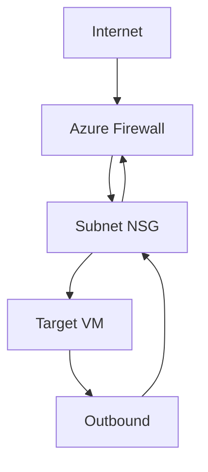

# NSG and Firewall Best Practices

Layered security ensures that even if one control fails, others provide protection. Combine Network Security Groups (NSGs) with Azure Firewall for depth-of-defense.

| Service | Responsibility | Best Practice |
| :--- | :--- | :--- |
| NSG | L3/L4 Subnet Isolation | Use Service Tags. Avoid "Any" source/destination. |
| Azure Firewall | L4-L7 Central Filter | Use FQDN filtering. Log to Log Analytics. |
| ASG | Workload Logical Grouping | Group VMs by role (e.g., Web, SQL) for rules. |

!!! tip
    Always check Effective Security Rules in the Azure Portal or via CLI to see the final resulting policy applied to a NIC.

## Validation Checks

| Check | Expected Result |
| :--- | :--- |
| NSG rule review | Deny-by-default and explicit allow rules only |
| Firewall log review | Required flows allowed and denied flows justified |

## See Also
- [Network Security Basics](../platform/network-security-basics.md)
- [Configure NSG](../operations/configure-nsg.md)
- [NSG vs UDR vs Firewall](../troubleshooting/nsg-vs-udr-vs-firewall.md)

## Sources

- [Azure network security best practices](https://learn.microsoft.com/en-us/azure/security/fundamentals/network-best-practices)
- [How Azure Firewall and NSGs work together](https://learn.microsoft.com/en-us/azure/firewall/firewall-faq#how-does-azure-firewall-work-with-network-security-groups)
