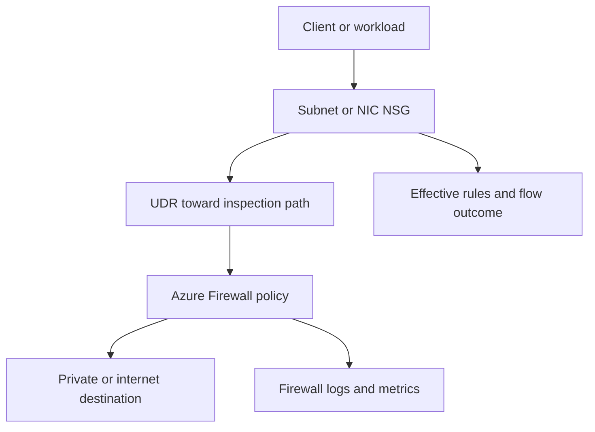

---
content_sources:
  diagrams:
    - id: why-this-matters
      type: flowchart
      source: mslearn-adapted
      based_on:
        - https://learn.microsoft.com/en-us/azure/virtual-network/network-security-groups-overview
        - https://learn.microsoft.com/en-us/azure/firewall/overview
        - https://learn.microsoft.com/en-us/azure/firewall-manager/policy-overview
content_validation:
  status: verified
  last_reviewed: 2026-07-25
  reviewer: agent
  core_claims:
    - claim: Network security groups contain security rules that allow or deny inbound and outbound traffic to resources in Azure virtual networks.
      source: https://learn.microsoft.com/en-us/azure/virtual-network/network-security-groups-overview
      verified: true
    - claim: Azure Firewall is a cloud-native and intelligent network firewall security service, and Firewall Policy is the recommended way to manage rules at scale.
      source: https://learn.microsoft.com/en-us/azure/firewall/overview
      verified: true
---
# NSG and Firewall Best Practices

NSGs and Azure Firewall should answer different questions: NSGs define local subnet or NIC segmentation, while Azure Firewall or a comparable central control point governs shared inspection, egress policy, and cross-network enforcement.

## Why This Matters

Most production networking incidents are not caused by a missing rule. They are caused by unclear rule intent, overlapping enforcement layers, or a team that cannot explain which control denied the packet.

Azure makes this easy to get wrong because NSGs, firewall policy, route tables, probes, and service dependencies all interact. Good practice is not "add more rules." It is to make each layer legible, stateful behavior understood, and validation repeatable.

<!-- diagram-id: why-this-matters -->

```mermaid
flowchart TD
    Client[Client or workload] --> NSG[Subnet or NIC NSG]
    NSG --> Route[UDR toward inspection path]
    Route --> Firewall[Azure Firewall policy]
    Firewall --> Destination[Private or internet destination]
    Firewall --> Logs[Firewall logs and metrics]
    NSG --> FlowState[Effective rules and flow outcome]
```

## Recommended Practices

### Use NSGs for local intent and Firewall Policy for shared intent

- Keep subnet-level NSGs focused on trust-boundary segmentation, health probes, and local east-west controls.
- Keep shared egress, shared ingress filtering, and organization-wide deny logic in Firewall Policy.
- Do not duplicate the same allowlist in both layers unless the duplicate is deliberate and documented.

```bash
az network nsg show \
    --resource-group $RG \
    --name $NSG_NAME \
    --query "{name:name,securityRules:securityRules[].{name:name,priority:priority,access:access,direction:direction,destinationPortRange:destinationPortRange}}"

az network firewall policy show \
    --resource-group $RG \
    --name $FIREWALL_POLICY_NAME
```

| Command | Purpose |
| --- | --- |
| `az network nsg show` | Show NSG rules and their priorities. |
| `--resource-group` | Resource group that contains the NSG. |
| `--name` | NSG to inspect. |
| `--query` | JMESPath projection for the rules that explain traffic intent. |
| `az network firewall policy show` | Show the firewall policy that governs shared inspection. |
| `--resource-group` | Resource group that contains the firewall policy. |
| `--name` | Firewall policy to inspect. |

### Write rule names for operator intent, not ticket history

- Name rules so incident responders can understand them without opening a change record.
- Keep priorities spaced enough that emergency inserts do not require complete re-numbering.
- Record which platform dependencies must stay allowed, including health probes, DNS, identity, and management traffic.

### Validate stateful behavior and flow outcome after every change window

- Remember that NSGs and Azure Firewall are stateful. Existing flows may survive while new flows fail, which can hide bad changes.
- Validate new sessions after rule changes instead of assuming established connections prove success.
- Use effective-rule and flow-testing tools from the workload's perspective.

```bash
az network nic list-effective-nsg \
    --resource-group $RG \
    --name $NIC_NAME

az network watcher test-ip-flow \
    --resource-group $RG \
    --vm $VM_NAME \
    --direction Outbound \
    --protocol TCP \
    --local 10.0.0.4:40000 \
    --remote 198.51.100.10:443
```

| Command | Purpose |
| --- | --- |
| `az network nic list-effective-nsg` | Show the effective NSG rules applied to a workload NIC. |
| `--resource-group` | Resource group that contains the NIC. |
| `--name` | NIC to inspect. |
| `az network watcher test-ip-flow` | Evaluate whether Azure allows or denies a test flow and which rule applies. |
| `--resource-group` | Resource group that contains the VM. |
| `--vm` | Virtual machine used for the test flow. |
| `--direction` | Traffic direction to evaluate. |
| `--protocol` | Transport protocol to evaluate. |
| `--local` | Local source IP and port for the simulated flow. |
| `--remote` | Remote destination IP and port for the simulated flow. |

### Keep routing and filtering reviews together

- Review route tables and firewall policy together whenever the subnet is expected to traverse a central inspection point.
- Treat a missing UDR as just as serious as a missing deny rule because either can bypass policy.
- Capture one evidence bundle that includes route intent, effective NSGs, and firewall outcome.

### Design layered controls around clear exceptions

- Allow health probes, DNS resolution, identity endpoints, and management dependencies explicitly when a service requires them.
- Prefer a short list of approved exception patterns over ad hoc one-off rules.
- Re-test after platform SKU or subnet changes because dependency paths often shift with topology changes.

## Common Mistakes / Anti-Patterns

- Copying the same allow rules into every NSG and every firewall collection until no one knows which layer matters.
- Naming rules after tickets or initials instead of traffic purpose.
- Assuming one successful session proves a new policy works for fresh connections.
- Blocking probe or DNS traffic because it was mistaken for unused background traffic.
- Sending traffic around the firewall with a route-table exception that was never reviewed by the security owner.

## Validation Checklist

- [ ] NSGs and Firewall Policy have distinct, non-duplicative responsibilities.
- [ ] Rule names explain business or platform intent.
- [ ] Effective NSG and flow-test evidence exists for representative workloads.
- [ ] Route tables still send inspected traffic through the intended firewall path.
- [ ] Required platform dependencies are explicitly allowed and documented.

## See Also

- [Routing Best Practices](routing-best-practices.md)
- [Observability Best Practices](observability-best-practices.md)
- [Configure NSG](../operations/configure-nsg.md)
- [Connectivity Failures](../troubleshooting/playbooks/connectivity-failures.md)

## Sources

- [Network security groups](https://learn.microsoft.com/en-us/azure/virtual-network/network-security-groups-overview)
- [Azure Firewall overview](https://learn.microsoft.com/en-us/azure/firewall/overview)
- [Firewall Policy overview](https://learn.microsoft.com/en-us/azure/firewall-manager/policy-overview)
