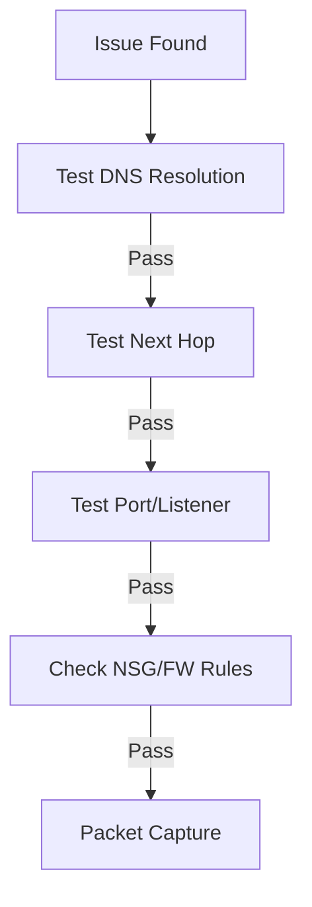

# Observability Best Practices

Proactive monitoring and structured troubleshooting minimize downtime. Use the Azure Network Watcher suite for deep visibility into traffic and connectivity.

| Symptom | Tool | What It Shows |
| :--- | :--- | :--- |
| DNS Failure | nslookup / dig | Resolve FQDN to IP using specific DNS server |
| Route Issue | Next Hop | The actual route path traffic is taking |
| Connection Drop | IP Flow Verify | Which NSG rule is blocking the traffic |
| Latency | Connection Monitor | Continuous tests of latency and path health |
| Traffic Analysis | VNet Flow Logs | Source/Dest IP, port, and protocol breakdown |

!!! tip
    Narrow down the problem to DNS, Route, Port, or Listener before initiating a complex packet capture. Most issues are found in the first three layers.

## Validation Checks

| Check | Expected Result |
| :--- | :--- |
| Connection Monitor scope | Critical paths covered with baseline latency |
| Flow logs retention | Sufficient retention for incident investigation |

## See Also
- [Monitor Network Paths](../operations/monitor-network-paths.md)
- [Packet Capture and Diagnostics](../operations/packet-capture-and-diagnostics.md)
- [Latency and Packet Loss](../troubleshooting/latency-and-packet-loss.md)

## Sources

- [What is Azure Network Watcher?](https://learn.microsoft.com/en-us/azure/network-watcher/network-watcher-overview)
- [Troubleshoot connections with Azure Network Watcher](https://learn.microsoft.com/en-us/azure/network-watcher/network-watcher-connectivity-overview)
