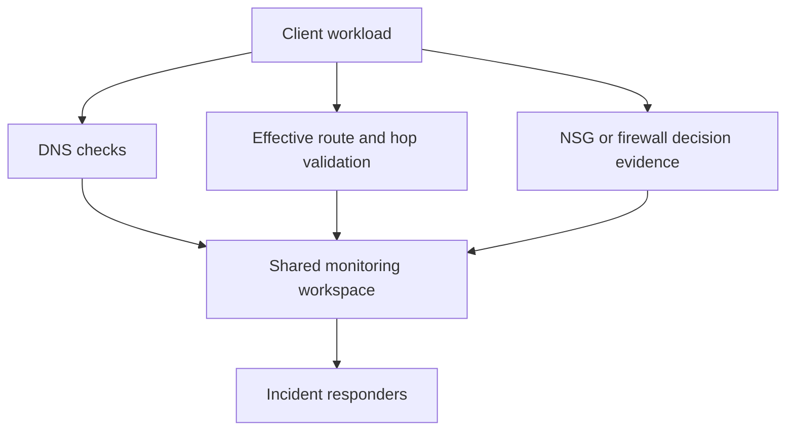

---
content_sources:
  diagrams:
    - id: why-this-matters
      type: flowchart
      source: mslearn-adapted
      based_on:
        - https://learn.microsoft.com/en-us/azure/network-watcher/network-watcher-overview
        - https://learn.microsoft.com/en-us/azure/network-watcher/connection-monitor-overview
        - https://learn.microsoft.com/en-us/azure/azure-monitor/essentials/diagnostic-settings
content_validation:
  status: verified
  last_reviewed: 2026-07-25
  reviewer: agent
  core_claims:
    - claim: Azure Network Watcher provides tools to monitor, diagnose, and gain insights into network performance and health in Azure.
      source: https://learn.microsoft.com/en-us/azure/network-watcher/network-watcher-overview
      verified: true
    - claim: Connection Monitor monitors communication between endpoints in Azure and from Azure to hybrid endpoints.
      source: https://learn.microsoft.com/en-us/azure/network-watcher/connection-monitor-overview
      verified: true
---
# Observability Best Practices

Azure networking observability should let operators prove the packet path, correlate control-plane changes, and decide quickly whether the problem is DNS, routing, filtering, probes, or the destination itself.

## Why This Matters

Networking outages get expensive when every team starts from a different data source. One person opens metrics, another checks peering, another inspects a DNS zone, and nobody can explain the path end to end.

The right observability guidance makes Network Watcher, Connection Monitor, metrics, diagnostic logs, and packet-path validation part of the normal operating model before an incident starts.

<!-- diagram-id: why-this-matters -->

```mermaid
flowchart TD
    Workload[Client workload] --> DNS[DNS checks]
    Workload --> Route[Effective route and hop validation]
    Workload --> Flow[NSG or firewall decision evidence]
    DNS --> Workspace[Shared monitoring workspace]
    Route --> Workspace
    Flow --> Workspace
    Workspace --> Operators[Incident responders]
```

## Recommended Practices

### Build one investigation path for DNS, routing, and filtering evidence

- Send diagnostic settings and activity logs for shared networking resources to the same monitoring workspace where practical.
- Keep dashboards and saved queries organized around incident questions such as "did the path change?" and "which layer denied the flow?"
- Make sure operators know where to find both configuration evidence and runtime evidence.

```bash
az monitor diagnostic-settings list \
    --resource $RESOURCE_ID

az monitor metrics list \
    --resource $RESOURCE_ID \
    --metric $METRIC_NAMES \
    --interval PT5M
```

| Command | Purpose |
| --- | --- |
| `az monitor diagnostic-settings list` | Show whether the resource is sending logs and metrics to an observability destination. |
| `--resource` | Resource ID to inspect. |
| `az monitor metrics list` | Query runtime metrics for the networking resource. |
| `--resource` | Resource ID to query. |
| `--metric` | Metric names to retrieve. |
| `--interval` | Aggregation interval for the metric query. |

### Use active path validation, not only passive dashboards

- Run Connection Monitor or equivalent synthetic checks for critical hub, private endpoint, and hybrid dependencies.
- Preserve a small set of known-good test paths so operators can compare normal and abnormal behavior quickly.
- Re-run synthetic tests after peering, firewall, DNS, or route changes.

```bash
az network watcher test-connectivity \
    --resource-group $RG \
    --source-resource $SOURCE_RESOURCE_ID \
    --dest-address $DESTINATION_FQDN \
    --dest-port 443

az network watcher show-topology \
    --resource-group $RG
```

| Command | Purpose |
| --- | --- |
| `az network watcher test-connectivity` | Test end-to-end connectivity from a workload to a target service. |
| `--resource-group` | Resource group that contains the source resource. |
| `--source-resource` | Resource ID of the workload that originates the test. |
| `--dest-address` | Target IP address or FQDN. |
| `--dest-port` | Destination port to test. |
| `az network watcher show-topology` | Visualize network relationships in the resource group during triage. |
| `--resource-group` | Resource group whose topology is inspected. |

### Make packet-path evidence easy to collect during incidents

- Decide ahead of time which team can run effective-route, effective-NSG, and packet-path validation commands.
- Pair connection tests with route and policy evidence so teams do not misclassify the failure domain.
- Keep short runbooks for the top incident types: private endpoint failure, hub transit failure, probe failure, and hybrid reachability loss.

### Keep flow logging decisions current

- If you rely on flow-level evidence, decide which resources need it and where that data will be retained and queried.
- Review NSG flow logging or its replacement plan alongside metrics and packet capture strategy so the estate does not drift into partial visibility.
- Align retention with the time window in which networking incidents are usually investigated.

### Prefer observable baselines over ad hoc troubleshooting

- Keep one representative workload per major network segment that can run path tests safely.
- Capture pre-change and post-change evidence during maintenance windows so later incidents have a known-good reference.
- Treat a networking change without observable baseline data as operational debt.

## Common Mistakes / Anti-Patterns

- Sending logs to multiple disconnected workspaces so teams cannot correlate DNS, routing, and firewall evidence.
- Using only control-plane screenshots and calling the system "healthy."
- Running one-off packet tests during incidents without any baseline to compare against.
- Enabling flow or diagnostic data after the incident starts.
- Keeping metrics without any active test path for critical dependencies.

## Validation Checklist

- [ ] Shared networking resources send diagnostics to a known workspace or evidence destination.
- [ ] Critical paths have active connectivity tests, not only dashboards.
- [ ] Operators can gather route, policy, and connectivity evidence from the same workload perspective.
- [ ] Flow-level evidence strategy is documented for segments that require it.
- [ ] Pre-change and post-change path-validation evidence is retained for important network changes.

## See Also

- [Routing Best Practices](routing-best-practices.md)
- [Nsg And Firewall Best Practices](nsg-and-firewall-best-practices.md)
- [Monitor Network Paths](../operations/monitor-network-paths.md)
- [First 10 Minutes](../troubleshooting/first-10-minutes/index.md)

## Sources

- [Azure Network Watcher overview](https://learn.microsoft.com/en-us/azure/network-watcher/network-watcher-overview)
- [Connection Monitor overview](https://learn.microsoft.com/en-us/azure/network-watcher/connection-monitor-overview)
- [Diagnostic settings in Azure Monitor](https://learn.microsoft.com/en-us/azure/azure-monitor/essentials/diagnostic-settings)
