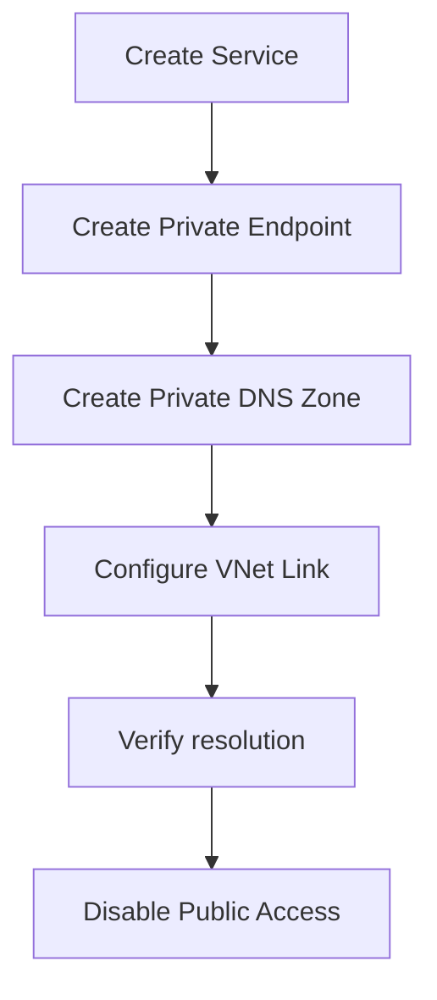

# Private Endpoint Best Practices

Private Endpoints provide secure, private connectivity to Azure services. Success depends on correct DNS configuration and subnet policies.

| Step | Action | Description |
| :--- | :--- | :--- |
| DNS Zone | Create Private DNS Zone | Matches the service type (e.g., privatelink.blob.core.windows.net) |
| Linkage | VNet Link | Link the DNS zone to all VNets that need to resolve the endpoint. |
| Verification | nslookup check | Ensure the service FQDN resolves to the Private IP, not Public. |
| Security | NSG Policy | Enable "Private Endpoint Network Policies" on the subnet if needed. |
| Routing | Route Propagation | Check that the Private IP is reachable from all relevant VNets. |

!!! warning
    A Private Endpoint without correct DNS is unusable. Applications will continue attempting to connect to the public IP if they cannot resolve the private IP.

## Validation Checks

| Check | Expected Result |
| :--- | :--- |
| DNS validation | Service FQDN resolves to private endpoint IP |
| Public access lock-down | Public network access disabled after cutover |

## See Also
- [Private Connectivity Options](../platform/private-connectivity-options.md)
- [Connect Private Endpoints](../operations/connect-private-endpoints.md)
- [Cannot Reach Private Endpoint](../troubleshooting/playbooks/connectivity/cannot-reach-private-endpoint.md)

## Sources

- [What is an Azure Private Endpoint?](https://learn.microsoft.com/en-us/azure/private-link/private-endpoint-overview)
- [Azure Private Endpoint DNS configuration](https://learn.microsoft.com/en-us/azure/private-link/private-endpoint-dns)
