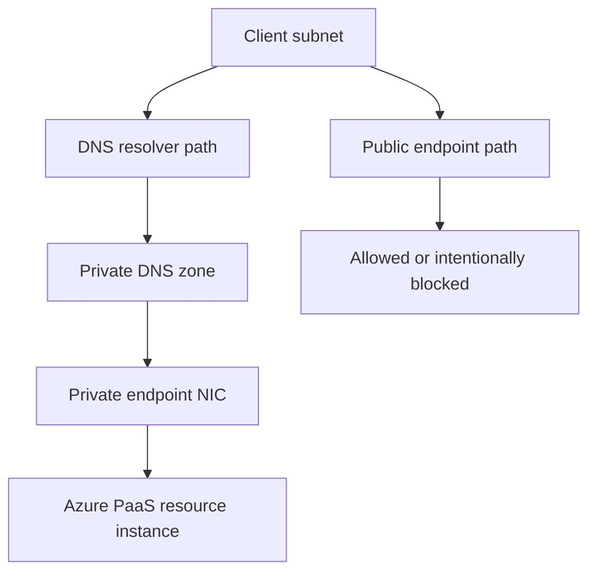

---
content_sources:
  diagrams:
    - id: why-this-matters
      type: flowchart
      source: mslearn-adapted
      based_on:
        - https://learn.microsoft.com/en-us/azure/private-link/private-endpoint-overview
        - https://learn.microsoft.com/en-us/azure/private-link/private-endpoint-dns
        - https://learn.microsoft.com/en-us/azure/storage/common/storage-private-endpoints
content_validation:
  status: verified
  last_reviewed: 2026-07-25
  reviewer: agent
  core_claims:
    - claim: A private endpoint assigns a private IP address from your virtual network to a specific Azure resource instance.
      source: https://learn.microsoft.com/en-us/azure/private-link/private-endpoint-overview
      verified: true
    - claim: Private endpoint deployments depend on DNS so that clients resolve the service name to the private endpoint address.
      source: https://learn.microsoft.com/en-us/azure/private-link/private-endpoint-dns
      verified: true
---
# Private Endpoint Best Practices

Private Endpoint guidance must cover the whole consumer path: endpoint approval, subnet placement, private DNS, public-access interaction, and service-specific subresource expectations.

## Why This Matters

Private Endpoint incidents often look deceptive. The private endpoint resource shows `Approved`, yet workloads still fail because the wrong clients resolve the private name, the public endpoint is still being used, or the service-specific subresource was never added.

That means good practice is not just "deploy a private endpoint." It is to make split-horizon DNS, consumer-network validation, and service-specific caveats part of the design from the start.

<!-- diagram-id: why-this-matters -->

```mermaid
flowchart TD
    Client[Client subnet] --> Resolver[DNS resolver path]
    Resolver --> PrivateZone[Private DNS zone]
    PrivateZone --> PrivateEndpoint[Private endpoint NIC]
    PrivateEndpoint --> Resource[Azure PaaS resource instance]
    Client --> PublicPath[Public endpoint path]
    PublicPath --> Decision[Allowed or intentionally blocked]
```

## Recommended Practices

### Treat private DNS as part of the deployment, not as follow-up work

- Create or reuse the correct private DNS zone and zone group in the same change window as the endpoint.
- Validate which VNets, on-premises resolvers, and build agents must consume the private answer.
- Keep a single owner for each private namespace so duplicate zones do not drift across subscriptions.

```bash
az network private-endpoint show \
    --resource-group $RG \
    --name $PRIVATE_ENDPOINT_NAME \
    --query "{customDnsConfigs:customDnsConfigs,networkInterfaces:networkInterfaces}"

az network private-endpoint dns-zone-group list \
    --resource-group $RG \
    --endpoint-name $PRIVATE_ENDPOINT_NAME
```

| Command | Purpose |
| --- | --- |
| `az network private-endpoint show` | Show the endpoint NIC and DNS metadata created with the private endpoint. |
| `--resource-group` | Resource group that contains the private endpoint. |
| `--name` | Private endpoint to inspect. |
| `--query` | JMESPath projection for DNS config and NIC references. |
| `az network private-endpoint dns-zone-group list` | List the DNS zone groups attached to the private endpoint. |
| `--resource-group` | Resource group that contains the private endpoint. |
| `--endpoint-name` | Private endpoint whose zone groups are inspected. |

### Design split-horizon behavior explicitly

- Decide which networks must resolve the public name and which must resolve the private address.
- Keep public access decisions aligned with client design; do not leave the public endpoint unintentionally reachable from unmanaged networks.
- Document whether fallback to the public path is allowed, blocked, or used only during migration.

### Validate from every required consumer network

- Test from each VNet, on-premises segment, and automation environment that consumes the service.
- Do not accept portal success as proof of runtime success; runtime success comes from DNS plus packet path together.
- Keep one validation note per consumer group so outages can be scoped quickly later.

```bash
az network private-dns link vnet list \
    --resource-group $RG \
    --zone-name $PRIVATE_DNS_ZONE_NAME \
    --output table

az network watcher test-connectivity \
    --resource-group $RG \
    --source-resource $SOURCE_RESOURCE_ID \
    --dest-address $DESTINATION_FQDN \
    --dest-port 443
```

| Command | Purpose |
| --- | --- |
| `az network private-dns link vnet list` | List the VNet links for the private DNS zone. |
| `--resource-group` | Resource group that contains the private DNS zone. |
| `--zone-name` | Private DNS zone to inspect. |
| `--output` | Output format for reviewing the links. |
| `az network watcher test-connectivity` | Test end-to-end private reachability from a consuming workload. |
| `--resource-group` | Resource group that contains the source resource. |
| `--source-resource` | Resource ID of the consuming workload. |
| `--dest-address` | Service FQDN that should resolve privately. |
| `--dest-port` | Destination port to test. |

### Capture service-specific caveats before rollout

- Storage, SQL, Key Vault, and other Private Link-enabled services use different private DNS zones and subresources; verify the right one for each connection.
- Separate endpoint lifecycle from application deployment lifecycle so endpoint approval and DNS stabilization do not surprise an application cutover.
- Reserve subnet capacity for additional endpoints instead of treating endpoint IP growth as an afterthought.

### Keep deletion and rollback as first-class workflows

- Record how to remove stale private endpoints, zone links, and approvals cleanly.
- Make sure rollback notes say whether clients should return to the public endpoint or wait for private DNS repair.
- Review old endpoints regularly so consumers do not resolve to abandoned private IPs.

## Common Mistakes / Anti-Patterns

- Creating the private endpoint first and leaving DNS to a later ticket.
- Assuming one consumer VNet proving success means all consumer networks are wired correctly.
- Leaving the public endpoint path undocumented during a private cutover.
- Reusing the wrong subresource or private DNS zone for the target service.
- Mixing private endpoint cleanup with unrelated application teardown so stale DNS and approvals remain.

## Validation Checklist

- [ ] Private endpoint, zone group, and required private DNS links are deployed together.
- [ ] Public-path behavior is documented for every consumer group.
- [ ] Validation covers all required consumer networks, not just the endpoint subnet.
- [ ] Service-specific DNS zones and subresources are correct.
- [ ] Rollback notes explain how clients recover if private resolution fails.

## See Also

- [Dns Best Practices](dns-best-practices.md)
- [Subnet Design Best Practices](subnet-design-best-practices.md)
- [Connect Private Endpoints](../operations/connect-private-endpoints.md)
- [DNS Resolution Failures](../troubleshooting/playbooks/dns/dns-resolution-failures.md)

## Sources

- [What is a private endpoint?](https://learn.microsoft.com/en-us/azure/private-link/private-endpoint-overview)
- [Azure Private Endpoint DNS configuration](https://learn.microsoft.com/en-us/azure/private-link/private-endpoint-dns)
- [Use private endpoints for Azure Storage](https://learn.microsoft.com/en-us/azure/storage/common/storage-private-endpoints)
