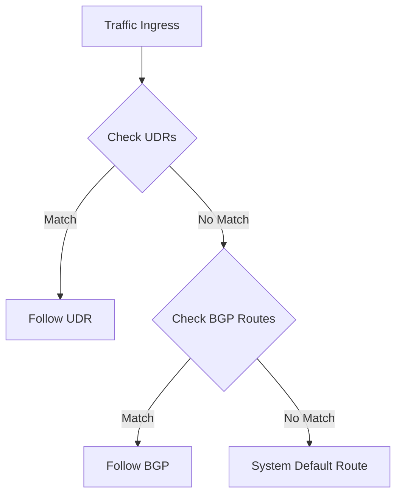

# Routing Best Practices

Control traffic flow within your VNets and to external destinations using User-Defined Routes (UDRs). Proper routing prevents asymmetric flows and unexpected traffic drops.

| Do | Don't |
| :--- | :--- |
| Use UDRs for Hub-and-Spoke NVA traffic | Use UDRs for every single subnet without a reason |
| Plan for Gateway Propagation | Forget that Azure first uses longest prefix match; when prefixes are equal, route priority is UDR > BGP > system. Virtual network, peering, and service endpoint system routes are preferred. |
| Check for Asymmetric Routing | Send traffic to an NVA without a return route |
| Monitor Next-Hop validity | Ignore the Routing Evaluation Order |

!!! note
    Don't confuse routing issues with NSG issues. Use Network Watcher "Next Hop" to verify the route path before checking security rules.

## Validation Checks

| Check | Expected Result |
| :--- | :--- |
| Effective routes | Expected UDR/BGP/system route selected for each prefix |
| Return path test | No asymmetric routing for inspected traffic |

## See Also
- [Routing Basics](../platform/routing-basics.md)
- [Configure UDR](../operations/configure-udr.md)
- [Routing Cheatsheet](../reference/routing-cheatsheet.md)

## Sources

- [Virtual network traffic routing](https://learn.microsoft.com/en-us/azure/virtual-network/virtual-networks-udr-overview)
- [Diagnose a virtual network routing problem](https://learn.microsoft.com/en-us/azure/virtual-network/diagnose-network-routing-problem)
