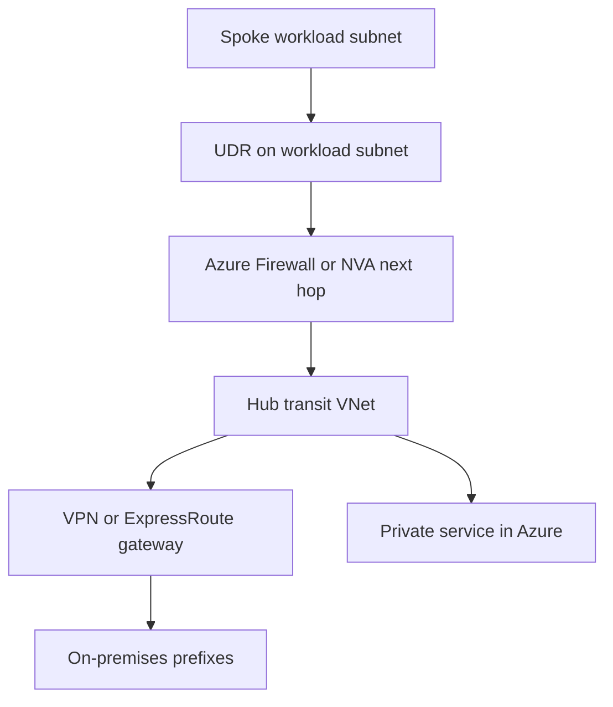

---
content_sources:
  diagrams:
    - id: why-this-matters
      type: flowchart
      source: mslearn-adapted
      based_on:
        - https://learn.microsoft.com/en-us/azure/virtual-network/virtual-networks-udr-overview
        - https://learn.microsoft.com/en-us/azure/virtual-network/diagnose-network-routing-problem
        - https://learn.microsoft.com/en-us/azure/virtual-network/virtual-network-peering-overview
content_validation:
  status: verified
  last_reviewed: 2026-07-25
  reviewer: agent
  core_claims:
    - claim: Azure creates default system routes for each subnet, and user-defined routes can override Azure's default routing behavior for matching traffic.
      source: https://learn.microsoft.com/en-us/azure/virtual-network/virtual-networks-udr-overview
      verified: true
    - claim: Network Watcher can diagnose routing problems and expose the effective routes applied to a virtual machine NIC.
      source: https://learn.microsoft.com/en-us/azure/virtual-network/diagnose-network-routing-problem
      verified: true
---
# Routing Best Practices

Routing guidance in Azure should explain exactly why a packet takes one path, what can change that path, and how operators prove the result after each change.

## Why This Matters

Routing mistakes rarely fail loudly. They usually show up as partial reachability, asymmetric return traffic, appliance bypass, or a spoke that works until a peering or gateway change lands elsewhere.

Hub-and-spoke designs make this sharper. A route table, gateway propagation change, or peering setting in one network can change how another subnet reaches on-premises, a firewall, or a private service. Teams need routing guidance that is explicit about precedence, transit intent, and verification.

<!-- diagram-id: why-this-matters -->

```mermaid
flowchart TD
    Workload[Spoke workload subnet] --> UDR[UDR on workload subnet]
    UDR --> Firewall[Azure Firewall or NVA next hop]
    Firewall --> Hub[Hub transit VNet]
    Hub --> Gateway[VPN or ExpressRoute gateway]
    Hub --> PrivateService[Private service in Azure]
    Gateway --> OnPrem[On-premises prefixes]
```

## Recommended Practices

### Make route intent explicit at subnet boundaries

- Treat every route table as a contract for a specific subnet purpose, not as a generic shared object.
- Document whether the subnet should use internet egress, hub transit, forced tunneling, or direct private reachability.
- Keep one owner for each route table so emergency changes do not create competing next-hop logic.

```bash
az network route-table show \
    --resource-group $RG \
    --name $ROUTE_TABLE_NAME \
    --query "{name:name,disableBgpRoutePropagation:disableBgpRoutePropagation,routes:routes[].{name:name,addressPrefix:addressPrefix,nextHopType:nextHopType,nextHopIpAddress:nextHopIpAddress}}"
```

| Command | Purpose |
| --- | --- |
| `az network route-table show` | Show a route table and the routes it enforces. |
| `--resource-group` | Resource group that contains the route table. |
| `--name` | Route table to inspect. |
| `--query` | JMESPath projection for BGP propagation state and route details. |

### Design for asymmetric-path prevention, not just happy-path forwarding

- Send both forward and return traffic through the same inspection point when a firewall or NVA is part of the path.
- Re-check route intent after peering, gateway, or VPN changes because return traffic often changes first.
- Avoid mixing direct spoke-to-spoke reachability with appliance-enforced reachability unless the exception is deliberate and documented.

### Validate peering transit assumptions on real NICs

- Do not assume peering alone creates transitive routing through a hub. Azure VNet peering is non-transitive unless you deliberately add gateways or virtual appliances.
- Review `--allow-forwarded-traffic`, gateway transit, and remote gateway settings as part of every hub-and-spoke change.
- Test from a workload NIC in each trust zone instead of from an operator shell only.

```bash
az network nic show-effective-route-table \
    --resource-group $RG \
    --name $NIC_NAME

az network watcher test-connectivity \
    --resource-group $RG \
    --source-resource $SOURCE_RESOURCE_ID \
    --dest-address $DESTINATION_IP \
    --dest-port 443
```

| Command | Purpose |
| --- | --- |
| `az network nic show-effective-route-table` | Show the effective routes applied to a workload NIC. |
| `--resource-group` | Resource group that contains the NIC. |
| `--name` | NIC to inspect. |
| `az network watcher test-connectivity` | Test whether the route and downstream policy produce end-to-end connectivity. |
| `--resource-group` | Resource group that contains the source resource. |
| `--source-resource` | Resource ID of the workload that originates the test. |
| `--dest-address` | Destination IP address or FQDN to test. |
| `--dest-port` | Destination port to test. |

### Separate appliance paths from direct platform paths

- Use different route tables when some subnets must traverse Azure Firewall or an NVA while others can stay on platform routing.
- Keep next-hop IP ownership, health checks, and failover behavior documented with the route table, not in a separate incident note.
- Prefer a small number of predictable inspection paths over many slightly different exceptions.

### Review BGP propagation deliberately

- Disable BGP route propagation only when you can explain the exact prefixes that must be suppressed and the operational impact.
- Reconcile BGP-learned prefixes against UDR intent during hybrid change reviews.
- Treat "it still worked last month" as a warning sign that the path is not actually understood.

## Common Mistakes / Anti-Patterns

- Applying one catch-all route table to unrelated subnets with different egress or inspection requirements.
- Assuming hub peering provides automatic spoke-to-spoke or spoke-to-on-premises transit without explicit design.
- Testing only from the portal or only from a jump box instead of from representative source NICs.
- Changing gateway or peering settings without re-checking effective routes and return-path symmetry.
- Using undocumented NVA next hops that have no health, ownership, or rollback notes.

## Validation Checklist

- [ ] Every workload subnet has a documented routing intent and named route-table owner.
- [ ] Effective routes on representative NICs match the intended egress, transit, and inspection path.
- [ ] Peering and gateway settings are reviewed together when hub transit is in scope.
- [ ] Appliance paths are symmetric and have explicit rollback steps.
- [ ] Connectivity tests are captured before and after route changes.

## See Also

- [Network Design Baseline](network-design-baseline.md)
- [Hybrid Connectivity Best Practices](hybrid-connectivity-best-practices.md)
- [Configure UDR](../operations/configure-udr.md)
- [Connectivity Failures](../troubleshooting/playbooks/connectivity-failures.md)

## Sources

- [Azure virtual network traffic routing](https://learn.microsoft.com/en-us/azure/virtual-network/virtual-networks-udr-overview)
- [Diagnose a virtual machine routing problem](https://learn.microsoft.com/en-us/azure/virtual-network/diagnose-network-routing-problem)
- [Virtual network peering](https://learn.microsoft.com/en-us/azure/virtual-network/virtual-network-peering-overview)
