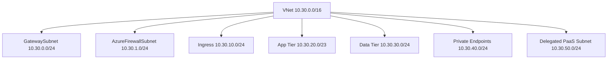

---
hide:
  - toc
---

# Subnet Design Best Practices

Subnet design in Azure is where architecture intent turns into enforceable boundaries for routing, policy, delegated services, and private connectivity.

## Why This Matters

Small or mixed-purpose subnets create hidden coupling. A simple NSG or route change can affect unrelated workloads, managed services, and incident recovery paths at the same time.

Azure services increasingly expect dedicated or well-sized subnets. Application Gateway, Azure Firewall, VPN Gateway, Bastion, private endpoints, and delegated platform services all behave better when subnet intent is explicit.

Subnet design also shapes how teams work. It determines who can deploy, who can attach policy, and how safely you can scale or troubleshoot each environment.



## Prerequisites

- Azure CLI 2.60 or later installed locally or in Azure Cloud Shell.
- Reader access to the current subscription and Contributor access in a lab subscription for hands-on changes.
- A shared naming convention for VNets, subnets, DNS zones, route tables, gateways, and firewall policies.
- A documented IP plan that includes Azure regions, on-premises ranges, partner networks, and future expansion.
- Diagnostic settings enabled for key networking resources so validation is based on evidence instead of assumptions.

## Recommended Practices

### Practice 1: Subnet by function and trust boundary

**Why**: Subnets should reflect traffic behavior and security posture rather than organization charts. Functional subnetting keeps policy readable and lowers blast radius.

**Real-world scenario**: A single shared subnet hosts jump boxes, app servers, and a delegated PaaS service. When the team tightens NSGs for the app tier, management access and platform health probes break at the same time.

**How**

- Create separate subnets for ingress, workloads, data, private endpoints, and platform services.
- Use environment-level segmentation when dev, test, and prod require different route tables or controls.
- Avoid placing manually managed VMs in service-specific reserved subnets such as GatewaySubnet or AzureFirewallSubnet.

```bash
az network vnet subnet create \
    --resource-group $RG \
    --vnet-name $VNET_NAME \
    --name app-tier \
    --address-prefixes 10.30.20.0/23

az network vnet subnet create \
    --resource-group $RG \
    --vnet-name $VNET_NAME \
    --name private-endpoints \
    --address-prefixes 10.30.40.0/24
```

**Validation**

- Each subnet has a single, clearly documented purpose.
- Routing and NSG intent is consistent across resources inside the same subnet.
- Platform-reserved subnets are not reused for unrelated workloads.

**Operator cue**: When one subnet needs more than one security model, it usually needs to become multiple subnets.

**Trade-off**: More subnets increase planning overhead but drastically reduce risky shared-policy changes.

### Practice 2: Size subnets for scale events and managed service requirements

**Why**: Subnet exhaustion often appears only during deployment spikes, platform upgrades, or private endpoint growth.

**Real-world scenario**: A delegated subnet for Container Apps is sized for the current node count only. During a scaling event, the platform cannot allocate enough IPs, and the service experiences delayed capacity recovery.

**How**

- Review Azure service subnet sizing requirements before assigning prefixes.
- Leave headroom for scale-out, rolling updates, maintenance operations, and future service endpoints or private endpoints.
- Use larger prefixes for subnets that host dynamic or rapidly growing services.

```bash
az network vnet subnet list \
    --resource-group $RG \
    --vnet-name $VNET_NAME \
    --query "[].{name:name,prefix:addressPrefix,delegations:delegations}" \
    --output table

az network vnet show \
    --resource-group $RG \
    --name $VNET_NAME \
    --query "addressSpace.addressPrefixes"
```

**Validation**

- Subnets hosting managed platforms have documented minimum and target sizes.
- IP utilization thresholds are monitored before exhaustion becomes critical.
- Growth plans reserve adjacent space where later expansion is likely.

**Operator cue**: If you can calculate only current IP usage and not future peak usage, the subnet is underspecified.

**Trade-off**: Larger subnets consume address space, but capacity surprises during production incidents cost more.

### Practice 3: Attach NSGs and route tables intentionally

**Why**: Subnet-level policy is powerful, but inconsistent attachment patterns create troubleshooting ambiguity and accidental open paths.

**Real-world scenario**: One subnet inherits a route table from the design standard, but another similar subnet does not. Only half of the application instances traverse the firewall, making the issue appear intermittent.

**How**

- Standardize which subnet types get route tables, which get NSGs, and where exceptions must be documented.
- Keep route tables aligned to trust zones so similar workloads follow similar next-hop logic.
- Validate effective NSG rules and effective routes after every change window, not only during incidents.

```bash
az network vnet subnet update \
    --resource-group $RG \
    --vnet-name $VNET_NAME \
    --name app-tier \
    --network-security-group $NSG_NAME \
    --route-table $ROUTE_TABLE_NAME

az network nic show-effective-nsg \
    --resource-group $RG \
    --name $NIC_NAME
```

**Validation**

- All subnets in the same trust boundary use the same attachment pattern.
- Effective rules and routes confirm intended behavior on representative NICs.
- Policy exceptions are documented with expiry dates and owners.

**Operator cue**: If the answer to "which subnets bypass inspection?" requires manual portal clicking, the design is too implicit.

**Trade-off**: Strict standards reduce flexibility, but they make outages much faster to triage.

### Practice 4: Separate private endpoints from application compute where practical

**Why**: Private endpoints add many IPs, generate DNS expectations, and often deserve their own lifecycle and ownership model.

**Real-world scenario**: A workload subnet mixes VMs and many private endpoints. The subnet becomes crowded, operators misread NSG intent, and incident responders struggle to see which IP belongs to which private link.

**How**

- Use a dedicated private endpoint subnet in shared landing zones unless workload-specific isolation is a hard requirement.
- Pair the subnet choice with clear private DNS zone linking rules.
- Track approval, deletion, and stale endpoint cleanup as separate operational processes from compute changes.

```bash
az network private-endpoint create \
    --resource-group $RG \
    --name $PE_NAME \
    --vnet-name $VNET_NAME \
    --subnet private-endpoints \
    --private-connection-resource-id $RESOURCE_ID \
    --group-id blob \
    --connection-name $PE_CONNECTION_NAME

az network private-endpoint list \
    --resource-group $RG \
    --output table
```

**Validation**

- Private endpoint IP consumption is visible separately from workload scaling.
- DNS resolution for private-link-enabled services is verified from required client subnets.
- The subnet has enough capacity for new endpoints and future services.

**Operator cue**: If operators cannot quickly identify whether an IP is compute or private link, consider subnet separation.

**Trade-off**: Dedicated subnets add planning overhead but improve clarity, governance, and cleanup.

### Practice 5: Respect delegated subnet boundaries

**Why**: Delegated services enforce platform rules, and mixing manual resource placement into these subnets leads to unsupported or fragile designs.

**Real-world scenario**: An engineering team places a VM in a subnet delegated for a PaaS service because the prefix has free space. Later, platform updates fail and the incident is misdiagnosed as a service regression.

**How**

- Use separate subnets for delegated services such as App Service regional VNet integration or other managed platforms.
- Document which services are allowed in each delegated subnet and block ad hoc reuse.
- Review delegation requirements before subnet policy or route changes.

```bash
az network vnet subnet show \
    --resource-group $RG \
    --vnet-name $VNET_NAME \
    --name delegated-subnet \
    --query "{name:name,delegations:delegations}"

az network vnet subnet update \
    --resource-group $RG \
    --vnet-name $VNET_NAME \
    --name delegated-subnet \
    --delegations Microsoft.Web/serverFarms
```

**Validation**

- Delegated subnets contain only supported resource types.
- Platform teams approve route and NSG changes that affect delegated services.
- Runbooks explain how delegated services consume IPs during maintenance and scale operations.

**Operator cue**: A subnet with both manual VMs and a delegated platform usually indicates expedient but unsafe reuse.

**Trade-off**: Dedicated delegated subnets reduce flexibility but prevent unsupported placements.

### Practice 6: Use subnet metadata and diagrams as operational artifacts

**Why**: Subnet purpose becomes ambiguous quickly unless the design is visible in both documentation and resource tags.

**Real-world scenario**: During an incident, engineers cannot tell whether the affected subnet is approved for internet egress or supposed to stay private. They hesitate to apply the obvious fix because the design intent is missing.

**How**

- Tag subnets with owner, environment, data classification, and connectivity model.
- Maintain diagrams that show subnet purpose, route tables, NSGs, and DNS dependencies together.
- Review subnet metadata during every network architecture change.

```bash
az network vnet subnet update \
    --resource-group $RG \
    --vnet-name $VNET_NAME \
    --name app-tier \
    --set tags.Owner=platform tags.Tier=app tags.Egress=firewall

az network vnet subnet show \
    --resource-group $RG \
    --vnet-name $VNET_NAME \
    --name app-tier \
    --query "{name:name,tags:tags}"
```

**Validation**

- Every production subnet has owner and purpose metadata.
- Design diagrams match deployed subnet names and prefixes.
- Incident responders can infer allowed traffic paths without guessing.

**Operator cue**: If subnet intent lives only in one architect’s memory, the design is already fragile.

**Trade-off**: Documentation upkeep takes time, but it prevents policy drift and miscommunication.

## Common Mistakes / Anti-Patterns

### Anti-Pattern 1: Using one large shared subnet for convenience

**What happens**: Every network change becomes high risk because too many resource types share the same rules.

**Why it is wrong**: Convenience hides coupling. Azure networking works best when traffic patterns map cleanly to subnet boundaries.

**Correct approach**: Split subnets by function, then standardize route and NSG attachments per subnet type.

```bash
az network vnet subnet list \
    --resource-group $RG \
    --vnet-name $VNET_NAME \
    --output table
```

### Anti-Pattern 2: Sizing only for steady state

**What happens**: Scaling or maintenance operations fail because available IPs drop below what the platform needs.

**Why it is wrong**: Azure services often require extra addresses during upgrades or temporary scale events.

**Correct approach**: Track utilization and reserve extra capacity for rolling updates, scale spikes, and future services.

```bash
az network vnet subnet show \
    --resource-group $RG \
    --vnet-name $VNET_NAME \
    --name $SUBNET_NAME
```

### Anti-Pattern 3: Forgetting that subnet policy is part of application behavior

**What happens**: Teams treat NSG or UDR changes as infrastructure-only changes, then are surprised when application calls break.

**Why it is wrong**: Subnets define real packet paths. They are part of runtime architecture, not just infrastructure decoration.

**Correct approach**: Require application dependency validation after any subnet policy change.

```bash
az network nic show-effective-route-table \
    --resource-group $RG \
    --name $NIC_NAME
```

### Anti-Pattern 4: Reusing reserved subnets for temporary workloads

**What happens**: Later deployment of Firewall, Bastion, or gateways requires emergency migration.

**Why it is wrong**: Azure-reserved subnet patterns exist for predictable operations and platform compatibility.

**Correct approach**: Protect reserved subnet prefixes from ad hoc workload placement and include them in baseline templates.

```bash
az network vnet subnet show \
    --resource-group $RG \
    --vnet-name $VNET_NAME \
    --name GatewaySubnet
```

## Performance Optimization Tips

- Use separate ingress and app subnets so health probes and east-west traffic analysis stay clear during tuning.
- Prefer larger app subnets over repeated fragmentation when services scale horizontally.
- Keep route-table complexity low on high-throughput subnets to simplify path analysis.
- Review SNAT and ephemeral port behavior when large numbers of instances share the same egress architecture.
- Validate that probe sources, DNS resolvers, and management tools can reach each subnet with acceptable latency.

## Security Considerations

- Apply NSGs by subnet role and keep rules readable; unreadable NSGs are rarely secure in practice.
- Use dedicated subnets for highly sensitive workloads so egress and lateral movement controls stay strict.
- Review service endpoint, private endpoint, and delegated subnet usage against data exfiltration controls.
- Keep management paths separate from workload paths where possible.
- Audit subnet tags and policy assignments regularly to catch drift.

## Cost Optimization Strategies

- Good subnet design reduces the number of exception firewalls, duplicated DNS forwarders, and emergency redesign projects.
- Over-segmentation can drive up route table, firewall rule, and operational overhead; balance isolation with operability.
- Dedicated private endpoint subnets simplify cleanup and prevent overprovisioning of larger mixed-use prefixes.
- Using the right subnet sizes early avoids migration costs later.
- Consistent subnet patterns make automation easier and reduce manual troubleshooting effort.

## Validation Checklist

- [ ] Every production subnet has a clearly defined purpose.
- [ ] Reserved platform subnets are protected and documented.
- [ ] Delegated services use dedicated or approved subnets.
- [ ] Private endpoints have an intentional subnet placement strategy.
- [ ] Subnet sizing accounts for scale and maintenance operations.
- [ ] NSG and route table attachment patterns are standardized.
- [ ] Operators can identify subnet owner and trust boundary quickly.
- [ ] Diagrams and tags match deployed prefixes.
- [ ] IP utilization is reviewed before exhaustion risk appears.
- [ ] Validation tests cover representative resources in each subnet type.

## See Also

- [Vnet And Subnet Basics](../platform/vnet-and-subnet-basics.md)
- [Create Vnet And Subnets](../operations/create-vnet-and-subnets.md)
- [Configure Nsg](../operations/configure-nsg.md)
- [Nsg Vs Udr Vs Firewall](../troubleshooting/playbooks/routing/nsg-vs-udr-vs-firewall.md)

## Sources

- [virtual-network-manage-subnet](https://learn.microsoft.com/en-us/azure/virtual-network/virtual-network-manage-subnet)
- [virtual-network-vnet-plan-design-arm](https://learn.microsoft.com/en-us/azure/virtual-network/virtual-network-vnet-plan-design-arm)
- [virtual-network](https://learn.microsoft.com/en-us/azure/well-architected/service-guides/virtual-network)
