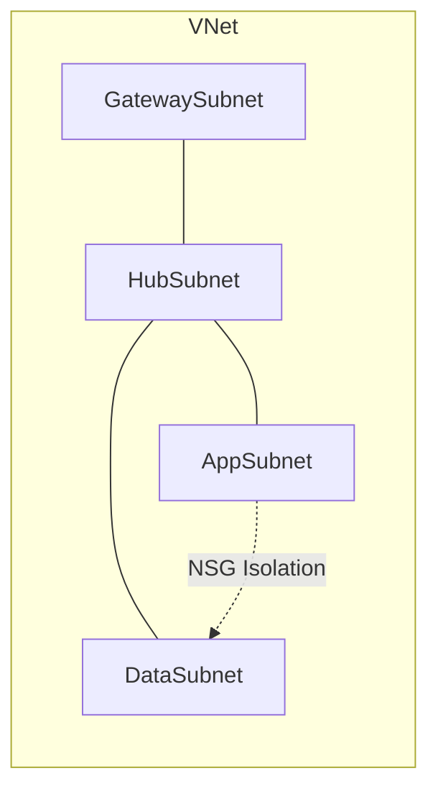

# Subnet Design Best Practices

Separating workloads by role and applying specific policies to each subnet ensures a scalable and secure network architecture. This reduces the blast radius of potential security incidents.

| Role | Subnet Name | Best Practice |
| :--- | :--- | :--- |
| Gateway | GatewaySubnet | Min /27. Only VPN/ExpressRoute GWs. |
| DMZ/NVA | DMZSubnet | Dedicated NSGs for external traffic. |
| Application | AppSubnet | Apply NSG rules for tier isolation. |
| Database | DataSubnet | No Public IPs. Restrict via Private Link. |
| Management | AzureBastionSubnet | Min /26. NSGs are supported; if applied, include all required Azure Bastion ingress and egress rules. |
| Private Endpoints | PESubnet | Use /28 or /27. Private endpoint network policies are disabled by default; enable NSG and/or route table support on the subnet only when required. |

!!! warning
    Avoid over-fragmentation. Creating too many small subnets can lead to complex routing and management overhead. Size subnets based on projected host count plus growth margin, and check Azure service-specific subnet requirements before sizing.

## Validation Checks

| Check | Expected Result |
| :--- | :--- |
| Gateway subnet size | Meets SKU minimum and growth headroom |
| Private endpoint subnet policy | Matches intended NSG/UDR policy behavior |

## See Also
- [VNet and Subnet Basics](../platform/vnet-and-subnet-basics.md)
- [Create VNet and Subnets](../operations/create-vnet-and-subnets.md)
- [Network Design Baseline](../best-practices/network-design-baseline.md)

## Sources

- [Azure virtual network subnet design](https://learn.microsoft.com/en-us/azure/virtual-network/virtual-network-vnet-plan-design-arm#subnets)
- [Add or remove a virtual network subnet](https://learn.microsoft.com/en-us/azure/virtual-network/virtual-network-manage-subnet)
