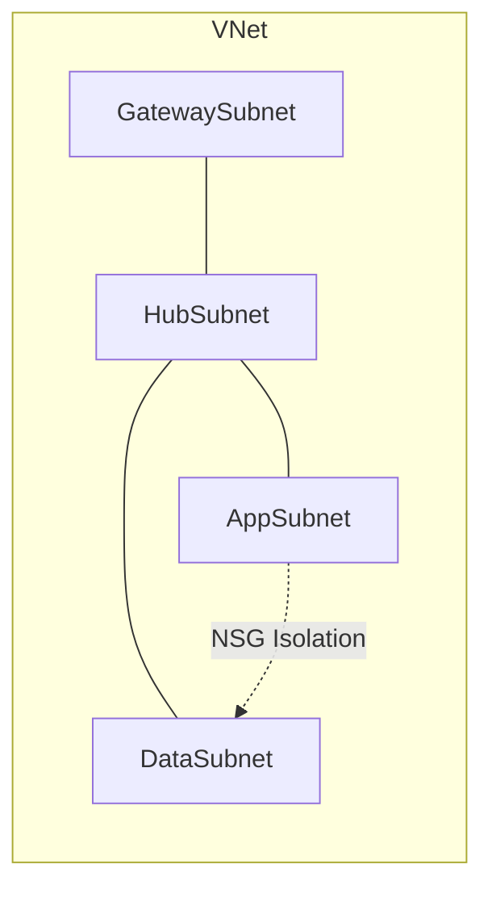

# Subnet Design Best Practices

Separating workloads by role and applying specific policies to each subnet ensures a scalable and secure network architecture. This reduces the blast radius of potential security incidents.

| Role | Subnet Name | Best Practice |
| :--- | :--- | :--- |
| Gateway | GatewaySubnet | Min /27. Only VPN/ExpressRoute GWs. |
| DMZ/NVA | DMZSubnet | Dedicated NSGs for external traffic. |
| Application | AppSubnet | Apply NSG rules for tier isolation. |
| Database | DataSubnet | No Public IPs. Restrict via Private Link. |
| Management | AzureBastionSubnet | Min /26. No NSG on this subnet usually. |
| Private Endpoints | PESubnet | Use /28 or /27. Disable NSG policies if not needed. |

!!! warning
    Avoid over-fragmentation. Creating too many small subnets can lead to complex routing and management overhead. Aim for at least /24 for generic app subnets.

## Sources

- [Azure virtual network subnet design](https://learn.microsoft.com/en-us/azure/virtual-network/virtual-network-vnet-plan-design-arm#subnets)
- [Add or remove a virtual network subnet](https://learn.microsoft.com/en-us/azure/virtual-network/virtual-network-manage-subnet)
