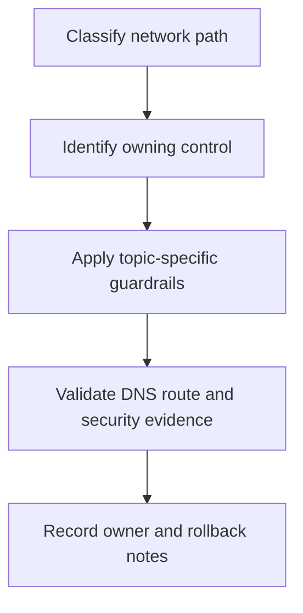

---
content_sources:
  diagrams:
  - id: best-practices-subnet-design-best-practices-flow
    type: flowchart
    source: mslearn-adapted
    description: Subnet boundaries
    based_on:
    - https://learn.microsoft.com/en-us/azure/virtual-network/virtual-network-manage-subnet
    - https://learn.microsoft.com/en-us/azure/virtual-network/subnet-delegation-overview
    - https://learn.microsoft.com/en-us/azure/bastion/configuration-settings
content_validation:
  status: pending_review
  last_reviewed: '2026-05-22'
  reviewer: ai-agent
  core_claims:
  - claim: This document has source metadata and is queued for text-level Microsoft
      Learn verification.
    source: https://learn.microsoft.com/en-us/azure/virtual-network/virtual-network-manage-subnet
    verified: false
  - claim: Core Azure networking guidance on this page should remain traceable to
      the listed sources before it is marked verified.
    source: https://learn.microsoft.com/en-us/azure/virtual-network/virtual-network-manage-subnet
    verified: false
---

# Subnet Design Best Practices

Subnet design should reflect blast radius, routing requirements, delegation, private endpoints, and operational ownership.

## Why This Matters

A workload team needs separate app, data, private endpoint, and management subnets without exhausting future address space.

<!-- diagram-id: best-practices-subnet-design-best-practices-flow -->

```mermaid
flowchart TD
    A[Classify network path] --> B[Identify owning control]
    B --> C[Apply topic-specific guardrails]
    C --> D[Validate DNS route and security evidence]
    D --> E[Record owner and rollback notes]
```

## Recommended Practices

### 1. Size subnets for lifecycle, not only day one

**Why:** Private endpoints, gateways, firewalls, and scale sets consume addresses over time.

**How:** Reserve headroom and avoid tiny production subnets except for known fixed-size service subnets.

**Validation:** Subnet utilization remains below the threshold documented by the owner.

### 2. Separate policy domains

**Why:** Putting unrelated tiers in one subnet forces broad NSG and route exceptions.

**How:** Use subnets to separate management, application, data, private endpoint, and shared service paths.

**Validation:** Each subnet has one clear purpose and matching NSG/route table.

### 3. Respect service-specific subnet rules

**Why:** Delegated subnets, gateway subnets, Bastion, and firewall subnets have naming or size requirements.

**How:** Check service requirements before assigning CIDR ranges.

**Validation:** Service subnets meet naming, delegation, and minimum size requirements.

### CLI review example

```bash
az network vnet show \
    --resource-group $RG \
    --name $VNET_NAME \
    --query "{name:name,addressSpace:addressSpace.addressPrefixes,subnets:subnets[].name}" \
    --output json

az network nic show-effective-route-table \
    --resource-group $RG \
    --name $NIC_NAME \
    --output table

az network nic list-effective-nsg \
    --resource-group $RG \
    --name $NIC_NAME \
    --output table
```

| Element | Purpose |
|---|---|
| `$RG` | Resource group containing the networking resources. |
| `$VNET_NAME` | Virtual network being created, linked, or inspected. |
| `$NIC_NAME` | Network interface used for effective rule or route checks. |
| `--resource-group` | Scopes the command to the intended resource group. |
| `--name` | Identifies the target Azure networking resource. |
| `--query` | Filters output to the evidence operators need. |
| `--output` | Controls output format for review or automation. |
| Expected result | Command succeeds and returns resource state, path evidence, or operation status for the change record. |

## Common Mistakes / Anti-Patterns

- Reviewing a single resource without validating DNS, route, and security behavior from the actual source subnet.
- Making broad allow or default-route changes without recording the owner and rollback path.
- Disabling public access or changing peering and route propagation before private path validation.

## Validation Checklist

- [ ] Source, destination, protocol, port, DNS name, and owner are recorded.
- [ ] Effective route and effective security rule evidence matches the intended path.
- [ ] DNS resolution is tested from the consumer network when private connectivity is involved.
- [ ] Rollback command or manual rollback path is documented.

## See Also

- [Network Design Baseline](network-design-baseline.md)
- [Operations](../operations/index.md)
- [Troubleshooting](../troubleshooting/index.md)

## Sources

- [Virtual Network Manage Subnet](https://learn.microsoft.com/en-us/azure/virtual-network/virtual-network-manage-subnet)
- [Subnet Delegation Overview](https://learn.microsoft.com/en-us/azure/virtual-network/subnet-delegation-overview)
- [Configuration Settings](https://learn.microsoft.com/en-us/azure/bastion/configuration-settings)
