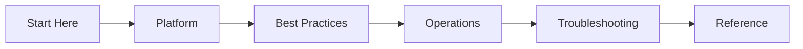

---
hide:
  - toc
---

# Azure Networking Practical Guide

A concise resource for Azure networking fundamentals, design, and operations.

## Navigation Hub

| Section | Description | Key Focus |
|---------|-------------|-----------|
| [Start Here](start-here/index.md) | Fundamentals and mental models | Core concepts and navigation |
| [Platform](platform/index.md) | Azure infrastructure components | VNets, subnets, and VNPs |
| [Best Practices](best-practices/index.md) | Design and security standards | Governance and performance |
| [Operations](operations/index.md) | Day-to-day management | Monitoring and configuration |
| [Troubleshooting](troubleshooting/index.md) | Connectivity diagnostics | DNS, routing, and NSG issues |
| [Reference](reference/index.md) | Quick lookup and limits | SKU comparison and quotas |

## Guide Structure

!!! tip
    Use this guide as a "field manual" rather than a textbook. Focus on the Mermaid diagrams to understand the flow of traffic before diving into configuration.

## Quick Links
- [Azure Virtual Network Documentation](https://learn.microsoft.com/en-us/azure/virtual-network/)
- [Azure Networking Architecture](https://learn.microsoft.com/en-us/azure/architecture/browse/?expanded=azure&products=azure-networking)

## See Also

- [Start Here Overview](start-here/overview.md)
- [How Azure Networking Works](platform/how-azure-networking-works.md)
- [Connectivity Decision Guide](reference/connectivity-decision-guide.md)

## Sources
- [Azure Networking Overview](https://learn.microsoft.com/en-us/azure/networking/networking-overview)
- [Virtual Network Concepts](https://learn.microsoft.com/en-us/azure/virtual-network/virtual-networks-overview)
