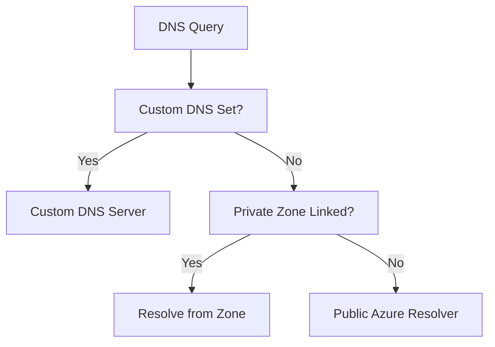

---
hide:
  - toc
---

# Configure DNS

Resolution configuration for workloads in Azure.

| Option | Description | Best Use Case |
| --- | --- | --- |
| VNet Default | 168.63.129.16 | Cloud-only simple VNets. |
| Private DNS | Azure Private Zones | Private Endpoint resolution. |
| Custom DNS | AD DS / Forwarder | Hybrid or complex topologies. |

| Validation Check | Command | Expected Result |
| --- | --- | --- |
| Active DNS server | `ipconfig /all` or `cat /etc/resolv.conf` | Configured server matches design. |
| Private endpoint name test | `nslookup <resource-fqdn>` | Private IP returned. |
| Zone link verification | Portal or CLI | Correct VNets linked to zone. |

!!! note
    Changing VNet DNS settings requires a VM restart or DHCP renewal on client machines for settings to take effect.

## See Also

- [DNS Basics](../platform/dns-basics.md)
- [DNS Best Practices](../best-practices/dns-best-practices.md)
- [DNS Resolution Failures](../troubleshooting/playbooks/dns/dns-resolution-failures.md)

## Sources

- [DNS resolution for Azure resources](https://learn.microsoft.com/en-us/azure/virtual-network/virtual-networks-name-resolution-for-vms-and-role-instances)
- [Azure Private DNS overview](https://learn.microsoft.com/en-us/azure/dns/private-dns-overview)
