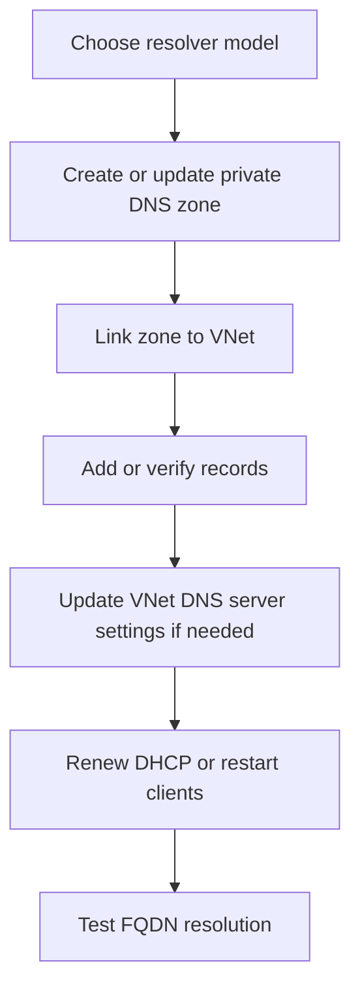

# Configure DNS

Use this runbook when Azure workloads must resolve private names consistently across VNets, peered environments, or hybrid networks.

## Prerequisites

- Existing VNet and a clear decision on Azure-provided DNS, custom DNS, or Private DNS zones.
- The exact zone name and record set naming standard for the workload.
- A validation VM or container with `nslookup` or `dig` available.
- If custom DNS is used, the forwarder path to Azure or on-premises resolvers is already approved.

## When to Use

Use this runbook when enabling private endpoint name resolution, changing VNet DNS servers, or standardizing internal service discovery between Azure workloads.

<!-- diagram-id: configure-dns -->

```mermaid
flowchart TD
    A[Choose resolver model] --> B[Create or update private DNS zone]
    B --> C[Link zone to VNet]
    C --> D[Add or verify records]
    D --> E[Update VNet DNS server settings if needed]
    E --> F[Renew DHCP or restart clients]
    F --> G[Test FQDN resolution]
```

## Procedure

1. If the workload needs private name resolution inside Azure, create a private DNS zone that matches the service naming pattern.
2. Link the zone to every VNet that must resolve records locally.
3. Add or verify the required `A` record sets.
4. Only change VNet DNS server settings after the target resolver path is ready, because clients keep old DHCP-delivered settings until renewal or restart.

```bash
az network private-dns zone create --resource-group $RG --name corp.contoso.internal
az network private-dns link vnet create --resource-group $RG --zone-name corp.contoso.internal --name link-$VNET_NAME --virtual-network $VNET_ID --registration-enabled false
az network private-dns record-set a add-record --resource-group $RG --zone-name corp.contoso.internal --record-set-name api --ipv4-address 10.40.2.10
az network vnet update --resource-group $RG --name $VNET_NAME --dns-servers 10.40.10.4 10.40.10.5
```
| Command | Purpose |
| --- | --- |
| `az network private-dns zone create` | Create the private DNS zone used by the workload. |
| `--resource-group` | Store the zone in the chosen DNS resource group. |
| `--name` | Define the private DNS suffix. |
| `az network private-dns link vnet create` | Link the zone to the VNet that must resolve records. |
| `--zone-name` | Select the zone to link. |
| `--name` | Name the virtual network link resource. |
| `--virtual-network` | Point the link at the VNet resource ID. |
| `--registration-enabled` | Disable autoregistration when you want explicit record control. |
| `az network private-dns record-set a add-record` | Publish the private IP for the service FQDN. |
| `--record-set-name` | Set the left-hand hostname within the zone. |
| `--ipv4-address` | Map the record to the service private IP. |
| `az network vnet update` | Replace Azure-provided DNS with custom resolvers when required. |
| `--dns-servers` | Set the ordered DNS server list for the VNet. |

Expected output:

- The zone and VNet link show `Succeeded`.
- The `api.corp.contoso.internal` record exists and points to the intended private IP.
- The VNet now advertises the custom DNS servers to renewed clients.

## Verification

Confirm both control-plane objects and actual name resolution.

```bash
az network private-dns record-set a show --resource-group $RG --zone-name corp.contoso.internal --name api --output json
nslookup api.corp.contoso.internal 10.40.10.4
```
| Command | Purpose |
| --- | --- |
| `az network private-dns record-set a show` | Verify the authoritative record set in Azure. |
| `--resource-group` | Scope the record lookup to the DNS resource group. |
| `--zone-name` | Select the private DNS zone. |
| `--name` | Query the specific record set. |
| `--output` | Return JSON for exact record-value inspection. |
| `nslookup api.corp.contoso.internal 10.40.10.4` | Test resolution through the resolver that clients should use. |

Healthy result:

- `arecords` contains the correct private IP.
- `nslookup` returns the same private IP and not a public endpoint.
- After a DHCP renew or VM restart, application clients resolve the same FQDN without stale answers.

## Rollback / Troubleshooting

- If resolution fails immediately after a DNS server change, renew DHCP leases or restart the workload VM before changing the zone again.
- If the zone exists but clients return `NXDOMAIN`, verify the VNet link and the exact suffix being queried.
- If a custom DNS forwarder is in the path, confirm it can reach Azure recursive DNS or the authoritative upstream servers.
- If the new DNS server list caused a broad outage, restore the previous `--dns-servers` list on the VNet and renew client leases.

## See Also

- [DNS Basics](../platform/dns-basics.md)
- [DNS Best Practices](../best-practices/dns-best-practices.md)
- [DNS Resolution Failures](../troubleshooting/playbooks/dns/dns-resolution-failures.md)

## Sources

- [Azure Virtual Network Name Resolution Guide](https://learn.microsoft.com/en-us/azure/virtual-network/virtual-networks-name-resolution-for-vms-and-role-instances)
- [Azure Private DNS overview](https://learn.microsoft.com/en-us/azure/dns/private-dns-overview)
