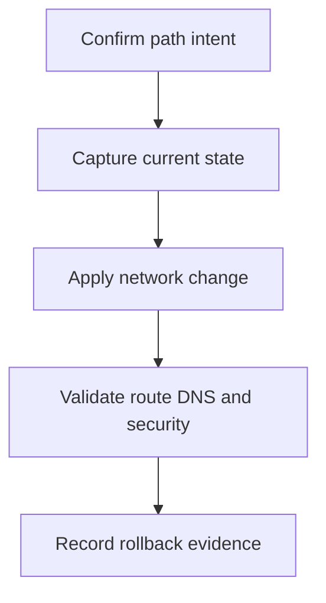

---
content_sources:
  diagrams:
  - id: operations-configure-dns-flow
    type: flowchart
    source: mslearn-adapted
    description: Runbook flow
    based_on:
    - https://learn.microsoft.com/en-us/azure/dns/private-dns-privatednszone
    - https://learn.microsoft.com/en-us/azure/private-link/private-endpoint-dns
content_validation:
  status: pending_review
  last_reviewed: '2026-05-22'
  reviewer: ai-agent
  core_claims:
  - claim: This document has source metadata and is queued for text-level Microsoft
      Learn verification.
    source: https://learn.microsoft.com/en-us/azure/dns/private-dns-privatednszone
    verified: false
  - claim: Core Azure networking guidance on this page should remain traceable to
      the listed sources before it is marked verified.
    source: https://learn.microsoft.com/en-us/azure/dns/private-dns-privatednszone
    verified: false
---

# Configure DNS

Configure private DNS zones and VNet links so name resolution follows the intended private path.

## Prerequisites

- Azure CLI is installed and authenticated with permission to read and change the target networking resources.
- Required variables such as `RG`, `LOCATION`, `VNET_NAME`, and resource-specific names are set before running commands.
- The intended source, destination, protocol, port, DNS name, and rollback owner are known.
- A maintenance window is approved for production path changes.

## When to Use

A private endpoint consumer VNet must resolve a service name to a private IP.

<!-- diagram-id: operations-configure-dns-flow -->

```mermaid
flowchart TD
    A[Confirm path intent] --> B[Capture current state]
    B --> C[Apply network change]
    C --> D[Validate route DNS and security]
    D --> E[Record rollback evidence]
```

## Procedure

1. Create or select the Private DNS zone.
2. Link the zone to each consumer VNet that should resolve private records.
3. Create or verify records created by private endpoint integration.
4. Test DNS resolution from a client in the linked VNet.

### Command sequence

```bash
az network private-dns zone create \
    --resource-group $RG \
    --name $PRIVATE_DNS_ZONE \
    --output json

az network private-dns link vnet create \
    --resource-group $RG \
    --zone-name $PRIVATE_DNS_ZONE \
    --name link-$VNET_NAME \
    --virtual-network $VNET_NAME \
    --registration-enabled false \
    --output json
```

| Element | Purpose |
|---|---|
| `$RG` | Resource group containing the networking resources. |
| `$PRIVATE_DNS_ZONE` | Private DNS zone used for name resolution. |
| `$VNET_NAME` | Virtual network being created, linked, or inspected. |
| `--resource-group` | Scopes the command to the intended resource group. |
| `--name` | Identifies the target Azure networking resource. |
| `--output` | Controls output format for review or automation. |
| `--zone-name` | Identifies a Private DNS zone. |
| `--virtual-network` | Azure CLI option used to scope or shape the network operation. |
| `--registration-enabled` | Controls automatic DNS registration for a VNet link. |
| Expected result | Command succeeds and returns resource state, path evidence, or operation status for the change record. |

## Verification

```bash
az network private-dns record-set a list \
    --resource-group $RG \
    --zone-name $PRIVATE_DNS_ZONE \
    --output table
```

| Element | Purpose |
|---|---|
| `$RG` | Resource group containing the networking resources. |
| `$PRIVATE_DNS_ZONE` | Private DNS zone used for name resolution. |
| `--resource-group` | Scopes the command to the intended resource group. |
| `--zone-name` | Identifies a Private DNS zone. |
| `--output` | Controls output format for review or automation. |
| Expected result | Command succeeds and returns resource state, path evidence, or operation status for the change record. |

Confirm from the actual source network that DNS, route, security rule, and service response match the intended design.

## Rollback / Troubleshooting

```bash
az network private-dns link vnet delete \
    --resource-group $RG \
    --zone-name $PRIVATE_DNS_ZONE \
    --name link-$VNET_NAME \
    --yes
```

| Element | Purpose |
|---|---|
| `$RG` | Resource group containing the networking resources. |
| `$PRIVATE_DNS_ZONE` | Private DNS zone used for name resolution. |
| `$VNET_NAME` | Virtual network being created, linked, or inspected. |
| `--resource-group` | Scopes the command to the intended resource group. |
| `--zone-name` | Identifies a Private DNS zone. |
| `--name` | Identifies the target Azure networking resource. |
| `--yes` | Confirms a destructive command without prompting. |
| Expected result | Command succeeds and returns resource state, path evidence, or operation status for the change record. |

- If validation fails, stop further changes and capture current route, NSG, DNS, and Activity Log evidence.
- Roll back the smallest changed control first: rule, route, DNS link, peering flag, or private endpoint connection.
- Escalate when policy, capacity, provider circuit, or private endpoint approval state blocks the documented path.

## See Also

- [Network Design Baseline](../best-practices/network-design-baseline.md)
- [Monitor Network Paths](monitor-network-paths.md)
- [Troubleshooting Playbooks](../troubleshooting/playbooks/index.md)

## Sources

- [Private Dns Privatednszone](https://learn.microsoft.com/en-us/azure/dns/private-dns-privatednszone)
- [Private Endpoint Dns](https://learn.microsoft.com/en-us/azure/private-link/private-endpoint-dns)
