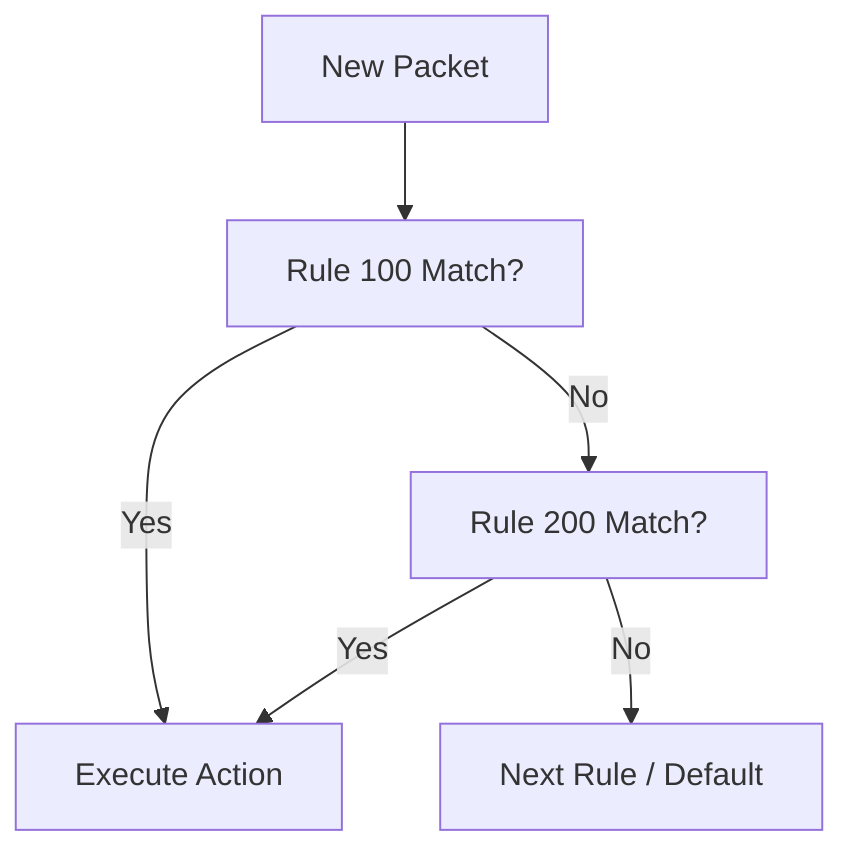

# Configure NSG

Network Security Groups provide distributed filtering for subnets and interfaces.

| Property | Example Value | Description |
| --- | --- | --- |
| Priority | 100 | Custom NSG rule priorities range from 100 to 4096. Azure default rules use priorities 65000, 65001, and 65500. |
| Source | VirtualNetwork | IP range, Service Tag, or ASG. |
| Destination | Any | Target IP range or tag. |
| Port | 443 | Destination port or range. |
| Protocol | TCP | TCP, UDP, ICMP, or Any. |
| Action | Allow | Allow or Deny the traffic. |

| Default Rule | Priority | Action | Description |
| --- | --- | --- | --- |
| AllowVnetInBound | 65000 | Allow | Inbound VNet-to-VNet. |
| AllowAzureLoadBalancerInBound | 65001 | Allow | Health probe traffic. |
| DenyAllInBound | 65500 | Deny | Standard "Deny All" rule. |

!!! warning
    Rule priority ordering matters. A "Deny" rule with higher priority (lower number) will block traffic even if an "Allow" rule exists at priority 200.

## See Also

- [Network Security Basics](../platform/network-security-basics.md)
- [NSG and Firewall Best Practices](../best-practices/nsg-and-firewall-best-practices.md)
- [NSG vs UDR vs Firewall](../troubleshooting/playbooks/routing/nsg-vs-udr-vs-firewall.md)

## Sources

- [Network Security Groups overview](https://learn.microsoft.com/en-us/azure/virtual-network/network-security-groups-overview)
- [Work with security rules](https://learn.microsoft.com/en-us/azure/virtual-network/manage-network-security-group#create-a-security-rule)
