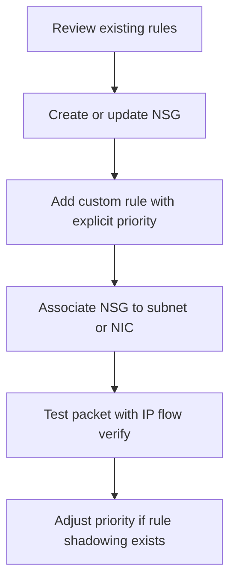

# Configure NSG

Use this runbook to add, change, and validate subnet-level filtering without guessing which rule actually allowed or denied a packet.

## Prerequisites

- Existing VNet and target subnet.
- Approved source and destination CIDR ranges, ports, and service tags.
- One validation VM NIC in the affected subnet.
- Change plan that lists the existing rule to supersede, if any.

## When to Use

Use this runbook when implementing new ingress or egress policy, tightening east-west access, or verifying whether an NSG change caused a connectivity regression.

<!-- diagram-id: configure-nsg -->

```mermaid
flowchart TD
    A[Review existing rules] --> B[Create or update NSG]
    B --> C[Add custom rule with explicit priority]
    C --> D[Associate NSG to subnet or NIC]
    D --> E[Test packet with IP flow verify]
    E --> F[Adjust priority if rule shadowing exists]
```

## Procedure

1. Export the current NSG rule set so you know which priority numbers are already occupied.
2. Create or update the NSG with a new rule that is specific enough to avoid accidental shadowing.
3. Associate the NSG to the subnet only after the custom rule exists.
4. Re-test the intended packet path before changing any additional rules.

```bash
az network nsg create --resource-group $RG --name $NSG_NAME --location $LOCATION
az network nsg rule create --resource-group $RG --nsg-name $NSG_NAME --name allow-web-from-hub --priority 200 --source-address-prefixes 10.10.0.0/16 --source-port-ranges '*' --destination-address-prefixes 10.40.1.0/24 --destination-port-ranges 443 --access Allow --protocol Tcp --direction Inbound
az network vnet subnet update --resource-group $RG --vnet-name $VNET_NAME --name $SUBNET_NAME --network-security-group $NSG_NAME
az network nsg show --resource-group $RG --name $NSG_NAME --output json
```
| Command | Purpose |
| --- | --- |
| `az network nsg create` | Create the NSG container if it does not already exist. |
| `--resource-group` | Place the NSG in the change resource group. |
| `--name` | Name the NSG to match the subnet or workload. |
| `--location` | Create the NSG in the same region as the subnet. |
| `az network nsg rule create` | Add the custom security rule. |
| `--nsg-name` | Target the NSG receiving the new rule. |
| `--priority` | Ensure the rule is evaluated before defaults and intended peers. |
| `--source-address-prefixes` | Limit the rule to the approved source range. |
| `--source-port-ranges` | Match any client source port. |
| `--destination-address-prefixes` | Limit the rule to the protected destination range. |
| `--destination-port-ranges` | Allow only the intended application port. |
| `--access` | Set the rule outcome to allow or deny. |
| `--protocol` | Restrict the rule to TCP for HTTPS traffic. |
| `--direction` | Apply the rule to inbound traffic only. |
| `az network vnet subnet update` | Associate the NSG to the target subnet. |
| `--vnet-name` | Select the parent virtual network. |
| `--network-security-group` | Bind the subnet to the NSG. |
| `az network nsg show` | Review the resulting rule order in JSON. |
| `--output` | Return structured output for audit evidence. |

Expected output:

- The NSG shows `provisioningState` as `Succeeded`.
- The custom rule appears with priority `200` and direction `Inbound`.
- The subnet object references the intended NSG ID.

## Verification

Use both effective-rule inspection and packet simulation.

```bash
az network nic list-effective-nsg --resource-group $RG --name $NIC_NAME --output json
az network watcher test-ip-flow --resource-group $RG --location $LOCATION --direction Inbound --protocol Tcp --local 10.40.1.4:443 --remote 10.10.5.10:51514 --nic $NIC_ID
```
| Command | Purpose |
| --- | --- |
| `az network nic list-effective-nsg` | Show the union of subnet and NIC rules applied to the validation NIC. |
| `--resource-group` | Scope the lookup to the NIC resource group. |
| `--name` | Select the NIC that should receive the traffic. |
| `--output` | Return JSON so you can inspect the matched rule. |
| `az network watcher test-ip-flow` | Simulate the intended packet and identify the winning NSG rule. |
| `--location` | Run the diagnostic in the region where Network Watcher is enabled. |
| `--direction` | Specify whether the packet is inbound or outbound. |
| `--protocol` | Match the packet protocol under test. |
| `--local` | Provide the destination IP and port on the Azure NIC for inbound tests. |
| `--remote` | Provide the remote source IP and client port. |
| `--nic` | Target the NIC resource ID being diagnosed. |

Healthy result:

- `list-effective-nsg` shows the custom rule before the default deny.
- `test-ip-flow` returns `Access: Allow` and identifies the custom rule name.
- If the test returns a different rule, change priority or prefixes before continuing.

## Rollback / Troubleshooting

- If traffic is unexpectedly denied, inspect the matched rule from `test-ip-flow` before editing anything else.
- If a new rule was too broad, remove or narrow it instead of stacking an emergency allow above it.
- If the subnet association caused an outage, reapply the previous NSG association to restore the prior policy set.
- If effective rules differ from the NSG object, check for NIC-level NSGs that are overriding expectations.

## See Also

- [Network Security Basics](../platform/network-security-basics.md)
- [NSG and Firewall Best Practices](../best-practices/nsg-and-firewall-best-practices.md)
- [NSG vs UDR vs Firewall](../troubleshooting/playbooks/routing/nsg-vs-udr-vs-firewall.md)

## Sources

- [Azure network security groups overview](https://learn.microsoft.com/en-us/azure/virtual-network/network-security-groups-overview)
- [Create, Change, or Delete Azure Network Security Groups](https://learn.microsoft.com/en-us/azure/virtual-network/manage-network-security-group)
