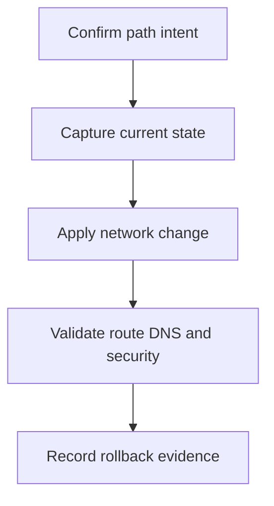

---
content_sources:
  diagrams:
  - id: operations-configure-nsg-flow
    type: flowchart
    source: mslearn-adapted
    description: Runbook flow
    based_on:
    - https://learn.microsoft.com/en-us/azure/virtual-network/network-security-groups-overview
    - https://learn.microsoft.com/en-us/azure/virtual-network/manage-network-security-group
content_validation:
  status: pending_review
  last_reviewed: '2026-05-22'
  reviewer: ai-agent
  core_claims:
  - claim: This document has source metadata and is queued for text-level Microsoft
      Learn verification.
    source: https://learn.microsoft.com/en-us/azure/virtual-network/network-security-groups-overview
    verified: false
  - claim: Core Azure networking guidance on this page should remain traceable to
      the listed sources before it is marked verified.
    source: https://learn.microsoft.com/en-us/azure/virtual-network/network-security-groups-overview
    verified: false
---

# Configure NSG

Configure NSG rules with explicit source, destination, priority, and validation output.

## Prerequisites

- Azure CLI is installed and authenticated with permission to read and change the target networking resources.
- Required variables such as `RG`, `LOCATION`, `VNET_NAME`, and resource-specific names are set before running commands.
- The intended source, destination, protocol, port, DNS name, and rollback owner are known.
- A maintenance window is approved for production path changes.

## When to Use

A subnet needs to allow HTTPS from an application gateway while denying broad internet administration.

<!-- diagram-id: operations-configure-nsg-flow -->

```mermaid
flowchart TD
    A[Confirm path intent] --> B[Capture current state]
    B --> C[Apply network change]
    C --> D[Validate route DNS and security]
    D --> E[Record rollback evidence]
```

## Procedure

1. Identify the exact source and destination ranges.
2. Create allow rules before enforcing deny rules.
3. Associate the NSG with the intended subnet or NIC.
4. Validate effective security rules from the actual NIC.

### Command sequence

```bash
az network nsg create \
    --resource-group $RG \
    --name $NSG_NAME \
    --location $LOCATION \
    --output json

az network nsg rule create \
    --resource-group $RG \
    --nsg-name $NSG_NAME \
    --name AllowHttpsFromAppGateway \
    --priority 200 \
    --direction Inbound \
    --access Allow \
    --protocol Tcp \
    --source-address-prefixes 10.60.10.0/24 \
    --destination-address-prefixes 10.60.20.0/24 \
    --destination-port-ranges 443 \
    --output json
```

| Element | Purpose |
|---|---|
| `$RG` | Resource group containing the networking resources. |
| `$NSG_NAME` | Network security group containing security rules. |
| `$LOCATION` | Azure region for regional networking resources. |
| `--resource-group` | Scopes the command to the intended resource group. |
| `--name` | Identifies the target Azure networking resource. |
| `--location` | Selects the Azure region for creation or lookup. |
| `--output` | Controls output format for review or automation. |
| `--nsg-name` | Azure CLI option used to scope or shape the network operation. |
| `--priority` | Sets NSG rule evaluation order. |
| `--direction` | Sets inbound or outbound NSG direction. |
| `--access` | Allows or denies matching NSG traffic. |
| `--protocol` | Sets the protocol matched by a rule. |
| Expected result | Command succeeds and returns resource state, path evidence, or operation status for the change record. |

## Verification

```bash
az network nic list-effective-nsg \
    --resource-group $RG \
    --name $NIC_NAME \
    --output table
```

| Element | Purpose |
|---|---|
| `$RG` | Resource group containing the networking resources. |
| `$NIC_NAME` | Network interface used for effective rule or route checks. |
| `--resource-group` | Scopes the command to the intended resource group. |
| `--name` | Identifies the target Azure networking resource. |
| `--output` | Controls output format for review or automation. |
| Expected result | Command succeeds and returns resource state, path evidence, or operation status for the change record. |

Confirm from the actual source network that DNS, route, security rule, and service response match the intended design.

## Rollback / Troubleshooting

```bash
az network nsg rule delete \
    --resource-group $RG \
    --nsg-name $NSG_NAME \
    --name AllowHttpsFromAppGateway
```

| Element | Purpose |
|---|---|
| `$RG` | Resource group containing the networking resources. |
| `$NSG_NAME` | Network security group containing security rules. |
| `--resource-group` | Scopes the command to the intended resource group. |
| `--nsg-name` | Azure CLI option used to scope or shape the network operation. |
| `--name` | Identifies the target Azure networking resource. |
| Expected result | Command succeeds and returns resource state, path evidence, or operation status for the change record. |

- If validation fails, stop further changes and capture current route, NSG, DNS, and Activity Log evidence.
- Roll back the smallest changed control first: rule, route, DNS link, peering flag, or private endpoint connection.
- Escalate when policy, capacity, provider circuit, or private endpoint approval state blocks the documented path.

## See Also

- [Network Design Baseline](../best-practices/network-design-baseline.md)
- [Monitor Network Paths](monitor-network-paths.md)
- [Troubleshooting Playbooks](../troubleshooting/playbooks/index.md)

## Sources

- [Network Security Groups Overview](https://learn.microsoft.com/en-us/azure/virtual-network/network-security-groups-overview)
- [Manage Network Security Group](https://learn.microsoft.com/en-us/azure/virtual-network/manage-network-security-group)
