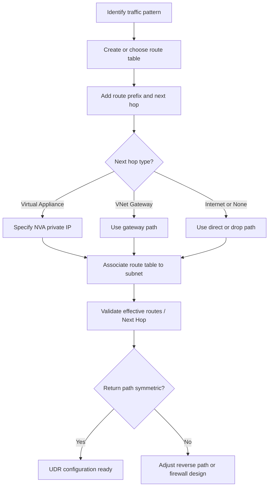

---
hide:
  - toc
---

# Configure UDR

User-Defined Routes (UDR) provide granular control over packet forwarding.

| Route Property | Example | Role |
| --- | --- | --- |
| Address Prefix | 0.0.0.0/0 | Target CIDR for the route. |
| Next Hop Type | VirtualAppliance | NVA, VNet, Internet, or None. |
| Next Hop IP | 10.0.1.4 | IP of the NVA or Gateway. |

| Scenario | Use Case |
| --- | --- |
| Force Tunnel | Send all traffic to on-prem via VPN. |
| NVA Routing | Send internet traffic through Firewall. |
| Intra-VNet | Route traffic between subnets via NVA. |

!!! note
    Azure selects routes by longest prefix match across all applicable routes. If multiple routes have the same prefix, priority is UDR > BGP > system, except virtual network, peering, and service endpoint system routes are preferred.

!!! warning
    UDRs can create asymmetric routing if the return path isn't managed. Traffic might be blocked by stateful firewalls.

## See Also

- [Routing Basics](../platform/routing-basics.md)
- [Routing Best Practices](../best-practices/routing-best-practices.md)
- [Routing Cheatsheet](../reference/routing-cheatsheet.md)

## Sources

- [Virtual network traffic routing](https://learn.microsoft.com/en-us/azure/virtual-network/virtual-networks-udr-overview)
- [Create, change, or delete a route table](https://learn.microsoft.com/en-us/azure/virtual-network/manage-route-table)
