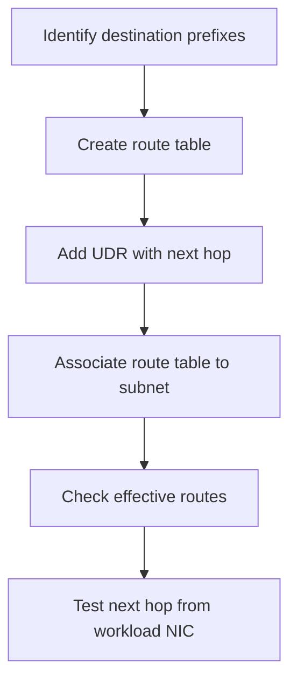

# Configure UDR

Use this runbook when you must override Azure system routing to steer traffic through a firewall, VPN gateway, or explicit drop route.

## Prerequisites

- Existing subnet and a documented desired next hop.
- Private IP address of the virtual appliance, or confirmed use of `VirtualNetworkGateway`, `Internet`, or `None`.
- Validation NIC in the affected subnet.
- Assurance that the target subnet is not `GatewaySubnet` if you plan to force a default route.

## When to Use

Use this runbook when implementing forced tunneling, service chaining through an NVA, or an explicit drop route for traffic that must not leave a subnet.

<!-- diagram-id: configure-udr -->

```mermaid
flowchart TD
    A[Identify destination prefixes] --> B[Create route table]
    B --> C[Add UDR with next hop]
    C --> D[Associate route table to subnet]
    D --> E[Check effective routes]
    E --> F[Test next hop from workload NIC]
```

## Procedure

1. Decide whether the route should be more specific than existing system routes; if it is not, Azure may keep the current path.
2. Create the route table and add only the prefixes required for this change window.
3. Associate the route table to the workload subnet, never to `GatewaySubnet` for a 0.0.0.0/0 forced-tunnel design.
4. Validate the selected next hop from an actual NIC before stacking more route entries.

```bash
az network route-table create --resource-group $RG --name $ROUTE_TABLE_NAME --location $LOCATION
az network route-table route create --resource-group $RG --route-table-name $ROUTE_TABLE_NAME --name default-to-firewall --address-prefix 0.0.0.0/0 --next-hop-type VirtualAppliance --next-hop-ip-address 10.40.100.4
az network vnet subnet update --resource-group $RG --vnet-name $VNET_NAME --name $SUBNET_NAME --route-table $ROUTE_TABLE_NAME
az network route-table show --resource-group $RG --name $ROUTE_TABLE_NAME --output json
```
| Command | Purpose |
| --- | --- |
| `az network route-table create` | Create the route table used for UDRs. |
| `--resource-group` | Place the route table in the target resource group. |
| `--name` | Name the route table for the workload or path role. |
| `--location` | Create the route table in the subnet region. |
| `az network route-table route create` | Add a user-defined route entry. |
| `--route-table-name` | Select the route table receiving the route. |
| `--address-prefix` | Define the destination prefix that should be overridden. |
| `--next-hop-type` | Set the next hop behavior such as NVA, gateway, internet, or drop. |
| `--next-hop-ip-address` | Provide the NVA private IP when using `VirtualAppliance`. |
| `az network vnet subnet update` | Associate the route table to the target subnet. |
| `--vnet-name` | Identify the parent virtual network. |
| `--route-table` | Bind the subnet to the route table. |
| `az network route-table show` | Review the final route table contents. |
| `--output` | Return JSON for route auditing. |

Expected output:

- The route table shows `Succeeded`.
- The route named `default-to-firewall` appears with address prefix `0.0.0.0/0` and next hop `VirtualAppliance`.
- The subnet references the intended route table ID.

## Verification

Use both effective route output and a point-in-time next-hop diagnostic.

```bash
az network nic show-effective-route-table --resource-group $RG --name $NIC_NAME --output table
az network watcher show-next-hop --resource-group $RG --location $LOCATION --source-resource $VM_ID --dest-ip-address 8.8.8.8
```
| Command | Purpose |
| --- | --- |
| `az network nic show-effective-route-table` | Confirm the UDR won on the validation NIC. |
| `--resource-group` | Scope the NIC lookup to the VM resource group. |
| `--name` | Select the NIC attached to the affected subnet. |
| `--output` | Render the effective route decision table. |
| `az network watcher show-next-hop` | Validate the chosen next hop for a specific destination IP. |
| `--location` | Use the region where Network Watcher is enabled. |
| `--source-resource` | Identify the source VM resource ID. |
| `--dest-ip-address` | Test the exact destination that should follow the route. |

Healthy result:

- Effective routes include the UDR with source `User`.
- `show-next-hop` returns the firewall private IP or the expected next-hop type.
- Return traffic is symmetric; if it is not, fix the reverse path before closing the change.

## Rollback / Troubleshooting

- If a forced default route breaks outbound traffic, disassociate the route table from the subnet first; this restores system routing fastest.
- If the next hop is `None` or `Internet` unexpectedly, verify the NVA IP and route table association.
- If the route exists but traffic still bypasses it, check for a longer matching prefix in the effective route table.
- If the target is a VPN-connected subnet, confirm BGP propagation and do not disable it blindly on gateway-related designs.

## See Also

- [Routing Basics](../platform/routing-basics.md)
- [Routing Best Practices](../best-practices/routing-best-practices.md)
- [Routing Cheatsheet](../reference/routing-cheatsheet.md)

## Sources

- [Azure virtual network traffic routing](https://learn.microsoft.com/en-us/azure/virtual-network/virtual-networks-udr-overview)
- [Create, change, or delete an Azure route table](https://learn.microsoft.com/en-us/azure/virtual-network/manage-route-table)
