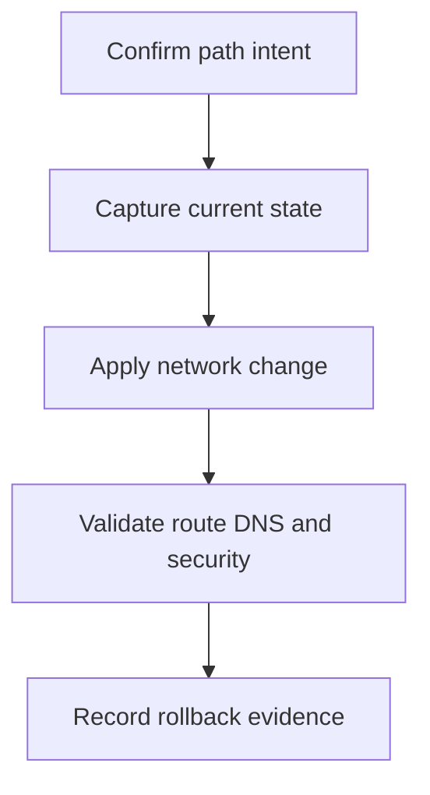

---
content_sources:
  diagrams:
  - id: operations-configure-udr-flow
    type: flowchart
    source: mslearn-adapted
    description: Runbook flow
    based_on:
    - https://learn.microsoft.com/en-us/azure/virtual-network/virtual-networks-udr-overview
    - https://learn.microsoft.com/en-us/azure/virtual-network/manage-route-table
content_validation:
  status: pending_review
  last_reviewed: '2026-05-22'
  reviewer: ai-agent
  core_claims:
  - claim: This document has source metadata and is queued for text-level Microsoft
      Learn verification.
    source: https://learn.microsoft.com/en-us/azure/virtual-network/virtual-networks-udr-overview
    verified: false
  - claim: Core Azure networking guidance on this page should remain traceable to
      the listed sources before it is marked verified.
    source: https://learn.microsoft.com/en-us/azure/virtual-network/virtual-networks-udr-overview
    verified: false
---

# Configure UDR

Configure user-defined routes only after documenting the intended next hop and return path.

## Prerequisites

- Azure CLI is installed and authenticated with permission to read and change the target networking resources.
- Required variables such as `RG`, `LOCATION`, `VNET_NAME`, and resource-specific names are set before running commands.
- The intended source, destination, protocol, port, DNS name, and rollback owner are known.
- A maintenance window is approved for production path changes.

## When to Use

A subnet must send internet-bound traffic to Azure Firewall without breaking private east-west traffic.

<!-- diagram-id: operations-configure-udr-flow -->

```mermaid
flowchart TD
    A[Confirm path intent] --> B[Capture current state]
    B --> C[Apply network change]
    C --> D[Validate route DNS and security]
    D --> E[Record rollback evidence]
```

## Procedure

1. Confirm the prefix that needs an override.
2. Create or update the route table and route.
3. Associate the route table with the intended subnet.
4. Validate effective routes from a NIC in that subnet.

### Command sequence

```bash
az network route-table create \
    --resource-group $RG \
    --name $ROUTE_TABLE_NAME \
    --location $LOCATION \
    --output json

az network route-table route create \
    --resource-group $RG \
    --route-table-name $ROUTE_TABLE_NAME \
    --name $ROUTE_NAME \
    --address-prefix 0.0.0.0/0 \
    --next-hop-type VirtualAppliance \
    --next-hop-ip-address 10.60.0.4 \
    --output json
```

| Element | Purpose |
|---|---|
| `$RG` | Resource group containing the networking resources. |
| `$ROUTE_TABLE_NAME` | Route table containing user-defined routes. |
| `$LOCATION` | Azure region for regional networking resources. |
| `$ROUTE_NAME` | User-defined route name. |
| `--resource-group` | Scopes the command to the intended resource group. |
| `--name` | Identifies the target Azure networking resource. |
| `--location` | Selects the Azure region for creation or lookup. |
| `--output` | Controls output format for review or automation. |
| `--route-table-name` | Azure CLI option used to scope or shape the network operation. |
| `--address-prefix` | Defines the route prefix being overridden. |
| `--next-hop-type` | Defines route next-hop behavior. |
| `--next-hop-ip-address` | Azure CLI option used to scope or shape the network operation. |
| Expected result | Command succeeds and returns resource state, path evidence, or operation status for the change record. |

## Verification

```bash
az network nic show-effective-route-table \
    --resource-group $RG \
    --name $NIC_NAME \
    --output table
```

| Element | Purpose |
|---|---|
| `$RG` | Resource group containing the networking resources. |
| `$NIC_NAME` | Network interface used for effective rule or route checks. |
| `--resource-group` | Scopes the command to the intended resource group. |
| `--name` | Identifies the target Azure networking resource. |
| `--output` | Controls output format for review or automation. |
| Expected result | Command succeeds and returns resource state, path evidence, or operation status for the change record. |

Confirm from the actual source network that DNS, route, security rule, and service response match the intended design.

## Rollback / Troubleshooting

```bash
az network route-table route delete \
    --resource-group $RG \
    --route-table-name $ROUTE_TABLE_NAME \
    --name $ROUTE_NAME
```

| Element | Purpose |
|---|---|
| `$RG` | Resource group containing the networking resources. |
| `$ROUTE_TABLE_NAME` | Route table containing user-defined routes. |
| `$ROUTE_NAME` | User-defined route name. |
| `--resource-group` | Scopes the command to the intended resource group. |
| `--route-table-name` | Azure CLI option used to scope or shape the network operation. |
| `--name` | Identifies the target Azure networking resource. |
| Expected result | Command succeeds and returns resource state, path evidence, or operation status for the change record. |

- If validation fails, stop further changes and capture current route, NSG, DNS, and Activity Log evidence.
- Roll back the smallest changed control first: rule, route, DNS link, peering flag, or private endpoint connection.
- Escalate when policy, capacity, provider circuit, or private endpoint approval state blocks the documented path.

## See Also

- [Network Design Baseline](../best-practices/network-design-baseline.md)
- [Monitor Network Paths](monitor-network-paths.md)
- [Troubleshooting Playbooks](../troubleshooting/playbooks/index.md)

## Sources

- [Virtual Networks Udr Overview](https://learn.microsoft.com/en-us/azure/virtual-network/virtual-networks-udr-overview)
- [Manage Route Table](https://learn.microsoft.com/en-us/azure/virtual-network/manage-route-table)
