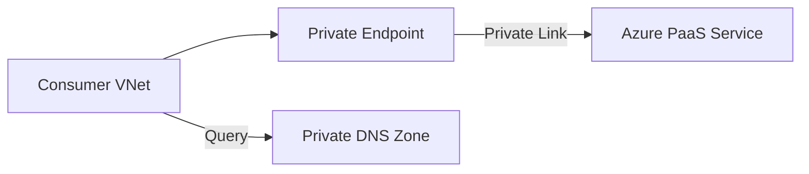

# Connect Private Endpoints

Private Endpoints allow secure access to Azure Services over a private IP.

| Step | Task | Status |
| --- | --- | --- |
| 1 | Create Private Endpoint for Service. | [ ] |
| 2 | Configure Private DNS Zone for Resource. | [ ] |
| 3 | Link DNS Zone to Virtual Network. | [ ] |
| 4 | Verify local DNS resolution. | [ ] |

!!! warning
    Test DNS resolution before disabling public access. If resolution fails, your applications will lose connectivity.

## Sources

- [What is Azure Private Endpoint?](https://learn.microsoft.com/en-us/azure/private-link/private-endpoint-overview)
- [Azure Private Endpoint DNS configuration](https://learn.microsoft.com/en-us/azure/private-link/private-endpoint-dns)
