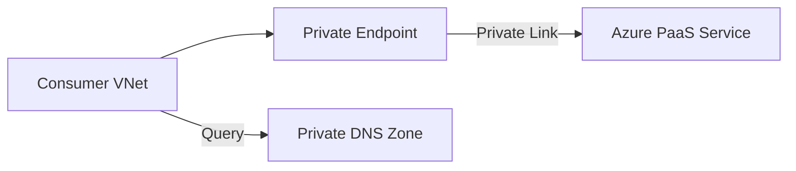

---
hide:
  - toc
content_sources:
  diagrams:
    - id: connect-private-endpoints
      type: flowchart
      source: mslearn-adapted
      mslearn_url: https://learn.microsoft.com/en-us/azure/private-link/private-endpoint-overview
      based_on:
        - https://learn.microsoft.com/en-us/azure/private-link/private-endpoint-dns
---

# Connect Private Endpoints

Private Endpoints allow secure access to Azure Services over a private IP.

| Step | Task | Status |
| --- | --- | --- |
| 1 | Create Private Endpoint for Service. | [ ] |
| 2 | Configure Private DNS Zone for Resource. | [ ] |
| 3 | Link DNS Zone to Virtual Network. | [ ] |
| 4 | Verify local DNS resolution. | [ ] |

| Validation | Method | Expected Result |
| --- | --- | --- |
| FQDN lookup | `nslookup <service-fqdn>` | Private endpoint IP returned. |
| Route check | Effective routes on source NIC | Prefix points to VNet path. |
| Port test | `Test-NetConnection -Port 443` | TCP connection succeeds. |

<!-- diagram-id: connect-private-endpoints -->

!!! warning
    Test DNS resolution before disabling public access. If resolution fails, your applications will lose connectivity.

## See Also

- [Private Connectivity Options](../platform/private-connectivity-options.md)
- [Private Endpoint Best Practices](../best-practices/private-endpoint-best-practices.md)
- [Cannot Reach Private Endpoint](../troubleshooting/playbooks/connectivity/cannot-reach-private-endpoint.md)

## Sources

- [What is Azure Private Endpoint?](https://learn.microsoft.com/en-us/azure/private-link/private-endpoint-overview)
- [Azure Private Endpoint DNS configuration](https://learn.microsoft.com/en-us/azure/private-link/private-endpoint-dns)
