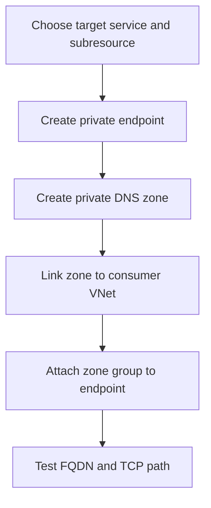

# Connect Private Endpoints

Use this runbook to onboard an Azure PaaS resource behind a private IP and to verify that clients resolve the service FQDN to the new private endpoint before public access is removed.

## Prerequisites

- Supported target service resource ID and subresource name.
- Existing VNet and dedicated subnet for private endpoints if your standards require isolation.
- Exact private DNS zone name for the target service.
- Validation client in the consumer VNet.

## When to Use

Use this runbook when moving an application from public service endpoints to Private Link, onboarding a new private endpoint for east-west access, or validating DNS before a public access lock-down.

<!-- diagram-id: connect-private-endpoints -->

```mermaid
flowchart TD
    A[Choose target service and subresource] --> B[Create private endpoint]
    B --> C[Create private DNS zone]
    C --> D[Link zone to consumer VNet]
    D --> E[Attach zone group to endpoint]
    E --> F[Test FQDN and TCP path]
```

## Procedure

1. Create the private endpoint in the consumer VNet subnet.
2. Create the matching private DNS zone for the service namespace.
3. Link the zone to the consumer VNet.
4. Attach a DNS zone group to the private endpoint so Azure can manage the endpoint record mapping.

```bash
az network private-endpoint create --resource-group $RG --name $PE_NAME --vnet-name $VNET_NAME --subnet $SUBNET_NAME --private-connection-resource-id $TARGET_RESOURCE_ID --group-ids blob --connection-name ${PE_NAME}-conn
az network private-dns zone create --resource-group $RG --name privatelink.blob.core.windows.net
az network private-dns link vnet create --resource-group $RG --zone-name privatelink.blob.core.windows.net --name link-$VNET_NAME --virtual-network $VNET_ID --registration-enabled false
az network private-endpoint dns-zone-group create --resource-group $RG --endpoint-name $PE_NAME --name default --private-dns-zone privatelink.blob.core.windows.net --zone-name privatelink.blob.core.windows.net
```
| Command | Purpose |
| --- | --- |
| `az network private-endpoint create` | Create the private endpoint NIC in the consumer subnet. |
| `--resource-group` | Place the private endpoint in the target resource group. |
| `--name` | Name the private endpoint resource. |
| `--vnet-name` | Select the consumer virtual network. |
| `--subnet` | Choose the subnet that will host the endpoint NIC. |
| `--private-connection-resource-id` | Point the endpoint at the Azure service resource. |
| `--group-ids` | Select the service subresource, such as `blob`. |
| `--connection-name` | Name the private-link connection request. |
| `az network private-dns zone create` | Create the service-specific private DNS zone. |
| `az network private-dns link vnet create` | Link the zone to the consumer VNet. |
| `--zone-name` | Select the private DNS zone to link. |
| `--virtual-network` | Use the VNet resource ID for the link target. |
| `--registration-enabled` | Disable autoregistration for service endpoint zones. |
| `az network private-endpoint dns-zone-group create` | Bind the endpoint to the private DNS zone for managed records. |
| `--endpoint-name` | Select the private endpoint receiving the zone group. |
| `--private-dns-zone` | Reference the private DNS zone resource or name. |

Expected output:

- The private endpoint reaches `Approved` or `Succeeded` state.
- The private DNS zone link is created.
- The zone group binds the endpoint to the correct zone.

## Verification

Validate both DNS and the service path from a client in the consumer VNet.

```bash
az network private-endpoint show --resource-group $RG --name $PE_NAME --output json
nslookup $STORAGE_ACCOUNT_NAME.blob.core.windows.net
```
| Command | Purpose |
| --- | --- |
| `az network private-endpoint show` | Inspect the endpoint IP and connection status. |
| `--resource-group` | Scope the lookup to the endpoint resource group. |
| `--name` | Select the private endpoint resource. |
| `--output` | Return JSON so the private IP and status are visible. |
| `nslookup $STORAGE_ACCOUNT_NAME.blob.core.windows.net` | Confirm the public FQDN resolves to the private endpoint IP. |

Healthy result:

- `privateLinkServiceConnections[].privateLinkServiceConnectionState.status` is `Approved`.
- `nslookup` returns the private IP from the endpoint subnet.
- Application traffic reaches the service without depending on public network access.

## Rollback / Troubleshooting

- If DNS still returns a public IP, check the zone link and zone-group attachment before editing application code.
- If the connection remains `Pending`, coordinate with the service owner or the separate subscription owner for approval.
- If multiple private endpoints for the same service are present in a shared DNS namespace, remove duplicate or stale records before cutover.
- If the rollout fails, keep public access enabled until name resolution and client connectivity both pass.

## See Also

- [Private Connectivity Options](../platform/private-connectivity-options.md)
- [Private Endpoint Best Practices](../best-practices/private-endpoint-best-practices.md)
- [Cannot Reach Private Endpoint](../troubleshooting/playbooks/connectivity/cannot-reach-private-endpoint.md)

## Sources

- [What is a private endpoint?](https://learn.microsoft.com/en-us/azure/private-link/private-endpoint-overview)
- [Azure Private Endpoint private DNS zone values](https://learn.microsoft.com/en-us/azure/private-link/private-endpoint-dns)
