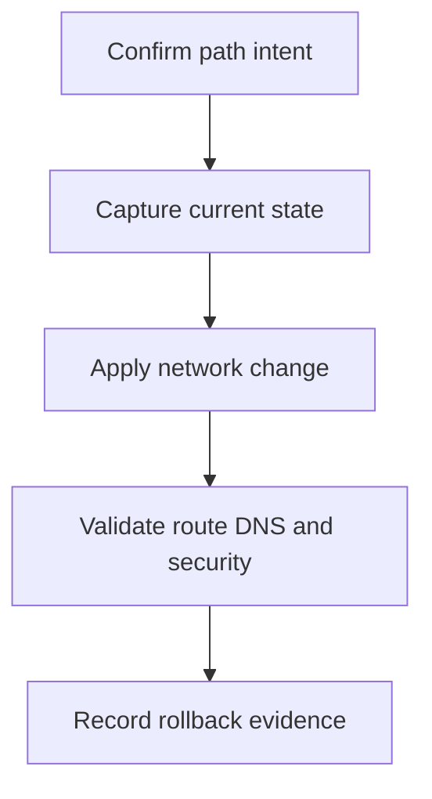

---
content_sources:
  diagrams:
  - id: operations-connect-private-endpoints-flow
    type: flowchart
    source: mslearn-adapted
    description: Runbook flow
    based_on:
    - https://learn.microsoft.com/en-us/azure/private-link/private-endpoint-overview
    - https://learn.microsoft.com/en-us/azure/private-link/create-private-endpoint-cli
content_validation:
  status: pending_review
  last_reviewed: '2026-05-22'
  reviewer: ai-agent
  core_claims:
  - claim: This document has source metadata and is queued for text-level Microsoft
      Learn verification.
    source: https://learn.microsoft.com/en-us/azure/private-link/private-endpoint-overview
    verified: false
  - claim: Core Azure networking guidance on this page should remain traceable to
      the listed sources before it is marked verified.
    source: https://learn.microsoft.com/en-us/azure/private-link/private-endpoint-overview
    verified: false
---

# Connect Private Endpoints

Create private endpoints with DNS validation and approval-state evidence.

## Prerequisites

- Azure CLI is installed and authenticated with permission to read and change the target networking resources.
- Required variables such as `RG`, `LOCATION`, `VNET_NAME`, and resource-specific names are set before running commands.
- The intended source, destination, protocol, port, DNS name, and rollback owner are known.
- A maintenance window is approved for production path changes.

## When to Use

A PaaS service must be available from a spoke subnet over private IP only.

<!-- diagram-id: operations-connect-private-endpoints-flow -->

```mermaid
flowchart TD
    A[Confirm path intent] --> B[Capture current state]
    B --> C[Apply network change]
    C --> D[Validate route DNS and security]
    D --> E[Record rollback evidence]
```

## Procedure

1. Confirm the target service subresource and consumer subnet.
2. Create the private endpoint connection.
3. Integrate or manually configure Private DNS.
4. Test name resolution and connection from the consumer network before disabling public access.

### Command sequence

```bash
az network private-endpoint create \
    --resource-group $RG \
    --name $PRIVATE_ENDPOINT_NAME \
    --vnet-name $VNET_NAME \
    --subnet $SUBNET_NAME \
    --private-connection-resource-id $TARGET_RESOURCE_ID \
    --group-id blob \
    --connection-name $CONNECTION_NAME \
    --output json
```

| Element | Purpose |
|---|---|
| `$RG` | Resource group containing the networking resources. |
| `$PRIVATE_ENDPOINT_NAME` | Private endpoint resource name. |
| `$VNET_NAME` | Virtual network being created, linked, or inspected. |
| `$SUBNET_NAME` | Subnet being created, delegated, secured, or tested. |
| `$TARGET_RESOURCE_ID` | Azure resource ID for the service behind the network action. |
| `$CONNECTION_NAME` | Connection Monitor or gateway connection name. |
| `--resource-group` | Scopes the command to the intended resource group. |
| `--name` | Identifies the target Azure networking resource. |
| `--vnet-name` | Selects the virtual network containing the subnet or peering. |
| `--subnet` | Azure CLI option used to scope or shape the network operation. |
| `--private-connection-resource-id` | Targets the PaaS resource for a private endpoint. |
| `--group-id` | Selects the subresource exposed through private link. |
| `--connection-name` | Names a private endpoint or gateway connection. |
| `--output` | Controls output format for review or automation. |
| Expected result | Command succeeds and returns resource state, path evidence, or operation status for the change record. |

## Verification

```bash
az network private-endpoint show \
    --resource-group $RG \
    --name $PRIVATE_ENDPOINT_NAME \
    --query "{name:name,provisioningState:provisioningState,customDnsConfigs:customDnsConfigs}" \
    --output json
```

| Element | Purpose |
|---|---|
| `$RG` | Resource group containing the networking resources. |
| `$PRIVATE_ENDPOINT_NAME` | Private endpoint resource name. |
| `--resource-group` | Scopes the command to the intended resource group. |
| `--name` | Identifies the target Azure networking resource. |
| `--query` | Filters output to the evidence operators need. |
| `--output` | Controls output format for review or automation. |
| Expected result | Command succeeds and returns resource state, path evidence, or operation status for the change record. |

Confirm from the actual source network that DNS, route, security rule, and service response match the intended design.

## Rollback / Troubleshooting

```bash
az network private-endpoint delete \
    --resource-group $RG \
    --name $PRIVATE_ENDPOINT_NAME \
    --yes
```

| Element | Purpose |
|---|---|
| `$RG` | Resource group containing the networking resources. |
| `$PRIVATE_ENDPOINT_NAME` | Private endpoint resource name. |
| `--resource-group` | Scopes the command to the intended resource group. |
| `--name` | Identifies the target Azure networking resource. |
| `--yes` | Confirms a destructive command without prompting. |
| Expected result | Command succeeds and returns resource state, path evidence, or operation status for the change record. |

- If validation fails, stop further changes and capture current route, NSG, DNS, and Activity Log evidence.
- Roll back the smallest changed control first: rule, route, DNS link, peering flag, or private endpoint connection.
- Escalate when policy, capacity, provider circuit, or private endpoint approval state blocks the documented path.

## See Also

- [Network Design Baseline](../best-practices/network-design-baseline.md)
- [Monitor Network Paths](monitor-network-paths.md)
- [Troubleshooting Playbooks](../troubleshooting/playbooks/index.md)

## Sources

- [Private Endpoint Overview](https://learn.microsoft.com/en-us/azure/private-link/private-endpoint-overview)
- [Create Private Endpoint Cli](https://learn.microsoft.com/en-us/azure/private-link/create-private-endpoint-cli)
