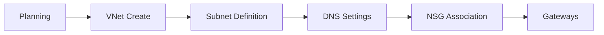

---
hide:
  - toc
content_sources:
  diagrams:
    - id: create-vnet-and-subnets
      type: flowchart
      source: mslearn-adapted
      mslearn_url: https://learn.microsoft.com/en-us/azure/virtual-network/virtual-networks-overview
      based_on:
        - https://learn.microsoft.com/en-us/azure/virtual-network/quick-create-portal
---

# Create VNet and Subnets

Standardized deployment of Virtual Networks ensures consistent addressing and security.

| Parameter | Recommended Value | Description |
| --- | --- | --- |
| Name | vnet-prod-region-001 | Descriptive name including environment and region. |
| Address Space | 10.0.0.0/16 | Sized based on total planned workloads. |
| Region | North Europe | Same region as compute resources. |
| DNS | Azure provided | Default or custom DNS servers. |
| Subnets | snet-app-001 | Sized by workload density (e.g., /24). |

| Step | Action | Status |
| --- | --- | --- |
| Pre-deployment | Confirm address space doesn't overlap with on-prem. | [ ] |
| Pre-deployment | Identify naming convention for subnets. | [ ] |
| Post-deployment | Verify subnet connectivity to peering/gateways. | [ ] |
| Post-deployment | Confirm NSG association to all subnets. | [ ] |

<!-- diagram-id: create-vnet-and-subnets -->

!!! note
    Avoid large address spaces like /8 to prevent future IP exhaustion in peering or hybrid scenarios.

## See Also

- [VNet and Subnet Basics](../platform/vnet-and-subnet-basics.md)
- [Subnet Design Best Practices](../best-practices/subnet-design-best-practices.md)
- [Configure NSG](./configure-nsg.md)

## Sources

- [Virtual network overview](https://learn.microsoft.com/en-us/azure/virtual-network/virtual-networks-overview)
- [Create virtual network quickstart](https://learn.microsoft.com/en-us/azure/virtual-network/quick-create-portal)
