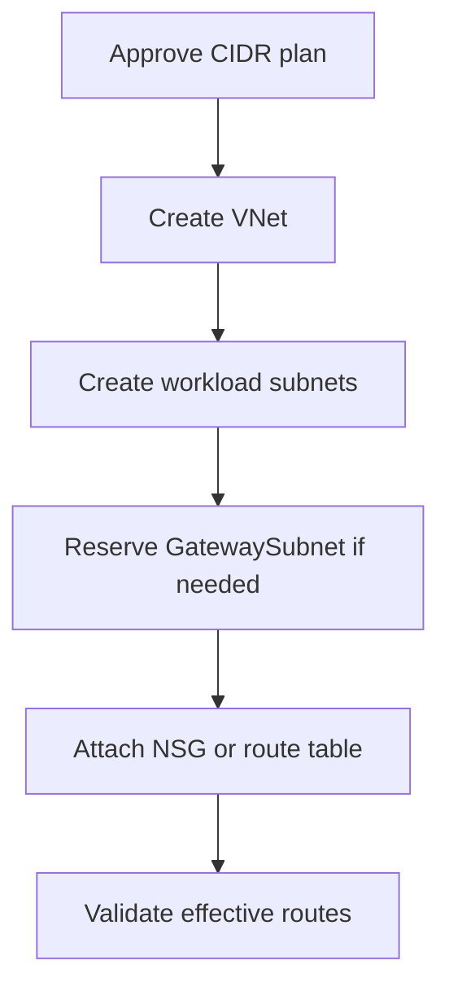

# Create VNet and Subnets

Use this runbook when you need to stand up or extend an Azure virtual network without creating overlapping prefixes or starving future gateway and workload subnets.

## Prerequisites

- A target resource group and Azure region.
- Approved CIDR plan that does not overlap with existing Azure or on-premises address space.
- Planned subnet roles, including a reserved `GatewaySubnet` when hybrid connectivity is expected.
- At least one test VM NIC available after deployment for effective route validation.

## When to Use

Use this runbook when creating a new landing-zone VNet, adding workload subnets for an application rollout, or resizing address space before peering or gateway work.

<!-- diagram-id: create-vnet-and-subnets -->

```mermaid
flowchart TD
    A[Approve CIDR plan] --> B[Create VNet]
    B --> C[Create workload subnets]
    C --> D[Reserve GatewaySubnet if needed]
    D --> E[Attach NSG or route table]
    E --> F[Validate effective routes]
```

## Procedure

1. Reserve the VNet address space and every workload subnet in the shared IP plan before creating resources.
2. Create the VNet with the broadest approved CIDR, then add only the subnets required for the current change window.
3. If VPN or ExpressRoute coexistence is in scope, create `GatewaySubnet` immediately so later gateway work does not require address renumbering.
4. Attach any required NSG or route table after the subnet objects exist.

```bash
az network vnet create --resource-group $RG --name $VNET_NAME --location $LOCATION --address-prefixes 10.40.0.0/16 --subnet-name snet-app-001 --subnet-prefixes 10.40.1.0/24
az network vnet subnet create --resource-group $RG --vnet-name $VNET_NAME --name snet-data-001 --address-prefixes 10.40.2.0/24
az network vnet subnet create --resource-group $RG --vnet-name $VNET_NAME --name GatewaySubnet --address-prefixes 10.40.255.0/27
az network vnet show --resource-group $RG --name $VNET_NAME --output json
```
| Command | Purpose |
| --- | --- |
| `az network vnet create` | Create the virtual network and first workload subnet in one transaction. |
| `--resource-group` | Place the VNet in the target resource group. |
| `--name` | Set the VNet resource name. |
| `--location` | Choose the Azure region for the VNet. |
| `--address-prefixes` | Define the VNet CIDR range. |
| `--subnet-name` | Create the first subnet during VNet creation. |
| `--subnet-prefixes` | Define the first subnet CIDR range. |
| `az network vnet subnet create` | Add additional subnets after the VNet exists. |
| `--vnet-name` | Target the parent virtual network. |
| `--address-prefixes` | Define each added subnet range. |
| `az network vnet show` | Review the resulting address space and subnet inventory. |
| `--output` | Return full JSON for audit evidence. |

Expected output:

- `provisioningState` shows `Succeeded` for the VNet and new subnets.
- `addressSpace.addressPrefixes` contains the approved `/16` (or equivalent) plan.
- `subnets[].name` includes the workload subnets and `GatewaySubnet` when requested.

## Verification

Run post-change checks from both Azure Resource Manager and a workload NIC.

```bash
az network vnet subnet list --resource-group $RG --vnet-name $VNET_NAME --output table
az network nic show-effective-route-table --resource-group $RG --name $NIC_NAME --output table
```
| Command | Purpose |
| --- | --- |
| `az network vnet subnet list` | Confirm subnet names, prefixes, and delegation state. |
| `--resource-group` | Scope the query to the target resource group. |
| `--vnet-name` | Query only the new or modified VNet. |
| `--output` | Render a readable subnet inventory table. |
| `az network nic show-effective-route-table` | Validate that Azure built the expected system routes for the subnet. |
| `--name` | Select the NIC attached to the verification VM. |

Healthy result:

- Every subnet prefix matches the design document.
- Effective routes include the VNet prefix with next hop `VnetLocal` or equivalent virtual network routing.
- No unintended 0.0.0.0/0 override appears unless a route table was intentionally attached.

## Rollback / Troubleshooting

- If a subnet prefix is wrong and the subnet is empty, delete and recreate the subnet with the correct CIDR immediately.
- If the VNet address space overlaps with an existing peered or on-premises range, stop and fix the IP plan before peering or gateway deployment.
- If effective routes do not show the new prefixes, confirm the NIC is in the expected subnet and that no stale route table association remains.
- If gateway work is no longer planned, keep `GatewaySubnet` only if the address plan has already been communicated to dependent teams; otherwise remove it before consumers deploy workloads.

## See Also

- [VNet and Subnet Basics](../platform/vnet-and-subnet-basics.md)
- [Subnet Design Best Practices](../best-practices/subnet-design-best-practices.md)
- [Configure NSG](configure-nsg.md)

## Sources

- [What is Azure Virtual Network?](https://learn.microsoft.com/en-us/azure/virtual-network/virtual-networks-overview)
- [Create, change, or delete an Azure virtual network](https://learn.microsoft.com/en-us/azure/virtual-network/manage-virtual-network)
- [Azure VPN Gateway configuration settings](https://learn.microsoft.com/en-us/azure/vpn-gateway/vpn-gateway-about-vpn-gateway-settings)
