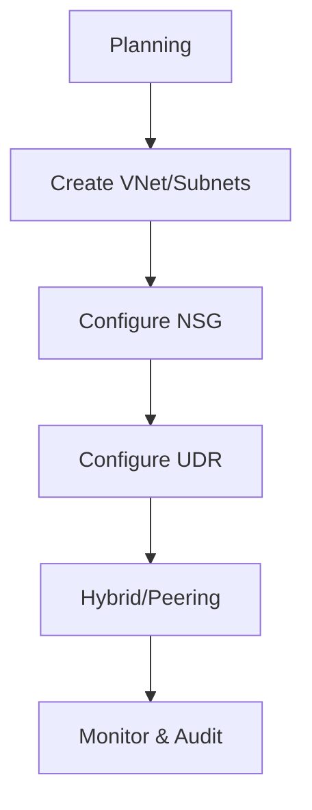

# Operations

The Operations section provides actionable guides for deploying and managing Azure Networking resources.

| Page | Description |
| --- | --- |
| Create VNet and Subnets | Standard procedures for virtual network deployment. |
| Configure NSG | Rules and best practices for Network Security Groups. |
| Configure DNS | Setup for Private DNS Zones and custom resolution. |
| Configure UDR | Routing table management and traffic steering. |
| Connect Private Endpoints | Securely exposing services into a VNet. |
| Peering Basics | Connecting virtual networks in the same or different regions. |
| VPN and ExpressRoute | Hybrid connectivity setup and maintenance. |
| Monitor Network Paths | Tools for visibility into network traffic flow. |
| Packet Capture | Deep diagnostic procedures for complex issues. |

!!! tip
    Run changes in this order: addressing, security, routing, connectivity, then monitoring validation.

## See Also

- [Learning Path](../start-here/learning-path.md)
- [Create VNet and Subnets](./create-vnet-and-subnets.md)
- [Troubleshooting Overview](../troubleshooting/index.md)

## Sources

- [Azure Virtual Network documentation](https://learn.microsoft.com/en-us/azure/virtual-network/)
- [Azure Network Security documentation](https://learn.microsoft.com/en-us/azure/networking/security/network-security)
- [Azure Private Link documentation](https://learn.microsoft.com/en-us/azure/private-link/)
