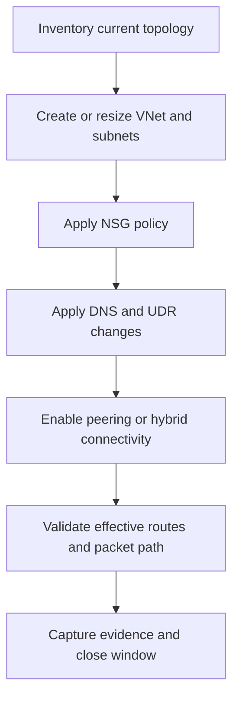

# Operations

Use this page when you need a single change sequence for Azure networking work that spans topology, policy, path selection, private access, and diagnostics.

## Prerequisites

- Azure CLI authenticated to the target subscription.
- `Network Contributor` on the affected resource groups.
- Existing inventory for VNets, subnets, route tables, NSGs, gateways, private endpoints, and Network Watcher resources.
- Change window and rollback owner agreed before modifying production routes or security policy.

## When to Use

Use this control runbook when you are coordinating multiple networking changes in one maintenance window, such as building a new spoke, tightening NSG policy, steering traffic through a firewall, or validating a private endpoint cutover.

<!-- diagram-id: operations-index-sequence -->

```mermaid
flowchart TD
    A[Inventory current topology] --> B[Create or resize VNet and subnets]
    B --> C[Apply NSG policy]
    C --> D[Apply DNS and UDR changes]
    D --> E[Enable peering or hybrid connectivity]
    E --> F[Validate effective routes and packet path]
    F --> G[Capture evidence and close window]
```

## Procedure

1. Capture the current network graph, effective routes, and security state before making any changes.
2. Apply foundational changes first: address space, subnets, delegated ranges, and gateway subnet reservations.
3. Apply distributed policy next: NSGs, DNS server settings, private DNS zone links, and route tables.
4. Enable connectivity last: peering, private endpoints, VPN, ExpressRoute, or monitoring probes.
5. After each stage, validate the packet path from at least one workload NIC before continuing.

```bash
az network vnet list --resource-group $RG --output table
az network nsg list --resource-group $RG --output table
az network route-table list --resource-group $RG --output table
az network watcher show-topology --resource-group $RG --location $LOCATION --output json
```
| Command | Purpose |
| --- | --- |
| `az network vnet list` | List virtual networks that are about to change. |
| `--resource-group` | Scope the inventory to the change resource group. |
| `--output` | Render a compact table for operator review. |
| `az network nsg list` | Review existing NSGs before policy changes. |
| `az network route-table list` | Review route tables before path changes. |
| `az network watcher show-topology` | Export the current resource relationship map. |
| `--location` | Select the region where Network Watcher is enabled. |

Expected output:

- `vnet list` returns the VNets and address spaces you expect to touch.
- `nsg list` and `route-table list` expose the names you will modify or preserve.
- `show-topology` returns a JSON topology with VNets, subnets, NICs, and peer relationships.

## Verification

- Confirm every changed subnet has the intended NSG and route table association.
- Confirm effective routes on at least one workload NIC per changed subnet.
- Confirm at least one path test or DNS lookup from a representative workload after each stage.
- Record the exact runbooks used for the final state:
    - [Create VNet and Subnets](create-vnet-and-subnets.md)
    - [Configure NSG](configure-nsg.md)
    - [Configure DNS](configure-dns.md)
    - [Configure UDR](configure-udr.md)
    - [Connect Private Endpoints](connect-private-endpoints.md)
    - [Peering Basics](peering-basics.md)
    - [VPN and ExpressRoute Basics](vpn-and-expressroute-basics.md)
    - [Monitor Network Paths](monitor-network-paths.md)
    - [Packet Capture and Diagnostics](packet-capture-and-diagnostics.md)

## Rollback / Troubleshooting

- If addressing changes fail, stop before policy work and restore the previous address plan.
- If an NSG or UDR cutover breaks reachability, revert the last associated NSG rule or subnet route table before changing anything else.
- If DNS resolution changes fail, restore the previous VNet DNS server list and renew client DHCP leases.
- If packet-path validation is ambiguous, run the diagnostics runbooks before continuing the change window.

## See Also

- [Repository Map](../start-here/repository-map.md)
- [How Azure Networking Works](../platform/how-azure-networking-works.md)
- [Troubleshooting Overview](../troubleshooting/index.md)

## Sources

- [Azure Virtual Network overview](https://learn.microsoft.com/en-us/azure/virtual-network/virtual-networks-overview)
- [Azure network security groups overview](https://learn.microsoft.com/en-us/azure/virtual-network/network-security-groups-overview)
- [Azure virtual network traffic routing](https://learn.microsoft.com/en-us/azure/virtual-network/virtual-networks-udr-overview)
- [What is a private endpoint?](https://learn.microsoft.com/en-us/azure/private-link/private-endpoint-overview)
- [Azure Network Watcher Overview](https://learn.microsoft.com/en-us/azure/network-watcher/network-watcher-overview)
