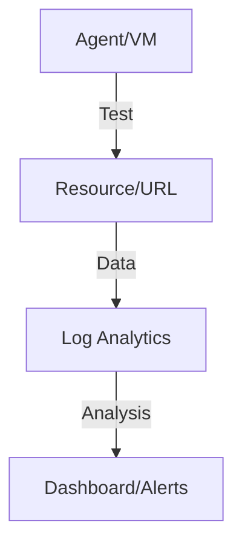

# Monitor Network Paths

Visibility into traffic flow and path performance.

| Tool | Capability | Data Type |
| --- | --- | --- |
| Connection Monitor | End-to-end path testing. | RTT, Loss, Hop. |
| NSG Flow Logs | Detailed traffic auditing. | Rule Match, Tuple. |
| Traffic Analytics | Visualizing flow patterns. | Geo-map, Security. |
| Network Watcher | Resource diagnostic tools. | IP Flow, Next Hop. |

!!! tip
    Establish baseline metrics for latency and packet loss before making significant network changes.

## Sources

- [What is Azure Network Watcher?](https://learn.microsoft.com/en-us/azure/network-watcher/network-watcher-overview)
- [Monitor networks with Connection Monitor](https://learn.microsoft.com/en-us/azure/network-watcher/connection-monitor-overview)
