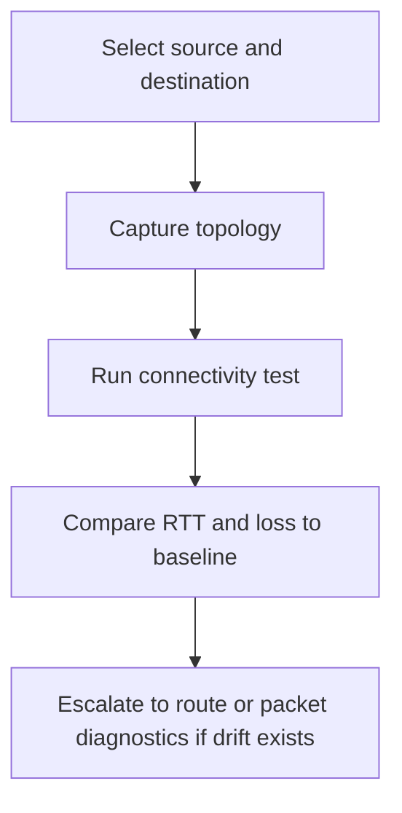

# Monitor Network Paths

Use this runbook to baseline and re-check the actual path between workloads so you can tell whether a network change affected latency, reachability, or intermediate hops.

## Prerequisites

- Azure Network Watcher enabled in the target region.
- Source VM, scale set instance, or Arc-enabled host for testing.
- Destination FQDN, URI, or IP address agreed for the monitoring target.
- Baseline RTT or packet-loss expectation from a known healthy period.

## When to Use

Use this runbook before and after routing or security changes, during incident triage for latency or intermittent failures, or when you need evidence that a path is still healthy across Azure and hybrid boundaries.

<!-- diagram-id: monitor-network-paths -->

```mermaid
flowchart TD
    A[Select source and destination] --> B[Capture topology]
    B --> C[Run connectivity test]
    C --> D[Compare RTT and loss to baseline]
    D --> E[Escalate to route or packet diagnostics if drift exists]
```

## Procedure

1. Capture the current topology so you know which resources participate in the path.
2. Run an on-demand connectivity test for the exact protocol and port used by the application.
3. Compare the returned RTT and hop data with the expected baseline.
4. If the path is degraded, hand off to routing or packet diagnostics instead of guessing.

```bash
az network watcher show-topology --resource-group $RG --location $LOCATION --output json
az network watcher test-connectivity --resource-group $RG --source-resource $SOURCE_VM_ID --dest-address $DESTINATION_FQDN --dest-port 443 --protocol Tcp --output json
```
| Command | Purpose |
| --- | --- |
| `az network watcher show-topology` | Capture the current Azure resource graph for the workload network. |
| `--resource-group` | Scope the topology map to the workload resource group. |
| `--location` | Select the region where Network Watcher is enabled. |
| `--output` | Return JSON for later diff or evidence capture. |
| `az network watcher test-connectivity` | Run a point-in-time connectivity test to the application endpoint. |
| `--source-resource` | Identify the source Azure resource ID. |
| `--dest-address` | Specify the destination FQDN or IP. |
| `--dest-port` | Match the application port under test. |
| `--protocol` | Match the application protocol under test. |

Expected output:

- `show-topology` returns the relevant VNets, NICs, load balancers, and peerings.
- `test-connectivity` returns a `connectionStatus`, hop list, and latency data.
- The test targets the same FQDN or port that the application actually uses.

## Verification

- Confirm `connectionStatus` is `Reachable` or the documented healthy equivalent.
- Compare RTT and packet loss with the previous baseline for the same path.
- If the returned hop chain changes after a routing or firewall change, document that as part of the change evidence.
- Re-run the same test after any remediation so you can compare pre-fix and post-fix results cleanly.

## Rollback / Troubleshooting

- If topology is missing expected resources, confirm you are querying the correct region and resource group before assuming a platform issue.
- If the path is unreachable, move to [Configure UDR](configure-udr.md) or [Packet Capture and Diagnostics](packet-capture-and-diagnostics.md) depending on whether the failure looks like routing or filtering.
- If RTT regresses without packet loss, compare the current path with the previous hop sequence before reverting a change.
- If the source is hybrid, confirm the monitoring agent or Arc source is still healthy before trusting the result.

## See Also

- [Observability Best Practices](../best-practices/observability-best-practices.md)
- [Packet Capture and Diagnostics](packet-capture-and-diagnostics.md)
- [Latency and Packet Loss](../troubleshooting/playbooks/connectivity/latency-and-packet-loss.md)

## Sources

- [Azure Network Watcher Overview](https://learn.microsoft.com/en-us/azure/network-watcher/network-watcher-overview)
- [Connection Monitor Overview](https://learn.microsoft.com/en-us/azure/network-watcher/connection-monitor-overview)
