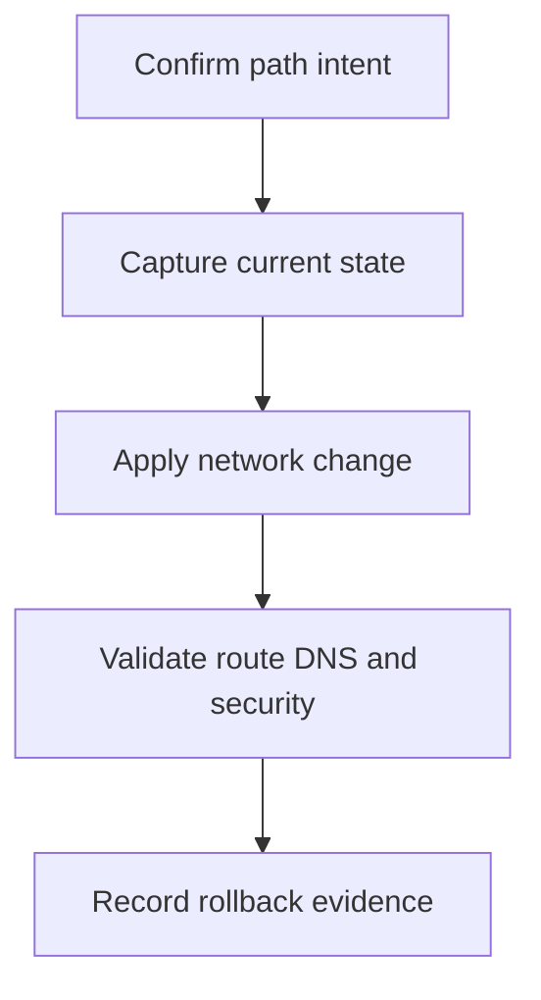

---
content_sources:
  diagrams:
  - id: operations-monitor-network-paths-flow
    type: flowchart
    source: mslearn-adapted
    description: Runbook flow
    based_on:
    - https://learn.microsoft.com/en-us/azure/network-watcher/network-watcher-ip-flow-verify-overview
    - https://learn.microsoft.com/en-us/azure/network-watcher/connection-monitor-overview
content_validation:
  status: pending_review
  last_reviewed: '2026-05-22'
  reviewer: ai-agent
  core_claims:
  - claim: This document has source metadata and is queued for text-level Microsoft
      Learn verification.
    source: https://learn.microsoft.com/en-us/azure/network-watcher/network-watcher-ip-flow-verify-overview
    verified: false
  - claim: Core Azure networking guidance on this page should remain traceable to
      the listed sources before it is marked verified.
    source: https://learn.microsoft.com/en-us/azure/network-watcher/network-watcher-ip-flow-verify-overview
    verified: false
---

# Monitor Network Paths

Monitor network paths by combining topology, route, security, DNS, and connection evidence.

## Prerequisites

- Azure CLI is installed and authenticated with permission to read and change the target networking resources.
- Required variables such as `RG`, `LOCATION`, `VNET_NAME`, and resource-specific names are set before running commands.
- The intended source, destination, protocol, port, DNS name, and rollback owner are known.
- A maintenance window is approved for production path changes.

## When to Use

An application has intermittent connectivity and responders need to determine which network control changed.

<!-- diagram-id: operations-monitor-network-paths-flow -->

```mermaid
flowchart TD
    A[Confirm path intent] --> B[Capture current state]
    B --> C[Apply network change]
    C --> D[Validate route DNS and security]
    D --> E[Record rollback evidence]
```

## Procedure

1. Identify source, destination, protocol, and port.
2. Run route and security checks from the source NIC.
3. Use Connection Monitor for recurring path validation where appropriate.
4. Correlate results with firewall, gateway, and DNS logs.

### Command sequence

```bash
az network watcher test-ip-flow \
    --resource-group $RG \
    --vm $VM_NAME \
    --direction Outbound \
    --protocol TCP \
    --local 10.60.1.4:50000 \
    --remote 10.60.2.4:443 \
    --output json

az network watcher show-next-hop \
    --resource-group $RG \
    --vm $VM_NAME \
    --source-ip 10.60.1.4 \
    --dest-ip 10.60.2.4 \
    --output json
```

| Element | Purpose |
|---|---|
| `$RG` | Resource group containing the networking resources. |
| `$VM_NAME` | Virtual machine used as a test source or destination. |
| `--resource-group` | Scopes the command to the intended resource group. |
| `--vm` | Azure CLI option used to scope or shape the network operation. |
| `--direction` | Sets inbound or outbound NSG direction. |
| `--protocol` | Sets the protocol matched by a rule. |
| `--local` | Azure CLI option used to scope or shape the network operation. |
| `--remote` | Azure CLI option used to scope or shape the network operation. |
| `--output` | Controls output format for review or automation. |
| `--source-ip` | Azure CLI option used to scope or shape the network operation. |
| `--dest-ip` | Azure CLI option used to scope or shape the network operation. |
| Expected result | Command succeeds and returns resource state, path evidence, or operation status for the change record. |

## Verification

```bash
az network watcher connection-monitor list \
    --resource-group $RG \
    --output table
```

| Element | Purpose |
|---|---|
| `$RG` | Resource group containing the networking resources. |
| `--resource-group` | Scopes the command to the intended resource group. |
| `--output` | Controls output format for review or automation. |
| Expected result | Command succeeds and returns resource state, path evidence, or operation status for the change record. |

Confirm from the actual source network that DNS, route, security rule, and service response match the intended design.

## Rollback / Troubleshooting

- If validation fails, stop further changes and capture current route, NSG, DNS, and Activity Log evidence.
- Roll back the smallest changed control first: rule, route, DNS link, peering flag, or private endpoint connection.
- Escalate when policy, capacity, provider circuit, or private endpoint approval state blocks the documented path.

## See Also

- [Network Design Baseline](../best-practices/network-design-baseline.md)
- [Monitor Network Paths](monitor-network-paths.md)
- [Troubleshooting Playbooks](../troubleshooting/playbooks/index.md)

## Sources

- [Network Watcher Ip Flow Verify Overview](https://learn.microsoft.com/en-us/azure/network-watcher/network-watcher-ip-flow-verify-overview)
- [Connection Monitor Overview](https://learn.microsoft.com/en-us/azure/network-watcher/connection-monitor-overview)
