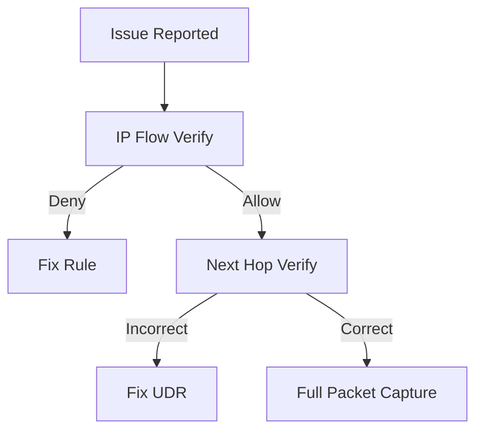

---
hide:
  - toc
content_sources:
  diagrams:
    - id: packet-capture-and-diagnostics
      type: flowchart
      source: mslearn-adapted
      mslearn_url: https://learn.microsoft.com/en-us/azure/network-watcher/network-watcher-connectivity-portal
      based_on:
        - https://learn.microsoft.com/en-us/azure/network-watcher/network-watcher-packet-capture-overview
---

# Packet Capture and Diagnostics

Advanced tools for deep network investigation.

| Tool | Primary Use Case | Outcome |
| --- | --- | --- |
| Packet Capture | Wireshark-compatible PCAP files. | Full Payload. |
| IP Flow Verify | Check if NSG allows traffic. | Rule Match. |
| Next Hop | Verify routing table entry. | Next Hop IP. |
| Connection Troubleshoot | TCP handshake check. | Success/Fail. |

| Triage Order | Diagnostic | Purpose |
| --- | --- | --- |
| 1 | IP Flow Verify | Confirm allow/deny decision. |
| 2 | Next Hop | Confirm selected route path. |
| 3 | Packet Capture | Inspect packets and retransmits. |

<!-- diagram-id: packet-capture-and-diagnostics -->

!!! tip
    Always use "IP Flow Verify" and "Next Hop" before initiating a full packet capture to save time.

## See Also

- [Monitor Network Paths](./monitor-network-paths.md)
- [Observability Best Practices](../best-practices/observability-best-practices.md)
- [Intermittent Network Failures](../troubleshooting/playbooks/connectivity/intermittent-network-failures.md)

## Sources

- [Use Network Watcher to troubleshoot connections](https://learn.microsoft.com/en-us/azure/network-watcher/network-watcher-connectivity-portal)
- [Variable packet capture in Azure](https://learn.microsoft.com/en-us/azure/network-watcher/network-watcher-packet-capture-overview)
