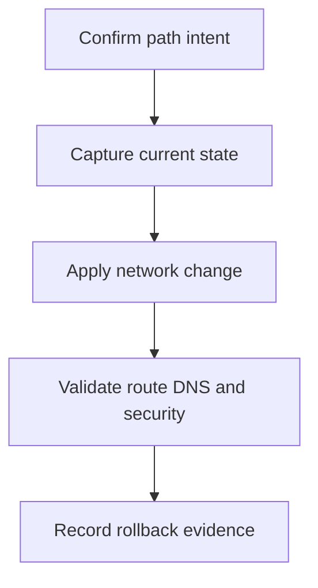

---
content_sources:
  diagrams:
  - id: operations-packet-capture-and-diagnostics-flow
    type: flowchart
    source: mslearn-adapted
    description: Runbook flow
    based_on:
    - https://learn.microsoft.com/en-us/azure/network-watcher/packet-capture-overview
    - https://learn.microsoft.com/en-us/azure/network-watcher/network-watcher-packet-capture-manage-cli
content_validation:
  status: pending_review
  last_reviewed: '2026-05-22'
  reviewer: ai-agent
  core_claims:
  - claim: This document has source metadata and is queued for text-level Microsoft
      Learn verification.
    source: https://learn.microsoft.com/en-us/azure/network-watcher/packet-capture-overview
    verified: false
  - claim: Core Azure networking guidance on this page should remain traceable to
      the listed sources before it is marked verified.
    source: https://learn.microsoft.com/en-us/azure/network-watcher/packet-capture-overview
    verified: false
---

# Packet Capture and Diagnostics

Use packet capture and Network Watcher diagnostics when control-plane evidence does not explain packet behavior.

## Prerequisites

- Azure CLI is installed and authenticated with permission to read and change the target networking resources.
- Required variables such as `RG`, `LOCATION`, `VNET_NAME`, and resource-specific names are set before running commands.
- The intended source, destination, protocol, port, DNS name, and rollback owner are known.
- A maintenance window is approved for production path changes.

## When to Use

A service still fails after NSG and route checks, so operators need packet-level evidence from the source VM.

<!-- diagram-id: operations-packet-capture-and-diagnostics-flow -->

```mermaid
flowchart TD
    A[Confirm path intent] --> B[Capture current state]
    B --> C[Apply network change]
    C --> D[Validate route DNS and security]
    D --> E[Record rollback evidence]
```

## Procedure

1. Confirm packet capture scope, duration, and storage location.
2. Start capture during a short reproduction window.
3. Stop capture and preserve files with incident evidence.
4. Compare packet evidence with NSG, UDR, DNS, and firewall logs.

### Command sequence

```bash
az network watcher packet-capture create \
    --resource-group $RG \
    --vm $VM_NAME \
    --name capture-$VM_NAME \
    --time-limit 120 \
    --output json
```

| Element | Purpose |
|---|---|
| `$RG` | Resource group containing the networking resources. |
| `$VM_NAME` | Virtual machine used as a test source or destination. |
| `--resource-group` | Scopes the command to the intended resource group. |
| `--vm` | Azure CLI option used to scope or shape the network operation. |
| `--name` | Identifies the target Azure networking resource. |
| `--time-limit` | Azure CLI option used to scope or shape the network operation. |
| `--output` | Controls output format for review or automation. |
| Expected result | Command succeeds and returns resource state, path evidence, or operation status for the change record. |

## Verification

```bash
az network watcher packet-capture show-status \
    --resource-group $RG \
    --name capture-$VM_NAME \
    --location $LOCATION \
    --output json
```

| Element | Purpose |
|---|---|
| `$RG` | Resource group containing the networking resources. |
| `$VM_NAME` | Virtual machine used as a test source or destination. |
| `$LOCATION` | Azure region for regional networking resources. |
| `--resource-group` | Scopes the command to the intended resource group. |
| `--name` | Identifies the target Azure networking resource. |
| `--location` | Selects the Azure region for creation or lookup. |
| `--output` | Controls output format for review or automation. |
| Expected result | Command succeeds and returns resource state, path evidence, or operation status for the change record. |

Confirm from the actual source network that DNS, route, security rule, and service response match the intended design.

## Rollback / Troubleshooting

```bash
az network watcher packet-capture stop \
    --resource-group $RG \
    --name capture-$VM_NAME \
    --location $LOCATION \
    --output json
```

| Element | Purpose |
|---|---|
| `$RG` | Resource group containing the networking resources. |
| `$VM_NAME` | Virtual machine used as a test source or destination. |
| `$LOCATION` | Azure region for regional networking resources. |
| `--resource-group` | Scopes the command to the intended resource group. |
| `--name` | Identifies the target Azure networking resource. |
| `--location` | Selects the Azure region for creation or lookup. |
| `--output` | Controls output format for review or automation. |
| Expected result | Command succeeds and returns resource state, path evidence, or operation status for the change record. |

- If validation fails, stop further changes and capture current route, NSG, DNS, and Activity Log evidence.
- Roll back the smallest changed control first: rule, route, DNS link, peering flag, or private endpoint connection.
- Escalate when policy, capacity, provider circuit, or private endpoint approval state blocks the documented path.

## See Also

- [Network Design Baseline](../best-practices/network-design-baseline.md)
- [Monitor Network Paths](monitor-network-paths.md)
- [Troubleshooting Playbooks](../troubleshooting/playbooks/index.md)

## Sources

- [Packet Capture Overview](https://learn.microsoft.com/en-us/azure/network-watcher/packet-capture-overview)
- [Network Watcher Packet Capture Manage Cli](https://learn.microsoft.com/en-us/azure/network-watcher/network-watcher-packet-capture-manage-cli)
